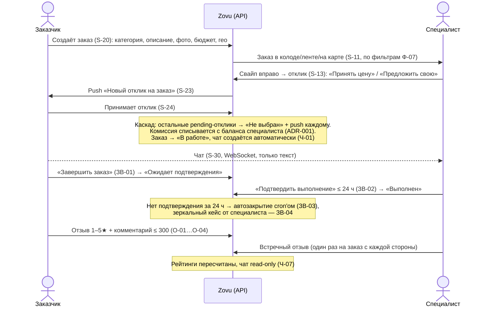
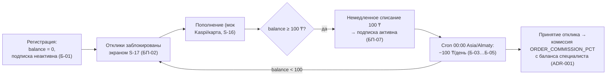

# 00 — Обзор проекта Zovu

> Стартовая страница LLM-вики. Вики (`docs/`) — source of truth проекта: новая сессия (LLM или человек) должна суметь продолжить разработку, прочитав только её. Порядок чтения — в разделе [«Как продолжить работу»](#как-продолжить-работу).

## Что такое Zovu

**Zovu** — C2C-маркетплейс услуг для Казахстана (аналог Profi/inDrive для бытовых услуг). Заказчик публикует заказ с ценой и гео; специалисты рядом видят его на карте, в ленте и в Tinder-колоде и откликаются. Дальше: принятие отклика → чат → выполнение → двустороннее подтверждение → взаимные оценки.

Результат проекта — монорепо: клиентское приложение (React PWA, ADR-008), NestJS-бэкенд, мини-админка и живая демо-сцена на сид-данных (Алматы: заказы по электрике + 5–6 специалистов с рейтингами).

**Важно:** платформа строго C2C — весь B2B-модуль из ТЗ исключён полностью, соответствующая лексика запрещена в домене, UI и коде. Полный список исключений — в [01-scope.md](01-scope.md).

## Две роли на одном аккаунте

Один аккаунт = один номер телефона (auth: SMS OTP, в dev код `1111`). Роли — флаги на пользователе (`isClient`, `isSpecialist`, `activeRole`), переключение **без релогина** (Р-01…Р-05, экран S-34):

- **Заказчик** — создаёт заказы (категория, описание, до 5 фото, бюджет, адрес/гео), настраивает фильтры подбора (Ф-02…Ф-05, Ф-07…Ф-09), принимает отклики, завершает заказ, оценивает.
- **Специалист (частный)** — проходит верификацию (селфи + селфи с документом; до её прохождения отклики заблокированы, В-06), опционально получает статус «Дипломированный специалист» (ДС-*), платит подписку 100 ₸/день, откликается на заказы (принять цену / предложить свою), выполняет, оценивает.

Профиль, баланс и история — раздельные по ролям. Если вторая роль не активирована — сценарий доанкетирования при переключении.

## Ключевой happy path (Definition of Done, §12 промпта)



Полные таблицы переходов state machine заказа и отклика — в [07-business-rules.md](07-business-rules.md); карта экранов S-01…S-35 — в [05-screens.md](05-screens.md).

## Денежный цикл (кратко)



Ключевые правила: при неактивной подписке ранее отправленные отклики остаются активными (БП-03) и могут быть приняты (БП-04); бонус за одобренную пользовательскую категорию — 3 дня подписки бесплатно через `subscriptionFreeUntil` (ADR-002); баланс может уйти в минус от комиссии. Детали — в [07-business-rules.md](07-business-rules.md), денежные интерфейсы (PaymentProvider-мок) — в [08-integrations.md](08-integrations.md).

## Стек

Клиент — **React PWA** (ADR-008): Vite + React 19 + TS, React Router, TanStack Query, Zustand, i18next ru+kk, socket.io-client, Leaflet + OSM; API — **NestJS 10 + Prisma + PostgreSQL 15 + PostGIS** (гео-запросы `ST_DWithin`/`ST_Distance`, Socket.IO-чат, JWT access/refresh, кроны `@nestjs/schedule`, файлы в MinIO, Swagger → `docs/api/openapi.json`); админка — **Vite + React + TS** (минимальная, логин по статическому админ-токену из `.env`). Все внешние интеграции (SMS, платежи, push, ИИ-модерация, карты) — за интерфейсами с dev-моками, ни один прод-ключ для демо не нужен. Подробности и схема взаимодействий — в [02-architecture.md](02-architecture.md).

## Структура репозитория

```
zovu/
├── CLAUDE.md               # краткий вход для LLM (создаётся в Phase 0)
├── ZOVU_PROMPT.md          # мастер-промпт (продукт, скоуп, правила)
├── docs/                   # LLM Wiki — source of truth (Phase 0)
├── docker-compose.yml      # postgres(+postgis), minio, api
├── apps/
│   ├── web/                # React PWA (Vite + React 19 + TS) — ADR-008
│   ├── api/                # NestJS 10 + Prisma + PostgreSQL 15 + PostGIS
│   └── admin/              # Vite + React + TS (минимальный, без дизайн-требований)
└── .env.example
```

Рядом с промптом лежат `ZOVU_DESIGN_HANDOFF.md` и папка `design/` (прототип `standalone.html` — канон визуального стиля, мокапы `mockups/zovu1–4.png`). Правила работы с ними — в [06-design-system.md](06-design-system.md).

## Оглавление вики

| Страница | Что внутри |
|---|---|
| [00-overview.md](00-overview.md) | Эта страница: миссия, роли, happy path, деньги, стек, оглавление, правила вики. |
| [01-scope.md](01-scope.md) | In/out scope, полный список исключений B2B, дельты от ТЗ v1.2 (Приложение B промпта). |
| [02-architecture.md](02-architecture.md) | Монорепо, стек, схема взаимодействий (mermaid), env-переменные. |
| [03-data-model.md](03-data-model.md) | ERD (mermaid), пояснения к Prisma-схеме, инварианты данных. |
| [04-api.md](04-api.md) | Обзор REST-эндпоинтов `/v1`, WS-события чата, ссылка на `openapi.json`, кроны. |
| [05-screens.md](05-screens.md) | Карта экранов S-01…S-35: роут, состояние, переходы, диплинки. |
| [06-design-system.md](06-design-system.md) | Токены (канон — `design/standalone.html`), UI-кит, моушн, haptics, запреты. |
| [07-business-rules.md](07-business-rules.md) | Подписка/баланс (Б-*, БП-*), state machine заказа и отклика (ЗВ-*), комиссия, оценки и модерация (О-*, ОМ-*), категории (К-*), дипломы (ДС-*), фильтры (Ф-*). |
| [08-integrations.md](08-integrations.md) | Интерфейсы SmsProvider / PaymentProvider / PushProvider / Storage / Moderator / Maps + dev-моки и прод-заглушки. |
| [09-decisions.md](09-decisions.md) | ADR-лог: № / дата / контекст / решение / последствия (ADR-001 комиссия, ADR-002 бонус-категория, ADR-003 Tinder/Duolingo-слой…). |
| [10-status.md](10-status.md) | Прогресс по майлстоунам M0–M8, что дальше, известные долги. |
| [glossary.md](glossary.md) | Термины: заказ, отклик, подписка, каскад, автозакрытие, колода, streak… |

## Правила ведения вики (действуют всю разработку)

1. **Вики = source of truth.** Расхождение кода и вики — баг: чини вики или код.
2. После каждого майлстоуна обновляй [10-status.md](10-status.md) и все затронутые страницы.
3. Любое отступление от промпта или ТЗ → запись в [09-decisions.md](09-decisions.md) (ADR), не переспрашивая пользователя по мелочам.
4. Схемы — mermaid, чтобы читались и человеком, и моделью.
5. `CLAUDE.md` в корне — короткий (≤ 60 строк): стек, команды запуска/тестов/линта, «сначала читай docs/», конвенции коммитов. Не дублирует вики — ссылается на неё.

## Как продолжить работу

Новая сессия (LLM или человек) действует так:

1. **`CLAUDE.md`** в корне — команды запуска, конвенции, точка входа.
2. **[10-status.md](10-status.md)** — на каком майлстоуне (M0–M8) проект, что дальше, известные долги.
3. **Страницы по теме задачи:**

| Задача касается… | Читай |
|---|---|
| Скоупа, «а входит ли X» | [01-scope.md](01-scope.md) |
| Инфраструктуры, env, запуска | [02-architecture.md](02-architecture.md) |
| Схемы БД, миграций | [03-data-model.md](03-data-model.md) |
| Эндпоинтов, WS, кронов | [04-api.md](04-api.md) |
| Экранов, роутинга, навигации | [05-screens.md](05-screens.md) |
| Цветов, компонентов, анимаций | [06-design-system.md](06-design-system.md) |
| Логики заказов, денег, отзывов | [07-business-rules.md](07-business-rules.md) |
| SMS/платежей/push/файлов/карт | [08-integrations.md](08-integrations.md) |
| «Почему сделано так» | [09-decisions.md](09-decisions.md) |
| Непонятного термина | [glossary.md](glossary.md) |

4. После завершения работы — обнови затронутые страницы и [10-status.md](10-status.md) (правило 2), отступления зафиксируй ADR (правило 3).
