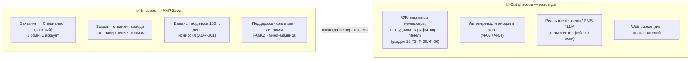

# 01 — Скоуп

> Что входит в MVP Zovu, что исключено навсегда, и чем реализация отличается от ТЗ v1.2.
> Исходное ТЗ: [reference/tz-v1.2.txt](reference/tz-v1.2.txt) · Обзор продукта: [00-overview.md](00-overview.md) · Лог решений: [09-decisions.md](09-decisions.md)

**Эта страница — единственное место в вики, где разрешено употреблять B2B-термины** («компания», «менеджер», «сотрудник» и т.п.) — исключительно для перечисления того, чего в продукте НЕТ. Везде остальное — см. раздел «Проверка на B2B-занос» ниже.

---

## 1. In scope (§1.1 промпта)

Полный список функциональности MVP с кодовыми ID требований из ТЗ v1.2 (детали правил — в [07-business-rules.md](07-business-rules.md), экраны — в [05-screens.md](05-screens.md)):

| # | Блок | Содержание | ID требований |
|---|------|-----------|----------------|
| 1 | **Две роли на одном аккаунте** | Заказчик и Специалист (частный), переключение без релогина; профиль/баланс/история ролей раздельно | Р-01…Р-05 |
| 2 | **Auth** | Номер телефона + SMS OTP (провайдер за интерфейсом, в dev — мок, код `1111`); OTP TTL 2 мин, resend 45 с, 5 попыток | НФ-05 |
| 3 | **Анкета специалиста** | ФИО, дата рождения, основная категория, доп. категории, «О себе», опциональная загрузка диплома | П-01…П-06 |
| 4 | **Верификация специалиста** | Селфи + селфи с документом; до прохождения отклики заблокированы; push о результате | В-01…В-06 |
| 5 | **Статус «Дипломированный специалист»** | Загрузка диплома jpg/png/pdf ≤ 10 МБ, проверка админом ≤ 48 ч, бейдж, повторная загрузка после отказа, отзыв статуса, приватное хранилище | ДС-01…ДС-09, НФ-09 |
| 6 | **Заказы: создание** | Категория, описание, до 5 фото (сжатие — НФ-08), бюджет, адрес/гео | З-01…З-06 |
| 7 | **Заказы: выдача специалисту** | Карта с маркерами, лента (сортировка по расстоянию), блок «Новые» < 1 мин, **Tinder-колода** (ADR-003) | С-01…С-05 |
| 8 | **Отклики** | Принять цену / предложить свою; каскадный отказ остальным («Не выбран» + push) при принятии одного | раздел 5.2 ТЗ |
| 9 | **Монетизация специалиста** | Баланс, подписка **100 ₸/день**, поведение при неактивной подписке, пополнение (Kaspi/карта — мок), **комиссия за заказ** (ADR-001) | Б-01…Б-07, БП-01…БП-07 |
| 10 | **Чат** | Текст, WebSocket, открывается после принятия отклика, push о сообщении, история, read-only после завершения+оценки, «Пожаловаться» | Ч-01, Ч-02, Ч-05…Ч-08 |
| 11 | **Завершение заказа** | Двустороннее подтверждение, автозакрытие через 24 ч (обе стороны), окно оценки 7 дней после автозакрытия, отмена, спор | ЗВ-01…ЗВ-07 |
| 12 | **Оценки и отзывы** | 1–5★ + комментарий ≤ 300, один раз на заказ, ИИ-фильтр (заглушка за интерфейсом), жалобы + пост-модерация, редактирование 24 ч, пересчёт рейтинга без скрытых | О-01…О-05, ОМ-01…ОМ-08 |
| 13 | **История заказов** | Разделы «Мои заказы» для обеих ролей, статусы, карточки, переход к отзыву/переписке | ИЗ-01…ИЗ-04, ИС-01…ИС-04 |
| 14 | **Справочник категорий** | Seed-справочник + «Предложить свою» (модерация ≤ 1 ч, до одобрения не видна — К-05, бонус 3 дня подписки — ADR-002) | К-01…К-06 |
| 15 | **Служба поддержки** | Тикеты-чат с категориями, ≤ 5 вложений, привязка заказа, статусы Новое → В работе → Решено, оценка поддержки | СП-01…СП-10 |
| 16 | **Фильтры подбора специалистов** | «Только дипломированные» (Ф-02), мин. рейтинг (Ф-03), опыт (Ф-04), расстояние (Ф-05), скрытие заказа от неподходящих (Ф-07), «смягчите фильтры» через 10 мин (Ф-08), пресеты (Ф-09, low priority), метрики в профиле (Ф-10) | Ф-01…Ф-05, Ф-07…Ф-10 |
| 17 | **Локализация** | RU / KZ, переключение в настройках; ru — канон, kk — черновой перевод `// TODO native review` | НФ-02 |
| 18 | **Push-уведомления** | Мок + FCM-адаптер; лента уведомлений с бейджем | НФ-06 |
| 19 | **Мини-админка** | Очереди: верификация, дипломы, пользовательские категории, жалобы на отзывы, тикеты поддержки; аудит-лог действий админа | НФ-13 |
| 20 | **Нефункциональные** | iOS ≥ 14 / Android ≥ 8 (НФ-01), GPS (НФ-04), отклик UI ≤ 2 с (НФ-07), сжатие фото (НФ-08), защищённое хранилище документов (НФ-09) | НФ-01, НФ-04, НФ-07…НФ-09 |
| 21 | **Delight-слой** | Streak 🔥N, празднования, Duolingo-прогресс онбординга — фичефлаг `gamification` (default on), ADR-003 | — (нет в ТЗ) |

---

## 2. Out of scope (§1.2 промпта) — НЕ ДЕЛАТЬ НИ ПРИ КАКИХ УСЛОВИЯХ

### 2.1 Весь B2B-модуль (раздел 12 ТЗ)

Формулировка промпта (дословно):

> **Весь B2B-модуль (раздел 12 ТЗ): компании, менеджеры, сотрудники компаний, корпоративная панель, тарифные планы компаний, регистрация через администратора.** Слов «компания», «менеджер», «сотрудник компании» в домене, UI и коде быть не должно.

Полный перечень исключаемых требований ТЗ v1.2:

| Группа ТЗ | ID | Что исключено |
|-----------|----|----|
| 12.2 Тарифные планы | Т-01…Т-08 | Тарифы «Старт/Бизнес/Корпорация/Энтерпрайз», оплата по счёту, напоминания, блокировка при неоплате |
| 12.3 Регистрация компании | КР-01…КР-16 | Заведение компаний администратором: БИН, документы, аккаунт менеджера, активация тарифа |
| 12.4.1 Управление сотрудниками | МС-01…МС-07 | Список/добавление/удаление сотрудников, передача прав менеджера |
| 12.4.2 Управление заказами | МЗ-01…МЗ-08 | Отклики от лица компании, назначение/переназначение исполнителей |
| 12.4.3 Аналитика | МА-01…МА-04 | Корпоративная статистика и отчётность |
| 12.5 Самостоятельная регистрация сотрудника | СС-01…СС-06 | Заявка «Работаю в компании», подтверждение менеджером |
| 12.6 Режим сотрудника | РС-01…РС-08 | «Мои задачи», бейдж компании, оплата тарифом вместо баланса |
| 12.7 Отображение для заказчика | ЗК-01…ЗК-05 | Иконки/карточки/рейтинг компаний в выдаче заказчика |
| 12.8 Верификация компании | ВК-01…ВК-05 | Проверка БИН по реестрам, значок «Проверено», блокировка компаний |
| 7. Роли | **Р-06** | Роль «Сотрудник компании» — удалена; переключатель ролей только Заказчик/Специалист |
| 13.3 Фильтры | **Ф-06** | Фильтр «Тип исполнителя» (частный/компания) — удалён вместе с B2B |
| 14. НФТ | НФ-10, НФ-11 | Корпоративная веб-панель (браузеры) и раздельное хранение данных компаний |
| 15. Открытые вопросы | № 2, 3, 5, 6, 7, 10 | Все вопросы по тарифам, двойной роли сотрудника, корп-панели, нескольким менеджерам, экспорту отчётов, каналам регистрации — сняты как беспредметные |

Также вычищаются B2B-хвосты внутри смешанных требований: упоминание менеджеров в Ч-02 и СП-05, «заявки сотрудников» в НФ-06, «частных и от компаний» в 4.2 ТЗ — в Zovu участвуют только частные специалисты.

### 2.2 Остальные исключения

1. **Ф-06** «Тип исполнителя» — удалён (см. таблицу выше).
2. **Автоперевод сообщений и эмодзи-панель в чате (Ч-03/Ч-04 из ТЗ v1.2)** — только plain text. Unicode с системной клавиатуры не блокируется, но отдельного UI для эмодзи нет.
3. **Реальные платежи, реальный SMS-шлюз, реальный LLM-модератор** — только интерфейсы + dev-моки; прод-адаптеры (`KaspiPayProvider`, `MobizonSmsProvider`, `AnthropicModerator`, `FcmPushProvider`) — заглушки с TODO. Детали: [08-integrations.md](08-integrations.md).
4. **Web-версия для пользователей** — не делается; единственный web — мини-админка.



---

## 3. Дельты от ТЗ v1.2 (Приложение B промпта — решено заказчиком, не переспрашивать)

1. **Раздел 12 (B2B) исключён полностью**: фильтр Ф-06 «Тип исполнителя» удалён; роль «Сотрудник компании» (Р-06) удалена; переключатель ролей — только Заказчик/Специалист. Полный перечень — раздел 2.1 выше.
2. **Комиссия за заказ добавлена** — в ТЗ её нет, на мокапах есть («Комиссия сервиса 250 ₸», «Вы получите 4 750 ₸»). Реализуется по мокапам: `ORDER_COMMISSION_PCT=5` (env, можно 0), списание с баланса специалиста в момент принятия отклика заказчиком, баланс может уйти в минус. → **ADR-001** в [09-decisions.md](09-decisions.md), правила в [07-business-rules.md](07-business-rules.md).
3. **Tinder-колода** для ленты специалиста и **Duolingo-delight** (streak, празднования, прогресс онбординга) добавлены поверх ТЗ — стилевое требование заказчика. Визуальный слой строго минималистичный, iOS-like, по мокапам. → **ADR-003**. Механика — [05-screens.md](05-screens.md) (S-11) и [06-design-system.md](06-design-system.md).
4. **SMS / Kaspi / FCM / ИИ-модерация / карты — за интерфейсами с dev-моками**; прод-адаптеры — заглушки с TODO. Ни один прод-ключ не нужен для запуска демо. → [08-integrations.md](08-integrations.md).
5. **SLA верификации**: ТЗ обещает ≤ 1 ч (В-04), мокап пишет «до 24 часов» — в UI используется текст мокапа («Обычно проверка занимает от нескольких минут до 24 часов»), целевой SLA в вики — 1 ч.
6. **Админ-функции из ТЗ** (модерация отзывов, верификация, категории, поддержка, аудит-лог НФ-13) реализуются как **мини-веб-админка без дизайн-требований** (Vite + React, статический админ-токен) — а не как часть мобильного приложения.

Мелкое расхождение вне Приложения B: категории обращений в поддержку — в ТЗ (СП-03) их шесть (включая отдельную «дипломированный статус»), канон экрана S-31 — пять: «Заказ / Оплата / Жалоба / Верификация / Иное» (диплом — внутри «Верификация»). Канон — промпт/standalone. TODO(M7): зафиксировать ADR при реализации поддержки, если потребуется отдельная категория.

---

## 4. Проверка на B2B-занос (правило для каждого ревью)

B2B не существует. Любая мысль «а вдруг понадобится компания» — отклоняется без обсуждения (правило 3 из §11 промпта).

### 4.1 Запрещённые слова

**В домене, UI-строках (i18next-ресурсы ru/kk), коде, схеме данных, seed-данных, тестах и вики** (кроме этой страницы и [reference/tz-v1.2.txt](reference/tz-v1.2.txt)):

- Русские: «компания», «менеджер», «сотрудник» (в т.ч. «сотрудник компании»), «корпоративный» / «корпоративная панель», «тариф» / «тарифный план», «БИН», «юридическое лицо» / «ИП» как исполнитель, «бренд/логотип компании».
- Английские идентификаторы: `company`, `corporate`, `corp`, `manager`, `employee`, `staff`, `tariff`, `b2b`, `organization`/`orgId`, `businessAccount`.
- Про «администратора»: администратор платформы Zovu — легитимная сущность (админка, модерация), но называем его «администратор», не «сотрудник Zovu».
- Про суффикс `Manager` в коде: не используем вовсе (даже технически — `SomethingManager`), чтобы grep-фильтр оставался чистым; вместо него — `Service` / `Provider` / `Controller` (это и так стандарт NestJS).

### 4.2 Правило-фильтр для ревью

Перед каждым коммитом/ревью прогоняется grep; **ожидаемый результат — 0 строк**, любое совпадение — блокер:

```bash
grep -rniE "компани|менеджер|сотрудник|корпорат|тарифн|\bбин\b|\bcompany\b|corporate|\bemployee\b|\bstaff\b|\btariff\b|\bb2b\b|\bmanager\b" \
  apps/ docs/ \
  --include="*.ts" --include="*.tsx" --include="*.scss" \
  --include="*.prisma" --include="*.md" --include="*.json" \
  --exclude-dir=node_modules --exclude-dir=.git --exclude-dir=dist \
  | grep -vE "docs/01-scope\.md|docs/reference/"
```

Примечания к фильтру:

- Исключения из проверки — только `docs/01-scope.md` (эта страница) и `docs/reference/` (исходное ТЗ). `ZOVU_PROMPT.md` и `ZOVU_DESIGN_HANDOFF.md` лежат в корне и в проверяемые пути не входят.
- Совпадение по `manager` в сторонних зависимостях (lock-файлы, generated-код) — не блокер; в своём коде — блокер (см. 4.1).
- Фильтр гоняется и по kk-переводам в i18next-ресурсах: казахские кальки («компания», «менеджер») ловятся теми же паттернами.

---

## Связанные страницы

- [00-overview.md](00-overview.md) — что такое Zovu, роли, ключевые сценарии
- [07-business-rules.md](07-business-rules.md) — подписка, комиссия, state machine заказа/отклика
- [08-integrations.md](08-integrations.md) — интерфейсы и dev-моки (следствие дельты № 4)
- [09-decisions.md](09-decisions.md) — ADR-001 (комиссия), ADR-002 (бонус за категорию), ADR-003 (Tinder/Duolingo-слой)
- [05-screens.md](05-screens.md) · [06-design-system.md](06-design-system.md) — экраны и стиль (канон палитры — `design/standalone.html`)
- [10-status.md](10-status.md) — текущий прогресс по майлстоунам
- [glossary.md](glossary.md) — термины домена
