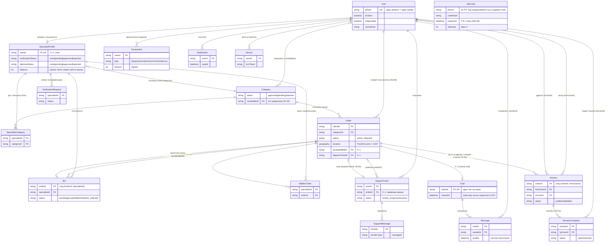

# 03 — Модель данных

> Источник: `ZOVU_PROMPT.md` §7 (ядро модели), §6 (бизнес-правила, задающие инварианты).
> Prisma-схема живёт в `apps/api/prisma/schema.prisma` (создаётся в майлстоуне M2, см. [10-status.md](10-status.md)). Расхождение схемы и этой страницы — баг: чини одно из двух.
> State machine заказа и отклика (таблицы переходов) — в [07-business-rules.md](07-business-rules.md). Эндпоинты поверх этих моделей — в [04-api.md](04-api.md). Термины — в [glossary.md](glossary.md).

Соглашения:
- У **каждой** модели есть суррогатный `id` (PK, cuid) — в таблицах ниже не повторяется.
- Все денежные поля — **целые тенге, `Int`** (тиын не используется): `balance`, `budget`, `price`, `commission`, `amount`, `balanceAfter`.
- `?` после типа = nullable/опционально.
- B2B-сущностей в модели нет и не будет (см. [01-scope.md](01-scope.md)).

---

## 1. ERD

Примечание к FK: везде, где §7 промпта пишет `specialistId` (Bid, HiddenOrder, SpecialistCategory, VerificationRequest), принято, что это ссылка на `SpecialistProfile.id` (не на `User.id`). TODO(M2): закрепить в Prisma-схеме и, при отступлении, оформить ADR в [09-decisions.md](09-decisions.md).

---

## 2. Модели и поля

### User

Один аккаунт = один номер телефона; роли — флаги на пользователе (§6.7, Р-01…Р-05). Профиль/баланс/история ролей раздельны: всё «специалистское» — в `SpecialistProfile`.

| Поле | Тип | Описание |
|---|---|---|
| `phone` | `String` **uniq** | Номер телефона (+7, КЗ-валидация на входе, S-02) |
| `name` | `String` | ФИО (заказчик заполняет только его, S-04→S-20) |
| `dob` | `DateTime?` | Дата рождения (обязательна в анкете специалиста S-05, у чистого заказчика пусто) |
| `lang` | enum `ru \| kk` | Язык приложения (НФ-02, S-35) |
| `isClient` | `Boolean` | Роль «Заказчик» активирована |
| `isSpecialist` | `Boolean` | Роль «Специалист» активирована |
| `activeRole` | enum `client \| specialist` | Текущая активная роль (тумблер S-34). TODO(M2): точные литералы enum зафиксировать в Prisma |
| `createdAt` | `DateTime` | Дата регистрации |

### SpecialistProfile

Создаётся при активации роли специалиста (анкета S-05). После регистрации: `balance = 0`, подписка неактивна, отклики заблокированы (Б-01, В-06).

| Поле | Тип | Описание |
|---|---|---|
| `userId` | `String` FK → User, **uniq** | 1:1 с пользователем |
| `about` | `String?` | «О себе», ≤ 500 символов (S-05) |
| `mainCategoryId` | `String` FK → Category | Основная категория (обязательна, S-05); должна быть `approved` |
| `rating` | `Float` | **Кэш** среднего рейтинга; скрытые отзывы исключены, при скрытии/возврате — пересчёт (ОМ-06) |
| `completedOrdersCount` | `Int` | **Кэш** числа выполненных заказов (`completed`/`completed_auto`); используется фильтром «Опыт работы» (Ф-04) и в профиле S-18 |
| `verificationStatus` | enum `none \| pending \| approved \| rejected` | Верификация личности (селфи + селфи с документом, S-06/S-07); до `approved` отклики заблокированы (В-06) |
| `diplomaStatus` | enum `none \| pending \| approved \| rejected` | Статус «Дипломированный специалист» (ДС-*); `approved` → бейдж «Дипломированный ✓» |
| `diplomaFileKey` | `String?` | Ключ файла диплома в приватном бакете MinIO (jpg/png/pdf ≤ 10 МБ, НФ-09) |
| `balance` | `Int` | Баланс в **целых тенге**; может уйти в минус при списании комиссии (ADR-001) |
| `subscriptionActive` | `Boolean` | Подписка 100 ₸/день активна (Б-*, БП-*) |
| `subscriptionFreeUntil` | `DateTime?` | Cron пропускает списание до этой даты; бонус +3 дня за одобренную категорию: `max(now, freeUntil) + 3d` (ADR-002) |
| `streakDays` | `Int` | Дни подряд с ≥ 1 откликом (Duolingo-слой, фичефлаг `gamification`, ADR-003) |
| `streakLastDate` | `DateTime?` | Последний день, засчитанный в streak |

### SpecialistCategory

M:N «специалист ↔ дополнительные категории» (мультивыбор в анкете S-05).

| Поле | Тип | Описание |
|---|---|---|
| `specialistId` | `String` FK → SpecialistProfile | |
| `categoryId` | `String` FK → Category | |

Логическая уникальность пары `(specialistId, categoryId)`.

### Category

Seed-справочник (§6.5): Электрика, Сантехника, Уборка, Ремонт, Сборка мебели, Бытовая техника, Отделка, Грузоперевозки, Клининг после ремонта, Компьютерная помощь, Красота, Репетиторство. Пользовательские категории проходят модерацию (К-02…К-06).

| Поле | Тип | Описание |
|---|---|---|
| `name` | `String` | Название (RU — канон) |
| `nameKk` | `String?` | Казахское название |
| `status` | enum `approved \| pending \| rejected` | `pending` не видна **никому**, кроме автора и админ-очереди (К-05); одобренная доступна всем (К-06) |
| `createdById` | `String?` FK → User | Кто предложил (`null` у seed-категорий); за одобрение — бонус 3 дня подписки (ADR-002) |

### Order

Заказ заказчика (S-20). Отображаемые названия статусов для истории заказчика (ИЗ-02) и специалиста (ИС-02) и таблица переходов — в [07-business-rules.md](07-business-rules.md).

| Поле | Тип | Описание |
|---|---|---|
| `clientId` | `String` FK → User | Автор-заказчик |
| `categoryId` | `String` FK → Category | Категория заказа |
| `title` | `String` | Название (в карточках ленты/колоды) |
| `description` | `String` | «Что надо сделать» |
| `photos` | `String[]` | Ключи фото, **≤ 5** (S-20); сжатие на клиенте до загрузки (НФ-08) |
| `budget` | `Int` | «Бюджет (₸)», целые тенге |
| `address` | `String` | Адрес (автоопределение по GPS + ручной ввод) |
| `location` | PostGIS `point` | Гео-точка заказа; **GiST-индекс**; выборки `ST_DWithin`/`ST_Distance`. Фоллбэк без PostGIS: `lat`/`lng` `double` + `cube`/`earthdistance` — см. ADR-005 в [09-decisions.md](09-decisions.md) |
| `status` | enum, см. §3 | `active \| in_progress \| awaiting_confirmation \| completed \| completed_auto \| cancelled \| disputed` |
| `filters` | `Json` | Фильтры подбора (S-21): `certifiedOnly` (Ф-02), `minRating` 1.0–5.0 шаг 0.5 (Ф-03), `minOrders` ≥5/≥20/≥50 (Ф-04), `maxDistanceKm` 1–50 (Ф-05). Специалисты вне фильтров заказ не видят (Ф-07) |
| `acceptedBidId` | `String?` FK → Bid | Принятый отклик (заполняется при переходе в `in_progress`) |
| `completedAt` | `DateTime?` | Момент завершения (`completed`) |
| `autoClosedAt` | `DateTime?` | Момент автозакрытия по таймеру 24 ч (`completed_auto`, ЗВ-03/ЗВ-04) |
| `disputeTicketId` | `String?` FK → SupportTicket | Тикет спора; пока открыт — заказ `disputed`, «На рассмотрении» (ЗВ-06) |
| `specialistDoneAt` | `DateTime?` | «Работа выполнена с моей стороны» от специалиста — старт зеркального таймера 24 ч (ЗВ-04) |
| `createdAt` | `DateTime` | Дата публикации; заказы младше 1 минуты попадают в блок «Новые» (С-03/С-04) — отдельного поля нет, вычисляется |

### Bid

Отклик специалиста на заказ (S-13).

| Поле | Тип | Описание |
|---|---|---|
| `orderId` | `String` FK → Order | |
| `specialistId` | `String` FK → SpecialistProfile | |
| `price` | `Int` | «Ваша цена», целые тенге (предзаполняется бюджетом заказчика) |
| `commission` | `Int` | Комиссия сервиса, целые тенге; `ORDER_COMMISSION_PCT` (env, по умолчанию 5) от цены; показывается на S-13, **списывается с баланса в момент принятия отклика заказчиком** (ADR-001) |
| `availability` | `String?` | Когда специалист готов приступить: `today \| tomorrow \| this_week` (S-13, структурированный отклик). API отдаёт `availability` (snake_case) |
| `hasMaterials` | `Boolean?` | Есть ли у специалиста материалы/инструмент (S-13). API отдаёт `has_materials` |
| `comment` | `String?` | Короткий комментарий-питч к отклику (S-13). API отдаёт `comment` |
| `status` | enum, см. §3 | `pending \| accepted \| declined \| not_selected` |
| `createdAt` | `DateTime` | |

Поля `availability` / `hasMaterials` / `comment` — **структурированный отклик** (миграция `bid_structured`): делают отклики сравнимыми в списке на S-23; `CreateBidDto` принимает их, `orderBids()` / `serializeBid()` возвращают (см. [04-api.md](04-api.md)).

Уникальность **`(orderId, specialistId)`** — один отклик специалиста на заказ. Каскад: принятие одного отклика переводит все остальные `pending` этого заказа в `not_selected` + push каждому (см. [07-business-rules.md](07-business-rules.md)).

### HiddenOrder

Свайп влево в Tinder-колоде (§4.3): заказ persist-скрыт и больше не показывается этому специалисту ни в колоде, ни в ленте (undo-снекбар 3 сек — до записи/с удалением записи).

| Поле | Тип | Описание |
|---|---|---|
| `specialistId` | `String` FK → SpecialistProfile | |
| `orderId` | `String` FK → Order | |

Логическая уникальность пары `(specialistId, orderId)`.

### Chat

Создаётся автоматически при принятии отклика (Ч-01). Участники не хранятся отдельно — выводятся из заказа: `Order.clientId` + специалист принятого отклика.

| Поле | Тип | Описание |
|---|---|---|
| `orderId` | `String` FK → Order, **uniq** | Один чат на заказ |
| `closedAt` | `DateTime?` | После завершения заказа и оценки чат read-only (Ч-07) |

### Message

Только plain text — автоперевод и эмодзи-панель вне скоупа (см. [01-scope.md](01-scope.md)).

| Поле | Тип | Описание |
|---|---|---|
| `chatId` | `String` FK → Chat | |
| `senderId` | `String` FK → User | Отправитель |
| `text` | `String` | Текст сообщения |
| `createdAt` | `DateTime` | Время отправки (пузырь с временем) |
| `readAt` | `DateTime?` | Прочтение — галочки доставки/прочтения; WS-событие `message:read` (см. [04-api.md](04-api.md)) |

### Transaction

Журнал всех движений баланса (S-15 «История операций»). Append-only.

| Поле | Тип | Описание |
|---|---|---|
| `userId` | `String` FK → User | Владелец баланса (специалист) |
| `type` | enum `topup \| subscription \| commission \| bonus` | Пополнение / ежедневное списание подписки / комиссия за заказ / бонус |
| `amount` | `Int` | **Signed**, целые тенге: `+` пополнение/бонус, `−` списание/комиссия |
| `balanceAfter` | `Int` | Баланс после операции (денормализованный снимок для истории) |
| `meta` | `Json` | Контекст: id заказа/отклика для комиссии, способ оплаты для пополнения и т.п. |
| `createdAt` | `DateTime` | |

### Review

Двусторонняя оценка 1–5★ после завершения заказа (О-01…О-04, S-27).

| Поле | Тип | Описание |
|---|---|---|
| `orderId` | `String` FK → Order | |
| `fromUserId` | `String` FK → User | Автор |
| `toUserId` | `String` FK → User | Кому |
| `stars` | `Int` | 1–5 |
| `text` | `String?` | Комментарий ≤ 300 символов; проходит `Moderator.check(text)` до публикации (ОМ-01/ОМ-02, см. [08-integrations.md](08-integrations.md)) |
| `status` | enum `published \| hidden` | `hidden` ставит админ по жалобе; скрытый исключается из среднего рейтинга с пересчётом (ОМ-06) и не виден в списках (ОМ-08) |
| `editableUntil` | `DateTime` | `createdAt + 24 ч` — окно редактирования автором (ОМ-07) |
| `createdAt` | `DateTime` | |

Уникальность **`(orderId, fromUserId)`** — один отзыв на заказ с каждой стороны (О-04).

### ReviewComplaint

Жалоба на отзыв (ОМ-03…ОМ-05); отзыв остаётся видимым до решения админа.

| Поле | Тип | Описание |
|---|---|---|
| `reviewId` | `String` FK → Review | |
| `byUserId` | `String` FK → User | Кто пожаловался |
| `reason` | enum | Причина: оскорбление / ложь / не относится к заказу / иное (ОМ-03). TODO(M6): латинские литералы enum зафиксировать в Prisma |
| `status` | enum `open \| resolved` | |
| `resolution` | `String?` | Решение админа (скрыть / вернуть) |

### VerificationRequest

Заявка на верификацию личности (S-06/S-07, В-*). Результат отражается в `SpecialistProfile.verificationStatus`. Файлы — в приватном бакете MinIO, доступ только админ-эндпоинтам (НФ-09).

| Поле | Тип | Описание |
|---|---|---|
| `specialistId` | `String` FK → SpecialistProfile | |
| `selfieKey` | `String` | Ключ файла «Селфи» |
| `selfieWithDocKey` | `String` | Ключ файла «Селфи с документом» |
| `status` | enum | Статус заявки. TODO(M2): §7 не задаёт значения; логично `pending \| approved \| rejected` (без `none` — заявка уже подана) — закрепить в Prisma |
| `reason` | `String?` | Причина отказа |
| `reviewedAt` | `DateTime?` | Когда рассмотрена админом |

### SupportTicket

Обращение в поддержку (S-31, СП-*). Тикет с привязкой заказа может переводить заказ в `disputed` (ЗВ-06, Ч-08).

| Поле | Тип | Описание |
|---|---|---|
| `userId` | `String` FK → User | Автор обращения |
| `category` | enum | «Заказ / Оплата / Жалоба / Верификация / Иное» (СП-03). TODO(M7): латинские литералы enum зафиксировать в Prisma |
| `orderId` | `String?` FK → Order | Привязанный заказ (СП-04) |
| `status` | enum `new \| in_progress \| resolved` | «Новое → В работе → Решено» (СП-06) |
| `rating` | `Int?` | Оценка поддержки 1–5★ после закрытия (СП-10) |
| `createdAt` | `DateTime` | |

### SupportMessage

| Поле | Тип | Описание |
|---|---|---|
| `ticketId` | `String` FK → SupportTicket | |
| `senderType` | enum `user \| agent` | Кто написал: пользователь или агент поддержки |
| `text` | `String` | |
| `attachments` | `String[]` | Ключи вложений, **≤ 5** (СП-04) |

### Notification

Лента уведомлений (S-32, НФ-06) + бейдж на колокольчике. Dev-мок `PushProvider` пишет сюда и эмитит по WS (см. [08-integrations.md](08-integrations.md)).

| Поле | Тип | Описание |
|---|---|---|
| `userId` | `String` FK → User | Получатель |
| `type` | `String` | Тип события («Новый отклик на заказ», «Заказ принят», «Низкий баланс», «Верификация пройдена»…). TODO(M6): полный enum типов не задан в источниках — зафиксировать при реализации M6 |
| `title` | `String` | Заголовок |
| `body` | `String` | Текст |
| `payload` | `Json` | Данные для диплинка (id заказа/отклика/тикета) |
| `readAt` | `DateTime?` | Прочитано (снимает бейдж) |

### Device

Регистрация устройства для push (`POST me/devices`, FCM-адаптер — заглушка, см. [08-integrations.md](08-integrations.md)).

| Поле | Тип | Описание |
|---|---|---|
| `userId` | `String` FK → User | |
| `fcmToken` | `String` | FCM-токен |
| `platform` | enum `ios \| android` | Платформа |

### OtpCode

SMS-код входа (S-03, НФ-05). Не связан FK с User — код запрашивается и до регистрации. Хранится только хеш.

| Поле | Тип | Описание |
|---|---|---|
| `phone` | `String` | Номер, на который выдан код |
| `codeHash` | `String` | Хеш 4-значного кода (в dev код всегда `1111`) |
| `expiresAt` | `DateTime` | TTL **2 минуты**; протухшие чистит cron раз в минуту |
| `attempts` | `Int` | Счётчик неверных попыток; **5 попыток → код сгорает**, resend через 45 с |

---

## 3. Инварианты и ограничения

### 3.1 Уникальности

| Ограничение | Зачем |
|---|---|
| `User.phone` uniq | Один аккаунт = один номер (§6.7) |
| `SpecialistProfile.userId` uniq | Один профиль специалиста на пользователя |
| `Bid (orderId, specialistId)` uniq | Один отклик специалиста на заказ |
| `Review (orderId, fromUserId)` uniq | Один отзыв на заказ с каждой стороны (О-04) |
| `Chat.orderId` uniq | Один чат на заказ (Ч-01) |
| `SpecialistCategory (specialistId, categoryId)`, `HiddenOrder (specialistId, orderId)` | Логические уникальности пар (в §7 не оговорены явно, но обязательны для целостности M:N) |

### 3.2 Enum-статусы (дословно, менять нельзя)

| Модель.поле | Значения |
|---|---|
| `Order.status` | `active \| in_progress \| awaiting_confirmation \| completed \| completed_auto \| cancelled \| disputed` |
| `Bid.status` | `pending \| accepted \| declined \| not_selected` |
| `SpecialistProfile.verificationStatus` / `.diplomaStatus` | `none \| pending \| approved \| rejected` |
| `Category.status` | `approved \| pending \| rejected` |
| `Review.status` | `published \| hidden` |
| `SupportTicket.status` | `new \| in_progress \| resolved` |
| `Transaction.type` | `topup \| subscription \| commission \| bonus` |
| `ReviewComplaint.status` | `open \| resolved` |
| `User.lang` | `ru \| kk` |
| `SupportMessage.senderType` | `user \| agent` |

Допустимые переходы `Order.status` и `Bid.status` (включая каскад `not_selected`, таймеры 24 ч → `completed_auto` по ЗВ-03/ЗВ-04, отмену по согласию ЗВ-07 и спор ЗВ-06) — таблицы переходов в [07-business-rules.md](07-business-rules.md). Маппинг enum → русские подписи статус-чипов (ИЗ-02 для заказчика, ИС-02 для специалиста) — там же; цвета чипов — в [06-design-system.md](06-design-system.md).

### 3.3 Деньги

- Все суммы — **целые тенге (`Int`)**, тиын не хранится.
- `SpecialistProfile.balance` **может уйти в минус** — комиссия списывается в момент принятия отклика без проверки достаточности (ADR-001); новые отклики при `balance < 100` и так заблокированы (Б-01, БП-02, S-17).
- `Transaction.amount` — signed; `balanceAfter` — снимок баланса после операции. Любое изменение баланса обязано порождать `Transaction` (подписка Б-03…Б-05, активация после пополнения БП-07, комиссия ADR-001, бонус ADR-002).
- `subscriptionFreeUntil` в будущем ⇒ ежедневный cron (00:00 Asia/Almaty) пропускает списание 100 ₸.

### 3.4 Гео

- `Order.location` — **PostGIS `point` + GiST-индекс**; лента/карта/колода фильтруются `ST_DWithin`, сортировка по `ST_Distance` (§2 промпта).
- Фоллбэк, если PostGIS недоступен в окружении: колонки `lat`/`lng` (`double`) + расширения `cube`/`earthdistance` — **ADR-005** в [09-decisions.md](09-decisions.md).

### 3.5 Массивы и файлы

- `Order.photos` — `String[]`, **≤ 5** элементов (валидация на клиенте и сервере; сжатие перед загрузкой — НФ-08).
- `SupportMessage.attachments` — `String[]`, **≤ 5** (СП-04).
- Все файловые поля (`photos`, `attachments`, `diplomaFileKey`, `selfieKey`, `selfieWithDocKey`) хранят **ключи объектов** в MinIO/S3, не URL. Документы (диплом, селфи) — приватный бакет, доступ только админ-эндпоинтам (НФ-09). Диплом: jpg/png/pdf ≤ 10 МБ (ДС-*).

### 3.6 Кэши и денормализация (кто и когда пересчитывает)

| Поле | Правило пересчёта |
|---|---|
| `SpecialistProfile.rating` | При публикации, скрытии и возврате отзыва; **скрытые (`hidden`) исключаются** (ОМ-06) |
| `SpecialistProfile.completedOrdersCount` | +1 при переходе заказа в `completed` или `completed_auto` |
| `SpecialistProfile.streakDays` / `streakLastDate` | При каждом отклике: день с ≥ 1 откликом продлевает streak (§4.4, ADR-003) |
| `Transaction.balanceAfter` | Фиксируется атомарно вместе с изменением `balance` |

### 3.7 Временные окна (данные ↔ кроны)

| Окно | Поле-носитель | Правило |
|---|---|---|
| OTP 2 мин / 5 попыток | `OtpCode.expiresAt`, `attempts` | НФ-05; cron раз в минуту чистит протухшие |
| Подтверждение выполнения 24 ч | `Order.completedAt` / `specialistDoneAt` + cron каждые 10 мин | ЗВ-02: специалист подтверждает → `completed`; молчание 24 ч → `completed_auto` (ЗВ-03); зеркально от `specialistDoneAt` (ЗВ-04) |
| Окно оценки после автозакрытия | `Order.autoClosedAt` + 7 дней | ЗВ-05; проверка при `POST reviews` |
| Редактирование отзыва | `Review.editableUntil` = `createdAt + 24 ч` | ОМ-07 |
| Бесплатная подписка | `SpecialistProfile.subscriptionFreeUntil` | ADR-002: +3 дня за одобренную категорию |
| «Нет откликов 10 мин» | `Order.createdAt` + отсутствие Bid | Ф-08: push «Смягчите фильтры» (cron каждые 10 мин) |
| Блок «Новые» в ленте | `Order.createdAt` < 1 мин | С-03/С-04: вычисляется, отдельного поля нет |

### 3.8 Прочие инварианты

- `verificationStatus ≠ approved` ⇒ создание `Bid` запрещено на уровне API (В-06); при `subscriptionActive = false` новые `Bid` тоже запрещены (БП-02), но **существующие остаются активными** и могут быть приняты (БП-03/БП-04).
- `Category.status = pending` ⇒ категория не видна никому, кроме автора и админ-очереди (К-05); `mainCategoryId` и `Order.categoryId` могут ссылаться только на `approved`.
- `Order.acceptedBidId` заполняется одновременно с `Bid.status = accepted`, переводом остальных `pending`-откликов в `not_selected` и созданием `Chat` — одна транзакция (каскад, см. [07-business-rules.md](07-business-rules.md)).
- `Order.disputeTicketId ≠ null` ⇔ `Order.status = disputed` до решения админа (ЗВ-06).
- `Chat.closedAt ≠ null` ⇒ отправка `Message` запрещена (Ч-07).
- Заказы из `HiddenOrder` исключаются из колоды, ленты и карты этого специалиста (§4.3); заказы вне `filters` заказчика не показываются специалисту вовсе (Ф-07).

---

## 4. Открытые TODO по модели

- TODO(M2): литералы `User.activeRole` (`client | specialist`) — зафиксировать в Prisma.
- TODO(M2): enum `VerificationRequest.status` — §7 не задаёт значений (предложение: `pending | approved | rejected`).
- TODO(M2): подтвердить, что `specialistId` во всех моделях ссылается на `SpecialistProfile.id` (принято здесь), а не на `User.id`.
- TODO(M6): латинские литералы `ReviewComplaint.reason` и полный перечень `Notification.type`.
- TODO(M7): латинские литералы `SupportTicket.category` (СП-03 задаёт только русские названия).

См. также: [02-architecture.md](02-architecture.md) (где живёт Prisma и PostGIS в docker-compose), [04-api.md](04-api.md) (эндпоинты и WS-события поверх моделей), [07-business-rules.md](07-business-rules.md) (state machine и каскады), [09-decisions.md](09-decisions.md) (ADR-001 комиссия, ADR-002 бонус категории, ADR-005 гео-фоллбэк).
