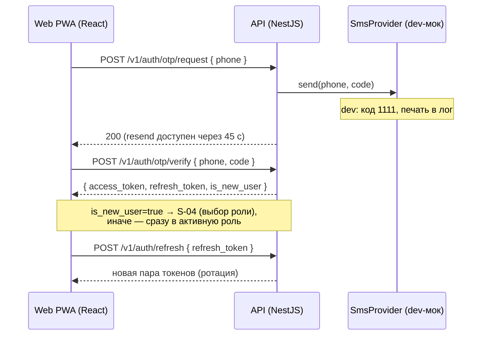
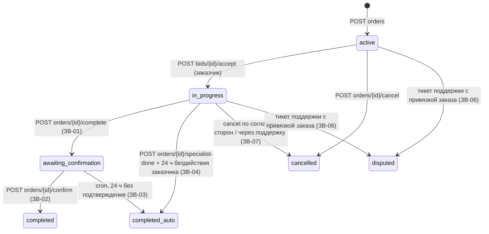
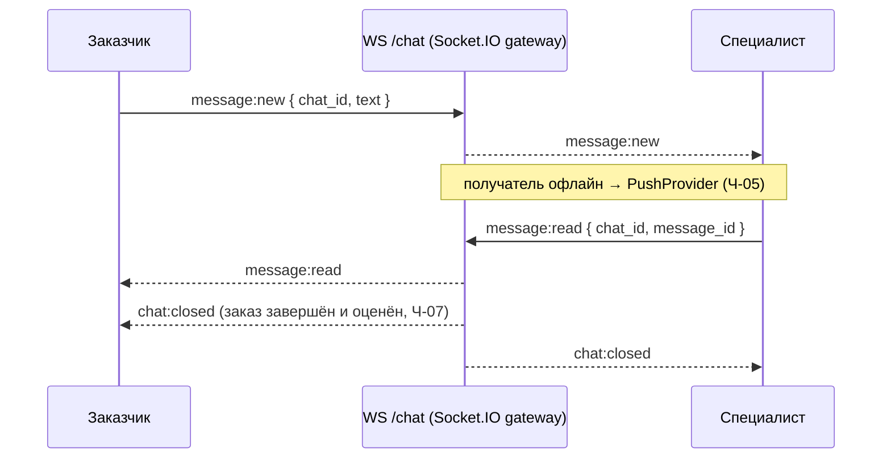

# 04 — API

> Обзор REST-API и WebSocket-контура Zovu. Канонический машиночитаемый контракт — `docs/api/openapi.json`, экспортируется из Swagger NestJS — **TODO(M2)**: файл появится после реализации API-ядра. До этого момента данная страница — единственный source of truth по контуру API.
>
> Соседние страницы: бизнес-правила и state machine — [07-business-rules.md](07-business-rules.md); сущности БД — [03-data-model.md](03-data-model.md); интерфейсы провайдеров (SMS, платежи, push, storage, модерация) — [08-integrations.md](08-integrations.md); экраны, которые потребляют эти эндпоинты — [05-screens.md](05-screens.md); стек и схема взаимодействий — [02-architecture.md](02-architecture.md).

---

## 1. Конвенции

| Правило | Значение |
|---|---|
| Базовый префикс | `REST /v1` (все пути ниже — относительно `/v1`) |
| Формат тел | JSON, ключи в **snake_case** (например, `is_new_user`, `refresh_token`) |
| Аутентификация | Все защищённые эндпоинты — `Authorization: Bearer <access JWT>` |
| Access token | JWT, срок жизни **15 минут** |
| Refresh token | Срок жизни **30 дней**, **с ротацией**: каждый `POST auth/refresh` выдаёт новую пару, старый refresh гасится |
| Админ-API | `admin/*` защищён **статическим админ-токеном** из `.env` (не JWT) |
| Валюта | Целые тенге (`int`), тиыны не используются (см. [03-data-model.md](03-data-model.md)) |
| Формат ошибок | Не зафиксирован в источниках — **TODO(M2)**, финализировать вместе со Swagger |
| Пагинация | Не зафиксирована в источниках — **TODO(M2)** |

Имена полей в примерах ниже — ориентировочные (в духе snake_case-конвенции); точные имена фиксируются в `openapi.json` — **TODO(M2)**.

---

## 2. Аутентификация: OTP → JWT

Правила OTP (НФ-05): код **4 цифры**, TTL **2 минуты**, повторная отправка через **45 секунд**, **5 неверных попыток → код сгорает** (нужен новый запрос). В dev-режиме код всегда `1111` и печатается в лог API (`SmsProvider` — мок, см. [08-integrations.md](08-integrations.md)). Один аккаунт = один номер телефона; роли — флаги на пользователе.

---

## 3. Эндпоинты

### 3.1 Auth

| Метод и путь | Auth | Описание | Трассировка |
|---|---|---|---|
| `POST auth/otp/request` | — | Запросить SMS-код на номер (валидация КЗ-номера) | НФ-05, S-02 |
| `POST auth/otp/verify` | — | Проверить код → пара токенов + `is_new_user` | НФ-05, S-03, S-04 |
| `POST auth/refresh` | refresh | Обновить пару токенов (ротация refresh) | НФ-05 |

### 3.2 Me — профиль и роли

| Метод и путь | Auth | Описание | Трассировка |
|---|---|---|---|
| `GET me` | JWT | Текущий пользователь: роли-флаги, активная роль, язык (ru/kk) | Р-01…Р-05, НФ-02 |
| `PATCH me` | JWT | Обновление профиля (имя, язык и т.д.) | S-35 |
| `POST me/role` | JWT | **switch** (переключить активную роль) / **activate** (активировать вторую роль с доанкетированием) | Р-01…Р-05, S-34 |
| `POST me/devices` | JWT | Регистрация устройства (FCM-токен, платформа) для push | НФ-06 |

Профиль, баланс и история у ролей раздельные (Р-*) — см. [07-business-rules.md](07-business-rules.md).

### 3.3 Specialist — анкета, верификация, диплом

| Метод и путь | Auth | Описание | Трассировка |
|---|---|---|---|
| `POST specialist/profile` | JWT | Анкета специалиста: ФИО, дата рождения, основная и доп. категории, «О себе» ≤ 500 | S-05 |
| `POST specialist/verification` | JWT | Загрузка **2 файлов**: селфи + селфи с документом → статус `pending`. До одобрения отклики заблокированы | В-06, S-06, S-07 |
| `POST specialist/diploma` | JWT | Загрузка диплома jpg/png/pdf ≤ 10 МБ (валидация клиент + сервер) → `pending`, SLA 48 ч, повторная загрузка после отказа | ДС-*, НФ-09, S-05a |

Файлы документов — в **приватном** бакете MinIO, чтение только через админ-эндпоинты (НФ-09). Механизм загрузки (multipart напрямую vs presigned URL) не зафиксирован — **TODO(M3)**. В dev флаг `AUTO_APPROVE_VERIFICATION=true` одобряет верификацию через ~5 сек.

### 3.4 Categories

| Метод и путь | Auth | Описание | Трассировка |
|---|---|---|---|
| `GET categories` | JWT | Справочник категорий (seed-список см. [07-business-rules.md](07-business-rules.md)); `pending`-категории никому не видны | К-05, К-06 |
| `POST categories/suggest` | JWT | Специалист предлагает свою категорию → `pending` → очередь админа (SLA ≤ 1 ч, push о решении). Бонус за одобрение: +3 дня подписки бесплатно | К-02, К-04, К-05, К-06, ADR-002 |

### 3.5 Orders

| Метод и путь | Auth / роль | Описание | Трассировка |
|---|---|---|---|
| `POST orders` | JWT, заказчик | Создание заказа: категория, описание, до 5 фото (сжаты на клиенте, НФ-08), бюджет, адрес/гео, фильтры подбора (Ф-02…Ф-05) | S-20, S-21, Ф-07 |
| `GET orders/my` | JWT | Мои заказы со статусами истории: заказчик — Активный / В работе / Ожидает подтверждения / Выполнен / Выполнен (автозакрытие) / Отменён / На рассмотрении | ИЗ-02, Ч-06 |
| `GET orders/feed` | JWT, специалист | Лента: **гео** (PostGIS `ST_DWithin`/`ST_Distance`) + фильтры заказчика (заказ виден только подходящим специалистам, Ф-07) + отдельный блок **«Новые» — заказы младше 1 минуты** (С-03), затем перетекают в общий список (С-04); сортировка по расстоянию | С-03, С-04, Ф-07, S-11 |
| `GET orders/nearby-map` | JWT | Маркеры для карт: заказы рядом (специалист, S-10) | S-10, S-22 |
| `GET orders/:id` | JWT | Полная карточка заказа | S-12 |
| `POST orders/:id/cancel` | JWT | Отмена: до принятия отклика — свободно; после — по согласию обеих сторон или через поддержку | ЗВ-07 |
| `POST orders/:id/complete` | JWT, заказчик | «Завершить заказ» → `awaiting_confirmation` + push специалисту. Инициирует завершение **только заказчик** | ЗВ-01, S-25 |
| `POST orders/:id/confirm` | JWT, специалист | «Подтвердить выполнение» в течение 24 ч → `completed` | ЗВ-02, S-26 |
| `POST orders/:id/specialist-done` | JWT, специалист | «Работа выполнена с моей стороны»; если заказчик 24 ч бездействует → cron → `completed_auto` | ЗВ-04 |
| `POST orders/:id/hide` | JWT, специалист | Свайп влево в колоде → persist `HiddenOrder`, заказ больше не показывается (undo-снекбар 3 с — на клиенте) | S-11 (колода, §4.3 промпта) |

Форма ответа `feed` для блока «Новые» (отдельный массив vs флаг на карточке) не зафиксирована — **TODO(M2)**. Двухэтапная отмена после принятия («Предложить отмену» → подтверждение второй стороной, ЗВ-07) поверх единственного `orders/:id/cancel` — детализация **TODO(M7)**.

Соответствие эндпоинтов переходам state machine заказа (полные таблицы переходов — в [07-business-rules.md](07-business-rules.md)):

### 3.6 Bids — отклики

| Метод и путь | Auth / роль | Описание | Трассировка |
|---|---|---|---|
| `POST orders/:id/bids` | JWT, специалист | Отклик: цена (принять цену заказчика или предложить свою). Опционально — `availability` (`today` \| `tomorrow` \| `this_week`), `has_materials` (bool), `comment` (≤200). Требования: верификация пройдена (В-06), подписка активна (иначе блок S-17, БП-02/БП-06). Один отклик на заказ от специалиста (уникальность `orderId+specialistId`, повторный отклик — upsert). В ответе — `commission`, `payout` («Вы получите», ADR-001) и структурированные поля `availability`/`has_materials`/`comment` | В-06, БП-02, БП-06, S-13 |
| `GET orders/:id/bids` | JWT, заказчик | Отклики на мой заказ: профиль, бейдж «Дипломированный ✓», рейтинг, `completed_orders`, цена, а также `availability`, `has_materials`, `comment` | S-23, О-05, ОМ-08 |
| `GET bids/my` | JWT, специалист | Мои отклики со статусами: Отклик отправлен / Принят / Выполняется / Ожидает подтверждения / Выполнен / Не выбран / Отменён | ИС-02, S-14 |
| `POST bids/:id/accept` | JWT, заказчик | Принять отклик: bid → `accepted`; **каскад** — все остальные `pending`-отклики заказа → `not_selected` + push каждому; заказ → `in_progress`; создаётся чат (Ч-01); с баланса специалиста списывается комиссия `ORDER_COMMISSION_PCT` от цены принятого отклика (баланс может уйти в минус, ADR-001) | S-24, Ч-01, ADR-001 |
| `POST bids/:id/decline` | JWT, заказчик | Отклонить отклик → `declined` | S-24 |

Статусы bid: `pending → accepted | declined | not_selected` — см. [07-business-rules.md](07-business-rules.md). Ранее отправленные отклики при неактивной подписке **остаются активными** и могут быть приняты (БП-03, БП-04).

### 3.7 Balance / Transactions / Topup

| Метод и путь | Auth / роль | Описание | Трассировка |
|---|---|---|---|
| `GET balance` | JWT, специалист | Текущий баланс, статус подписки, дата следующего списания (100 ₸/день) | Б-01, S-15 |
| `GET transactions` | JWT, специалист | История операций: `topup` (+), `subscription` (−), `commission` (−), `bonus` | S-15 |
| `POST topup` | JWT, специалист | Пополнение (мок `PaymentProvider`: Kaspi / банковская карта — мгновенный успех). Если подписка была неактивна и после пополнения `balance ≥ 100` → **немедленное** списание 100 ₸ + активация | БП-07, S-16 |

### 3.8 Chats — REST + WebSocket

| Метод и путь | Auth | Описание | Трассировка |
|---|---|---|---|
| `GET chats` | JWT | Список чатов пользователя (чат создаётся автоматически при принятии отклика) | Ч-01, S-30 |
| `GET chats/:id/messages` | JWT | История сообщений (доступна из «Моих заказов») | Ч-06 |

**WS namespace `/chat`** (Socket.IO). События:

| Событие | Смысл | Трассировка |
|---|---|---|
| `message:new` | Новое сообщение (только plain text — автоперевод и эмодзи-панель вне скоупа); офлайн-получателю дублируется push | Ч-05, [01-scope.md](01-scope.md) |
| `message:read` | Отметка прочтения (галочки доставки/прочтения в UI) | S-30 |
| `chat:closed` | Чат закрыт: после завершения заказа и оценки чат становится read-only | Ч-07 |

Аутентификация WS-handshake и точные payload'ы событий не зафиксированы — **TODO(M6)**.

### 3.9 Reviews — отзывы

| Метод и путь | Auth | Описание | Трассировка |
|---|---|---|---|
| `POST reviews` | JWT | Оценка 1–5★ + комментарий ≤ 300; **один раз на заказ с каждой стороны** (уникальность `orderId+fromUserId`); текст проходит `Moderator.check` (стоп-словарь RU/KZ в dev) — при срабатывании блок с предложением переформулировать; после автозакрытия окно оценки 7 дней | О-01…О-04, ОМ-01, ОМ-02, ЗВ-05, S-27 |
| `PATCH reviews/:id` | JWT | Редактирование автором в течение **24 ч** после публикации | ОМ-07 |
| `POST reviews/:id/complaint` | JWT | Жалоба на отзыв: причина (оскорбление / ложь / не относится к заказу / иное) → очередь админа; отзыв виден до решения | ОМ-03, ОМ-04 |
| `GET users/:id/reviews` | JWT | Отзывы о пользователе; скрытые админом исключены из выдачи и из среднего рейтинга | О-05, ОМ-06, ОМ-08, S-33 |

### 3.10 Support — тикеты поддержки

| Метод и путь | Auth | Описание | Трассировка |
|---|---|---|---|
| `POST support/tickets` | JWT | Создание обращения: категория (Заказ / Оплата / Жалоба / Верификация / Иное), опциональная привязка заказа, вложения ≤ 5 файлов | СП-03, СП-04, S-31 |
| `GET support/tickets` | JWT | Мои тикеты со статусами `new → in_progress → resolved` | СП-06 |
| `POST support/tickets/:id/messages` | JWT | Сообщение в тикет-чат (отвечает агент поддержки со стороны админки) | S-31 |
| `POST support/tickets/:id/rate` | JWT | Оценка поддержки 1–5★ после закрытия тикета | СП-10 |

Тикет с привязкой заказа может переводить заказ во флаг `disputed` («На рассмотрении») до решения админа (ЗВ-06) — см. [07-business-rules.md](07-business-rules.md).

### 3.11 Notifications

| Метод и путь | Auth | Описание | Трассировка |
|---|---|---|---|
| `GET notifications` | JWT | Лента уведомлений: «Новый отклик на заказ», «Заказ принят», «Низкий баланс», «Верификация пройдена» и пр.; бейдж-счётчик на колокольчике | НФ-06, S-32 |
| `POST notifications/read` | JWT | Отметить прочитанными | S-32 |

Доставка: dev-мок `PushProvider` пишет в `Notification` + эмитит по WS; прод-адаптер FCM — заглушка (см. [08-integrations.md](08-integrations.md)).

### 3.12 Admin (`admin/*`, статический токен)

Единственный web-потребитель — мини-админка (Vite + React). Все действия админа пишутся в аудит-лог (НФ-13).

| Очередь | Действия | Трассировка |
|---|---|---|
| `verification` | approve / reject (с причиной) | В-*, S-07 |
| `diplomas` | approve / reject (с причиной); отзыв статуса «Дипломированный» | ДС-* |
| `categories` | approve (→ доступна всем + бонус 3 дня подписки предложившему) / reject | К-04, К-06, ADR-002 |
| `review-complaints` | hide (отзыв скрыт, исключается из рейтинга с пересчётом) / restore / resolve; уведомления обеим сторонам | ОМ-05, ОМ-06 |
| `tickets` | взять в работу / resolve; переписка с пользователем; решение споров `disputed` | СП-06, СП-07, ЗВ-06 |
| `users` | предупредить (push с причиной) / заблокировать / разблокировать пользователя при нарушениях (`User.blockedAt`, `blockedReason`) | СП-09, ADR-007 |

| Метод и путь | Описание | Трассировка |
|---|---|---|
| `GET admin/audit-log` | Журнал всех действий админа | НФ-13 |

Точная форма роутов очередей и действий (например, `GET admin/verification`, `POST admin/verification/:id/approve`) не зафиксирована в источниках — **TODO(M7)**, финализировать при реализации админки и отразить в `openapi.json`.

### 3.13 Uploads / Files — фото заказа

Реализация загрузки фото заказа (снимает часть **TODO(M3)** для публичных изображений; механизм для приватных документов — верификация, диплом, вложения тикетов — остаётся multipart-vs-presigned открытым). Модуль `apps/api/src/uploads/`.

| Метод и путь | Auth | Описание | Трассировка |
|---|---|---|---|
| `POST uploads/image` | JWT | Загрузка изображения `multipart/form-data`, поле `file`. Лимит **8 МБ** (multer `limits.fileSize`, поток обрывается до буферизации + defense-in-depth проверка размера). Разрешены `image/jpeg`, `image/png`, `image/webp`. Сохраняется в **публичный** бакет → `{ key }` | НФ-08, S-20, S-12 |
| `GET files/public/:name` | — | Раздача публичного файла (фото заказа) по имени. **Без авторизации**. Только имена вида `^[a-z0-9]+\.(jpg\|jpeg\|png\|webp)$` (guard от path-traversal), отдаётся строго из бакета `public/`. Заголовки: `Content-Type` по расширению, `Cache-Control: public, max-age=31536000, immutable`, `X-Content-Type-Options: nosniff` | НФ-08, S-12 |

**Приватный** бакет (селфи/документы верификации, дипломы — НФ-09) через `files/public/:name` **недоступен** — раздаётся только `public/`. Фото передаются в `POST orders` как `Order.photos` (`String[]`, ключи из `uploads/image`); клиент строит URL через `lib/image.ts` (`fileUrl`) и предварительно сжимает изображение (`compressImage`, Canvas — НФ-08).

---

## 4. Кроны (`@nestjs/schedule`)

| Расписание | Задача | Трассировка |
|---|---|---|
| Ежедневно **00:00 Asia/Almaty** | Списание подписки 100 ₸ у специалистов с активной подпиской (`Transaction: subscription`); при `balance < 100` → подписка неактивна + push «Низкий баланс»; даты `subscriptionFreeUntil` (бонус за категорию) пропускаются | Б-03…Б-05, БП-*, ADR-002 |
| Каждые **10 минут** | 1) Автозакрытие заказов: 24 ч без подтверждения специалиста после «Завершить» → `completed_auto` (ЗВ-03); 24 ч бездействия заказчика после «specialist-done» → `completed_auto` (ЗВ-04). 2) Заказ без откликов 10 минут → push заказчику «Смягчите фильтры» | ЗВ-03, ЗВ-04, Ф-08 |
| Каждую **минуту** | Очистка протухших OTP-кодов | НФ-05 |

---

## 5. Swagger / OpenAPI

- Swagger подключается в NestJS в майлстоуне M2; спецификация экспортируется в **`docs/api/openapi.json`** — **TODO(M2)**.
- После появления `openapi.json` он становится каноном полевых контрактов (имена полей, схемы запросов/ответов, коды ошибок); данная страница остаётся обзором и картой трассировки на требования.
- Правило вики: расхождение `openapi.json` ↔ кода ↔ этой страницы — баг, чинить немедленно (см. [10-status.md](10-status.md) и [09-decisions.md](09-decisions.md)).

---

## Открытые вопросы

- **TODO(M2)** — точные схемы запросов/ответов, формат ошибок и пагинация не заданы в источниках; фиксируются при генерации `openapi.json`.
- **TODO(M2)** — форма блока «Новые» в ответе `GET orders/feed` (отдельный массив vs флаг `is_new` на карточке).
- **TODO(M3)** — механизм загрузки файлов (multipart напрямую в API vs presigned URL MinIO) для верификации, диплома и вложений тикетов. Для **фото заказа решено**: прямой multipart `POST uploads/image` в публичный бакет + раздача `GET files/public/:name` (§3.13).
- **TODO(M4)** — эндпоинт для «Сохранить фильтры как пресет» (Ф-09, low priority) в §8 промпта отсутствует.
- **TODO(M6)** — аутентификация WS-handshake `/chat` и точные payload'ы событий `message:new` / `message:read` / `chat:closed`.
- **TODO(M7)** — точные роуты действий `admin/*` (форма URL для очередей и approve/reject/hide/restore/resolve).
- **TODO(M7)** — реализация двухэтапной отмены после принятия отклика (ЗВ-07: «Предложить отмену» → подтверждение второй стороной) поверх единственного `POST orders/:id/cancel`.
- **TODO(M5)** — где отдаётся streak специалиста (`streakDays`): в `GET me`, `GET balance` или отдельным эндпоинтом — в §8 не задано.
