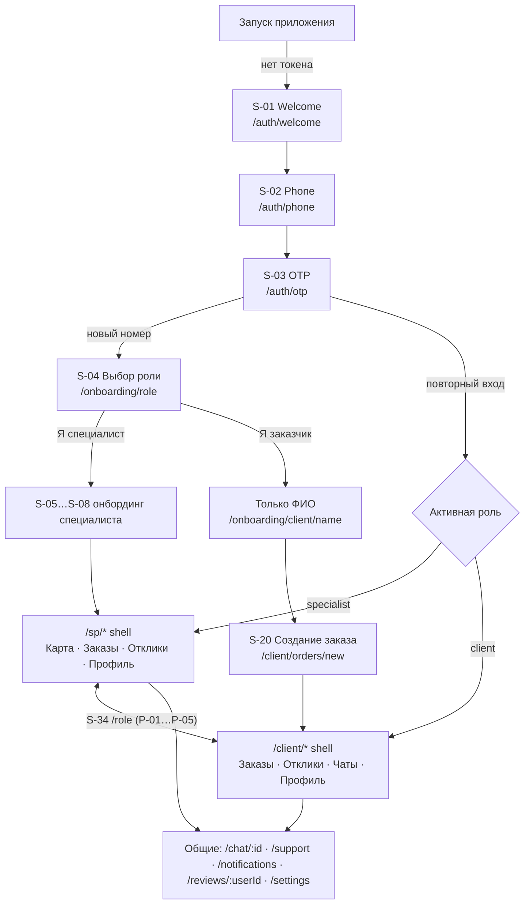
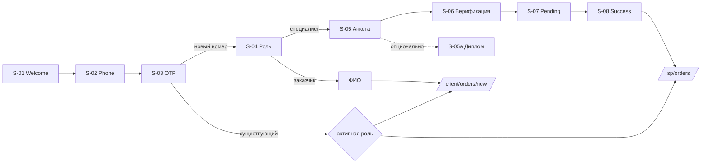
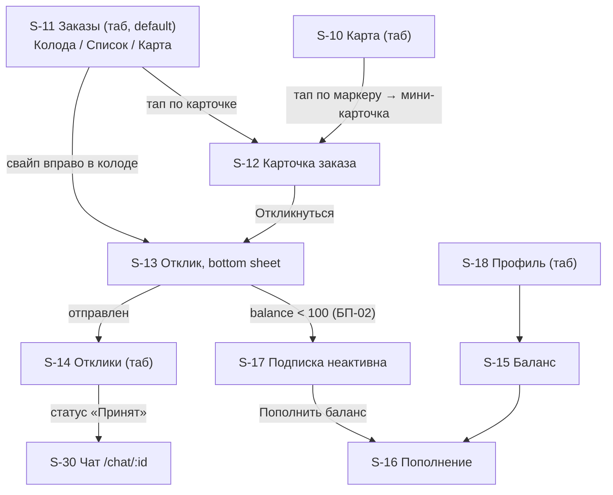
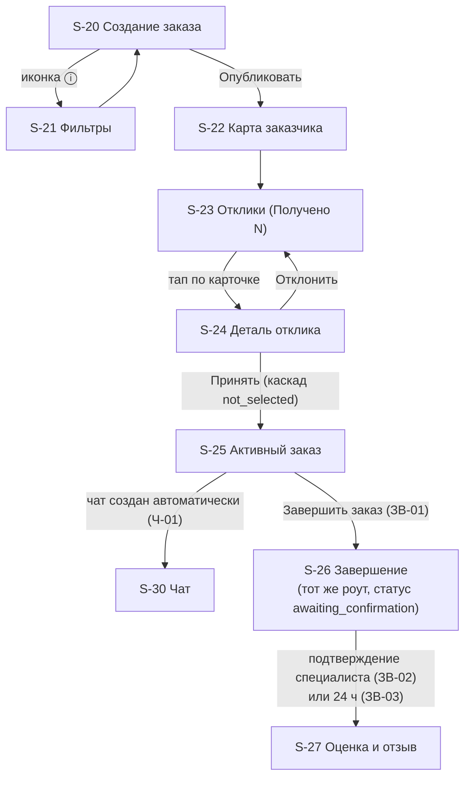

# 05 — Карта экранов S-01…S-35

> Источник: `ZOVU_PROMPT.md` §5 (карта экранов), §4.3 (Tinder-колода), §6 (бизнес-правила, на которые ссылаются экраны) и `ZOVU_DESIGN_HANDOFF.md` §3 (маппинг на design-ассеты). Эта страница — единственный канон по экранам, роутам, переходам и диплинкам. Визуальные токены и компоненты — в [06-design-system.md](06-design-system.md); state machine заказа/отклика и денежные правила — в [07-business-rules.md](07-business-rules.md); эндпоинты — в [04-api.md](04-api.md); термины — в [glossary.md](glossary.md).

Нумерация S-XX сквозная, с намеренными «дырами» (S-09, S-19, S-28, S-29 зарезервированы, не используются). Группы соответствуют четырём листам мокапов (`design/mockups/zovu1–4.png`):

- **Лист 1** — онбординг и auth: S-01…S-08 (+ подэкран S-05a)
- **Лист 2** — специалист: S-10…S-18
- **Лист 3** — заказчик: S-20…S-27
- **Лист 4** — общие: S-30…S-35

---

## 1. Схема роутинга (React Router — ADR-008)

Соглашения (приняты этой страницей, kebab-case):

- `/auth/*` — стек до получения токена.
- `/onboarding/*` — стек после первого OTP (новый номер): выбор роли, анкета, верификация.
- `/sp/*` — shell специалиста с таббаром **Карта / Заказы / Отклики / Профиль**.
- `/client/*` — shell заказчика с таббаром **Заказы / Отклики / Чаты / Профиль**.
- Общие полноэкранные роуты вне shell'ов: `/chat/:id`, `/support`, `/notifications`, `/reviews/:userId`, `/role`, `/settings`.
- `/dev/uikit` — скрытый экран всех компонентов UI-кита (майлстоун M1, канвас `components.dc.html`).
- Путь роута = путь диплинка: web-URL (`/chat/42`) и, для установленной PWA, кастомная схема `zovu://` + тот же путь. Universal/App Links — TODO(M6): домен не задан в источниках.

### Redirect-guard'ы (глобальные, в `src/router`)

| Условие | Redirect |
|---|---|
| Нет токена | `/auth/welcome` (S-01) |
| Токен есть, роль не выбрана (новый номер) | `/onboarding/role` (S-04) |
| `activeRole = specialist`, анкета не заполнена | `/onboarding/specialist/profile` (S-05) |
| `activeRole = specialist`, `verificationStatus = pending` | `/onboarding/specialist/pending` (S-07) — отклики заблокированы (В-06) |
| `activeRole = specialist`, верификация пройдена | `/sp/orders` (S-11, колода — главный экран специалиста по §4.3) |
| `activeRole = client` | новый пользователь → `/client/orders/new` (S-20 — «первый экран заказчика после входа»); повторный вход → `/client/orders` |
| Специалист жмёт «Откликнуться» при неактивной подписке (`balance < 100`) | `/sp/subscription-lock` (S-17; БП-02, БП-06) |

### Общий граф навигации

### Сводная таблица роутов

| S | Экран | Роут | Тип |
|---|---|---|---|
| S-01 | Welcome | `/auth/welcome` | fullscreen |
| S-02 | Phone input | `/auth/phone` | fullscreen |
| S-03 | OTP | `/auth/otp` | fullscreen |
| S-04 | Выбор роли | `/onboarding/role` | fullscreen |
| — | ФИО заказчика (без S-номера) | `/onboarding/client/name` | fullscreen |
| S-05 | Анкета специалиста (шаг 1) | `/onboarding/specialist/profile` | fullscreen, progress 1/4 |
| S-05a | Загрузка диплома | `/onboarding/specialist/diploma` | bottom sheet / push |
| S-06 | Верификация (шаг 2) | `/onboarding/specialist/verification` | fullscreen, progress |
| S-07 | Pending | `/onboarding/specialist/pending` | fullscreen |
| S-08 | Success | `/onboarding/specialist/success` | fullscreen |
| S-10 | Карта специалиста | `/sp/map` | таб 1 |
| S-11 | Заказы (Колода/Список/Карта) | `/sp/orders?view=deck\|list\|map` | таб 2 (default-таб shell'а) |
| S-12 | Карточка заказа | `/sp/orders/:id` | push |
| S-13 | Отклик | `/sp/orders/:id/bid` | bottom sheet |
| S-14 | Отклики специалиста | `/sp/bids?tab=all\|active\|done` | таб 3 |
| S-15 | Баланс | `/sp/balance` | push (из S-18 и пушей) |
| S-16 | Пополнение | `/sp/balance/topup` | push |
| S-17 | Подписка неактивна | `/sp/subscription-lock` | fullscreen-блок |
| S-18 | Профиль специалиста | `/sp/profile` | таб 4 |
| S-20 | Создание заказа | `/client/orders/new` | таб 1 (форма) |
| — | Мои заказы (без S-номера; ИЗ-02, Ч-06) | `/client/orders` | таб 1 (рут) |
| S-21 | Фильтры подбора | `/client/orders/new/filters` (при редактировании — `/client/orders/:id/filters`) | bottom sheet |
| S-22 | Карта заказчика | `/client/map` | push (карта всех своих заказов) |
| S-23 | Отклики по заказу | `/client/orders/:id/bids` | таб 2 (через рут `/client/bids`) |
| S-24 | Деталь отклика | `/client/orders/:id/bids/:bidId` | push |
| S-25 | Активный заказ | `/client/orders/:id` | push |
| S-26 | Завершение | `/client/orders/:id` (состояние `awaiting_confirmation`/`completed`) | тот же роут |
| S-27 | Оценка и отзыв | `/client/orders/:id/review` (у специалиста — `/sp/orders/:id/review`, тот же виджет) | fullscreen-модал |
| — | Чаты заказчика (без S-номера) | `/client/chats` | таб 3 |
| — | Профиль заказчика (без S-номера) | `/client/profile` | таб 4 |
| S-30 | Чат | `/chat/:id` | fullscreen |
| S-31 | Поддержка | `/support`, `/support/new`, `/support/:id` | fullscreen |
| S-32 | Уведомления | `/notifications` | fullscreen |
| S-33 | Отзывы о пользователе | `/reviews/:userId` | fullscreen |
| S-34 | Роль | `/role` | fullscreen |
| S-35 | Настройки | `/settings` | push из S-18 / профиля заказчика |
| — | UI-kit (dev) | `/dev/uikit` | скрытый |

---

## 2. Лист 1 — Онбординг и auth (S-01…S-08)

Канвас: `design/canvases/onboarding.dc.html`, скриншоты `design/screenshots/onb-*.png`.

### S-01 Welcome — `/auth/welcome`
- **Содержимое:** лого Zovu, слоган «Находим специалистов рядом», CTA «Начать».
- **Правила:** показывается только без токена.
- **Переходы:** «Начать» → S-02.

### S-02 Phone input — `/auth/phone`
- **Содержимое:** заголовок «Ваш номер», подпись «Мы отправим код подтверждения в SMS», префикс +7, маска `912 345-67-89`, CTA «Получить код».
- **Правила:** валидация казахстанского номера; CTA активна только при полном номере. API: `POST auth/otp/request`.
- **Переходы:** назад → S-01; «Получить код» → S-03.

### S-03 OTP — `/auth/otp`
- **Содержимое:** «Введите код из SMS», 4 ячейки, таймер «Отправить код повторно 00:45».
- **Правила (НФ-05, §6.7):** TTL кода **2 минуты**; resend через 45 с; 5 неверных попыток → код сгорает, нужен новый. В dev код всегда `1111` и печатается в лог API. Моушн: ячейка подпрыгивает при вводе (scale 1→1.08→1), ошибка — shake + heavy haptic (§4.2). API: `POST auth/otp/verify` → tokens + `isNewUser`.
- **Переходы:** успех + `isNewUser=true` → S-04; успех + существующий пользователь → shell активной роли (guard).

### S-04 Role choice — `/onboarding/role`
- **Содержимое:** «Кто вы?», карточки «Я заказчик» / «Я специалист».
- **Правила:** показывается **только новым номерам**; повторный вход — сразу в активную роль. Выбор пишет флаги `isClient`/`isSpecialist` + `activeRole` (`POST me/role`).
- **Переходы:** «Я специалист» → S-05; «Я заказчик» → экран ФИО (`/onboarding/client/name`, без S-номера — заказчик «заполняет только ФИО») → S-20.

### S-05 Specialist form, шаг 1 — `/onboarding/specialist/profile`
- **Содержимое:** «Расскажите о себе»; поля: ФИО\*, дата рождения\* (ДД.ММ.ГГГГ), основная категория\* (справочник, см. [07-business-rules.md](07-business-rules.md) §категории), доп. категории (мультивыбор), «О себе» (счётчик 0/500), пунктирная кнопка «Загрузить диплом» (опционально → S-05a). Толстый закруглённый Duolingo-progress bar, шаги 1–4, анимированное заполнение (§4.2).
- **Правила:** обязательные поля со звёздочкой; «О себе» ≤ 500 символов. API: `POST specialist/profile`.
- **Переходы:** «Продолжить» → S-06; «Загрузить диплом» → S-05a.

### S-05a Загрузка диплома — `/onboarding/specialist/diploma`
- **Содержимое:** выбор файла диплома.
- **Правила (ДС-\*):** jpg/png/pdf ≤ 10 МБ, валидация на клиенте и сервере; статусы `none → pending → approved | rejected(reason)`; SLA 48 ч; push о результате; файл — в приватном бакете MinIO, доступ только админ-эндпоинтам (НФ-09). Повторная загрузка после отказа разрешена. API: `POST specialist/diploma`. В канвасе онбординга есть состояние «Диплом на проверке».
- **Переходы:** назад → S-05 (диплом не блокирует онбординг).

### S-06 Verification, шаг 2 — `/onboarding/specialist/verification`
- **Содержимое:** «Подтверждение личности», подпись «Загрузите фотографии для проверки»; две карточки-загрузки: «Селфи» («Сделайте фото своего лица») и «Селфи с документом» («С документом в руках»), источник — камера/галерея; CTA «Отправить на проверку».
- **Правила:** обе фотографии обязательны для отправки. **До прохождения верификации отклики заблокированы (В-06).** API: `POST specialist/verification` (2 файла).
- **Переходы:** «Отправить на проверку» → S-07.

### S-07 Pending — `/onboarding/specialist/pending`
- **Содержимое:** иллюстрация часов (стиль §4.4 — простые формы, primarySoft-палитра), «Проверяем ваши данные», текст «Обычно проверка занимает от нескольких минут до 24 часов. Мы пришлём уведомление.» (текст мокапа; целевой SLA в вики — 1 ч, см. [01-scope.md](01-scope.md), дельта №5).
- **Правила:** обновление статуса по push + polling. В dev `AUTO_APPROVE_VERIFICATION=true` — одобрение через ~5 сек.
- **Переходы:** одобрение → S-08; отказ → назад на S-06 с причиной (reason из `VerificationRequest`).

### S-08 Success — `/onboarding/specialist/success`
- **Содержимое:** зелёный чек с burst-частицами + confetti + medium haptic (§4.2), «Верификация пройдена», подпись «Спасибо! Ваш профиль успешно подтверждён.», CTA «Продолжить».
- **Переходы:** «Продолжить» → рабочее пространство специалиста `/sp/orders` (S-11).

---

## 3. Лист 2 — Специалист (S-10…S-18)

Канвас: `design/canvases/specialist.dc.html`. **Tinder-колода в экспорте НЕ отрисована** — реализуется по §4.3 промпта поверх этих экранов (см. ниже S-11). Shell-таббар: **Карта / Заказы / Отклики / Профиль**.

### S-10 Карта — `/sp/map` (таб 1)
- **Содержимое:** **реальная** карта Leaflet + OSM-тайлы (не заглушка) с маркерами-пилюлями активных заказов **в категориях специалиста**; на пине — цена заказа. Реализация: `components/MapView.tsx` (инициализация Leaflet, tileLayer OSM, брендовые `divIcon`-пины), обёртка `features/orders/OrdersMap.tsx`, экран `features/orders/SpecialistMapScreen.tsx`. Позиция — Geolocation (`lib/useGeo`), fallback — центр Алматы (`ALMATY_FALLBACK`). Данные — `fetchFeed(lat, lng)` c `refetchInterval` 15 с. Кластеризация при зуме — TODO.
- **Правила:** показываются только заказы, под фильтры которых специалист подходит (Ф-07). API: `GET orders/feed` (тот же, что у ленты S-11).
- **Переходы:** тап по маркеру → S-12 (`/sp/orders/:id`).

### S-11 Заказы — `/sp/orders?view=deck|list|map` (таб 2, default-таб)
- **Содержимое:** segmented control с тремя видами: **Колода (default) / Список / Карта**. Заголовок листа — «Лента заказов».
  - **Колода (§4.3):** стопка карточек заказа — фото (или заглушка категории), чип категории, цена крупно, расстояние, описание в 2 строки, «когда удобно». Жесты: **свайп вправо** → S-13 (bottom sheet отклика); **свайп влево** → скрыть заказ (persist в `HiddenOrder`, `POST orders/:id/hide`, больше не показывать) + undo-снекбар 3 сек; **тап** → S-12. Физика: rotation до ±8°, полупрозрачные overlay-иконки ✓/✕ растут по мере свайпа, haptic на пороге срабатывания. Пустая колода → дружелюбный empty state + кнопка «Открыть карту» (→ S-10).
  - **Список:** фильтры-чипы «Новые (N)» / «Рядом» / «Все». Блок **«Новые»** — заказы младше 1 минуты, отдельно сверху (С-03), затем перетекают в общий список (С-04). Сортировка по расстоянию. Карточка: чип «Новый», название, адрес, цена, расстояние, «N мин назад». Staggered-появление (§4.2).
  - **Карта:** тот же виджет карты, что и S-10, встроенный в таб.
- **Правила:** выдача — `GET orders/feed` (гео + фильтры заказчиков + блок new<1min); скрытые заказы исключены.
- **Переходы:** карточка/тап → S-12; свайп вправо → S-13.

### S-12 Карточка заказа — `/sp/orders/:id`
- **Содержимое:** **галерея реальных фото заказа** (`order.photos`, горизонтальная лента `img src={fileUrl(key)}`); если фото нет — заглушка-иконка категории. Далее чип категории, название, цена крупно, адрес, секция «Описание», CTA «Откликнуться». Пока грузится — `SkeletonDetail`. Фото отдаются публичным файл-роутом (`GET /v1/files/public/:name`, без авторизации, только public-бакет), см. S-20 и [08-integrations.md](08-integrations.md).
- **Правила:** CTA «Откликнуться» доступна одна на экран (§4.5); при неактивной подписке → S-17; при непройденной верификации отклик заблокирован (В-06). Для заказа со статусом `in_progress`, где отклик специалиста принят, этот же роут показывает состояние активного заказа с CTA «Подтвердить выполнение» (ЗВ-02) и «Работа выполнена с моей стороны» (ЗВ-04) — отдельного S-номера у этого состояния нет, статусы специалиста по ИС-02.
- **Переходы:** «Откликнуться» → S-13; из состояния активного заказа → S-30 (чат), S-27-виджет оценки (`/sp/orders/:id/review`).

### S-13 Отклик — `/sp/orders/:id/bid` (bottom sheet, радиус 20)
- **Содержимое:** сводка заказа, поле «Ваша цена» (предзаполнено ценой заказчика), строки «Комиссия сервиса» и «Вы получите» (пересчёт на лету по `ORDER_COMMISSION_PCT`, ADR-001 → [09-decisions.md](09-decisions.md)), кнопки «Принять цену» (primary) / «Предложить свою» (secondary), подпись «Клиент увидит вашу цену и примет решение.».
- **Правила:** комиссия рассчитывается от цены отклика, показывается **до** отправки; списывается при принятии отклика заказчиком (§6.2). Блокировки: подписка неактивна → S-17 (БП-02); верификация не пройдена → В-06. Один отклик на заказ (уникальность `(orderId, specialistId)`). API: `POST orders/:id/bids`.
- **Переходы:** отправка → снекбар/статус «Ожидание ответа» → S-14; блок → S-17.

### S-14 Отклики — `/sp/bids?tab=all|active|done` (таб 3)
- **Содержимое:** табы «Все / Активные / Завершённые»; карточки откликов со статус-чипами «Ожидание ответа» (warning), «Принят» (success), «Не выбран» (inkSecondary `#6B7280` на divider `#F0F1F4`) — палитра чипов в [06-design-system.md](06-design-system.md).
- **Правила:** полный набор статусов истории специалиста (ИС-02): Отклик отправлен / Принят / Выполняется / Ожидает подтверждения / Выполнен / Не выбран / Отменён. Отклики, отправленные до деактивации подписки, остаются активными (БП-03) и могут быть приняты (БП-04). API: `GET bids/my`.
- **Переходы:** карточка «Принят»/«Выполняется» → S-30 чат и/или `/sp/orders/:id`; завершённые → S-27-виджет оценки, если окно оценки открыто (7 дней после автозакрытия, ЗВ-05).

### S-15 Баланс — `/sp/balance`
- **Содержимое:** синяя карточка (primary #4C6FFF): «Текущий баланс», «Следующее списание <дата> · 100 ₸/день», чип «Подписка активна/неактивна»; ниже — «История операций»: пополнения (+), «Списание за подписку» (−), «Комиссия за заказ» (−), бонусы. Баланс — анимированный счётчик (§4.2).
- **Правила:** после регистрации `balance = 0`, подписка неактивна, новые отклики заблокированы (Б-01). Списание 100 ₸/день кроном 00:00 Asia/Almaty; `balance < 100` → подписка неактивна + push «Низкий баланс» (Б-03…Б-05). `subscriptionFreeUntil` (бонус К-06/ADR-002) — крон пропускает списание. API: `GET balance`, `GET transactions`.
- **Переходы:** CTA пополнения → S-16; вход — из S-18, из S-17, из push «Низкий баланс».

### S-16 Пополнение — `/sp/balance/topup`
- **Содержимое:** «Введите сумму», пресеты 1000/2000/5000/10000 ₸, «Способ оплаты»: Kaspi / Банковская карта (радио), подпись «Комиссия не взимается», CTA «Пополнить».
- **Правила:** платёж — мок (`PaymentProvider`, [08-integrations.md](08-integrations.md)) → мгновенный успех → обновление баланса с анимацией. Если подписка была неактивна и после пополнения `balance ≥ 100` → немедленное списание 100 ₸ и активация, статус «Подписка активна» (БП-07). API: `POST topup`.
- **Переходы:** успех → назад на S-15 (баланс анимированно растёт).

### S-17 Подписка неактивна — `/sp/subscription-lock` (fullscreen-блок)
- **Содержимое:** иллюстрация кошелька, заголовок «Пополните баланс», текст «Баланс нулевой, поэтому отклики недоступны. Пополните баланс, чтобы продолжить работу.», CTA «Пополнить баланс», ссылка «Подробнее о подписке» (БП-06).
- **Правила:** показывается при попытке отклика с `balance < 100` (БП-02). Ранее отправленные отклики остаются активными и видны заказчикам (БП-03). Цель ссылки «Подробнее о подписке» в источниках не описана — TODO(M5).
- **Переходы:** «Пополнить баланс» → S-16; закрыть → назад.

### S-18 Профиль специалиста — `/sp/profile` (таб 4)
- **Содержимое:** аватар, имя, ★рейтинг (анимированный счётчик), «N заказов», бейдж «Дипломированный ✓» (если `diplomaStatus=approved`), метка «Подписка неактивна» (если так, БП-05), категории + кнопка «Добавить» (→ предложение своей категории, К-02: вводится название, статус `pending`, никому не видна до одобрения — К-05; push о результате — К-04), «Портфолио» (N работ), «Отзывы» (N) → S-33, «О себе». Streak-чип 🔥N при фичефлаге `gamification=on` (§4.4).
- **Правила:** рейтинг — кэш `SpecialistProfile.rating`, скрытые отзывы исключены из среднего (ОМ-06). API: `GET me`, `POST categories/suggest`.
- **Переходы:** «Отзывы» → S-33 (`/reviews/:userId` со своим id); баланс → S-15; шестерёнка/настройки → S-35; смена роли → S-34.

---

## 4. Лист 3 — Заказчик (S-20…S-27)

Канвас: `design/canvases/client.dc.html`. Shell-таббар: **Заказы / Отклики / Чаты / Профиль**. Четвёртая вкладка «Профиль» ведёт на собственный экран заказчика `/client/profile` (`CLIENT_TABS` в `router/routes.ts`) — ранее она ошибочно указывала на `/sp/profile` (профиль специалиста); исправлено.

### S-20 Создание заказа — `/client/orders/new` (таб «Заказы», первый экран заказчика после входа)
- **Содержимое:** заголовок «Создание заказа»; категория\* (bottom sheet справочника + «Предложить свою»), «Что надо сделать»\*, **фото-пикер «Фото (до 5)»** — сетка миниатюр загруженных фото (с крестиком удаления) + плитка добавления (`<input type=file accept=image/* multiple>`, спиннер во время загрузки, пофайловый catch — одно битое фото не роняет остальные); клиентское сжатие через Canvas (`lib/image.ts` `compressImage`, НФ-08); «Бюджет (₸)»\* с подсказкой ориентировочного бюджета по категории и предупреждением при слишком низкой сумме; «Адрес» (автоопределение по Geolocation API + ручной ввод); CTA «Опубликовать». Иконка-фильтр в AppBar → S-21 (шит фильтров прямо в этом экране). Черновик всех полей (включая `photos`) переживает выход через `localStorage` (`zovu.orderDraft`), очищается после публикации.
- **Правила:** обязательные поля со звёздочкой; ≤ 5 фото. Каждое фото грузится через `POST /v1/uploads/image` (JWT, multipart поле `file`, ≤ 8 МБ, jpg/png/webp) → `{key}` в публичном бакете; `order.photos` (String[]) хранит эти ключи. Публикация → заказ `active` (state machine в [07-business-rules.md](07-business-rules.md)). API: `POST orders`, `POST /v1/uploads/image`.
- **Переходы:** ⓘ → S-21; «Опубликовать» → S-22 (переход выведен из порядка экранов на листе 3 мокапа — явной стрелки в промпте нет, см. openQuestions); таб-рут при повторном входе — «Мои заказы» `/client/orders` (список с чипами статусов ИЗ-02: Активный / В работе / Ожидает подтверждения / Выполнен / Выполнен (автозакрытие) / Отменён / На рассмотрении; экран подразумевается Ч-06 «история в „Моих заказах“» и `GET orders/my`, но S-номера не имеет).

### S-21 Фильтры подбора — `/client/orders/new/filters` (bottom sheet; для опубликованного заказа — `/client/orders/:id/filters`)
- **Содержимое:** заголовок «Фильтры»; «Только дипломированные» (свитч, Ф-02); «Мин. рейтинг» (1.0–5.0, шаг 0.5, Ф-03); «Опыт работы» (≥5 / ≥20 / ≥50 заказов, Ф-04); «Расстояние» (слайдер 1–50 км, Ф-05); «Сбросить»; CTA «Показать N специалистов» (живой счётчик подходящих); «Сохранить как пресет» (Ф-09, low priority).
- **Правила:** панель фильтров доступна и при создании, и на опубликованном заказе (Ф-01); специалисты вне фильтров заказ **не видят** (Ф-07 — фильтрация на бэке в feed/map). Если 10 минут нет откликов → push «Смягчите фильтры» (Ф-08, крон каждые 10 мин). Фильтр «Тип исполнителя» (Ф-06) удалён вместе с B2B — см. [01-scope.md](01-scope.md).
- **Переходы:** «Показать N специалистов» → назад на S-20 (или S-22, если заказ уже опубликован).

### S-22 Карта заказчика — `/client/map`
- **Содержимое:** **реальная** карта Leaflet + OSM (не заглушка): маркеры-пилюли всех своих заказов с гео (`variant: 'me'`, зелёные, на пине — бюджет). Тап по пину → снизу выезжает карточка «Ваш заказ: <название> · <категория · адрес> · <бюджет>» с кнопкой «Открыть». Пустое состояние (нет заказов с гео) → `EmptyState`. Реализация: `features/orders/ClientMapScreen.tsx` поверх `components/MapView.tsx`; данные — `fetchMyOrders`.
- **Правила:** показываются заказы заказчика, у которых есть координаты (`lat/lng`). Прежняя семантика «маркеры подходящих специалистов вокруг заказа» в текущей реализации не используется — карта показывает **свои заказы**, а не специалистов.
- **Переходы:** «Открыть» → для `active`-заказа S-23 (`/client/orders/:id/bids`), иначе S-25 (`/client/orders/:id`).

### S-23 Отклики (список) — `/client/orders/:id/bids` (таб «Отклики», рут `/client/bids`)
- **Содержимое:** заголовок «Получено N откликов» (русская плюрализация i18next `bidsReceived_one/_few/_many`). Показываются только активные отклики (`pending`/`accepted`).
  - **Waiting-state (пока откликов нет):** экран ожидания «Ищем специалистов рядом…» (`matching.title`) — пульсирующая иконка поиска, подсказка (`matching.hint`), счётчик-ноль (`matching.counterZero`) и 1–2 скелетон-карточки (`SkeletonBidCard`). Реализация — компонент `MatchingState` в `OrderBidsScreen.tsx`.
  - **Карточка отклика (структурный отклик, 4 сигнала доверия):** фото/аватар, имя, и:
    1. **честный рейтинг ИЛИ бейдж «Новый специалист»** (`NewSpecialistBadge`) — звёзды показываются только при реальной истории (`completed_orders > 0 && rating > 0`), иначе честно «Новый специалист» вместо фейковых 0.0★;
    2. **`VerifiedBadge` «Личность подтверждена»** (`trust.verified`) — всегда у верифицированного специалиста;
    3. **`DiplomaBadge` «Дипломированный»** — если `diploma` (ДС-\*);
    4. **структурный отклик** — теги доступности «Готов сегодня/завтра/на этой неделе» (`availability` → `today|tomorrow|this_week`), «Со своими материалами» (`has_materials`) и свободный `comment` специалиста.
  - Цена `price`, статус-пилюля `BidStatusPill` («Ожидает решения» / «Принят», ключи `bidStatus.*`). Для `pending` — кнопки «Отклонить» / «Принять» прямо на карточке.
- **Правила:** список поллится (`refetchInterval` 5 с). Рейтинг и отзывы специалиста видны заказчику; скрытые отзывы исключены (О-05, ОМ-08). Структурные поля отклика приходят из модели `Bid` (миграция `bid_structured`, Спринт 1): `availability`, `has_materials`, `comment` (snake_case в API). Таб-рут `/client/bids`: при одном активном заказе — сразу S-23 этого заказа; при нескольких — группировка по заказам (кейс в источниках не описан — TODO(M4), см. openQuestions). API: `GET orders/:id/bids`.
- **Переходы:** «Принять» → каскад `not_selected` + S-25; «Отклонить» → отклик `declined`, остаётся на списке. (Экран S-24 «Деталь отклика» в текущей реализации свёрнут в карточку S-23 — тот же `OrderBidsScreen` отвечает и на роут `/client/orders/:id/bids/:bidId`.)

### S-24 Деталь отклика — `/client/orders/:id/bids/:bidId`
> **Текущая реализация:** отдельного экрана детали нет — роут `/client/orders/:id/bids/:bidId` рендерит тот же `OrderBidsScreen`, что и S-23. Действия «Принять» / «Отклонить» и структурный отклик показаны прямо на карточке S-23 (см. выше). Описание ниже — целевой полноэкранный вид.
- **Содержимое:** заголовок «Детали отклика»; профиль специалиста: бейдж «Дипломированный», о себе, ★рейтинг, N заказов, расстояние; «Предложение N ₸»; «Сроки»; кнопки «Отклонить» / «Принять».
- **Правила:** «Принять» → bid `accepted`, **все остальные pending-отклики заказа → `not_selected` + push каждому (каскад)**, заказ → `in_progress`, в момент принятия с баланса специалиста списывается комиссия (ADR-001), создаётся чат (Ч-01). «Отклонить» → bid `declined`. API: `POST bids/:id/accept`, `POST bids/:id/decline`.
- **Переходы:** «Принять» → S-25 (и автооткрытие S-30 — чат создан); «Отклонить» → назад на S-23; тап по профилю → S-33 (отзывы специалиста).

### S-25 Активный заказ — `/client/orders/:id`
- **Содержимое:** статус-баннер по состоянию заказа (`in_progress` «В работе», `awaiting_confirmation` «Ожидает подтверждения», `completed`/`completed_auto` «Выполнен»); ниже — **таймлайн статуса** `StatusTimeline` (Опубликован → Выбран → В работе → Выполнено → Оценено, Uber/DoorDash-стиль; текущий шаг подсвечен, пройденные — с чеком; для `cancelled`/`disputed` таймлайн скрыт); **карточка исполнителя** `PerformerCard` (фото, честный рейтинг при наличии истории, `VerifiedBadge` + кнопка входа в чат) — берётся из принятого отклика (`bids.find(status==='accepted')`); строки «Бюджет» / «Адрес»; CTA «Завершить заказ» (для `in_progress`) либо «Оставить отзыв» (для `completed`/`completed_auto`). Пока заказ грузится — `SkeletonDetail`. Реализация: `features/deal/ActiveOrderScreen.tsx`, `components/ui/StatusTimeline.tsx`.
- **Правила:** «Завершить» жмёт **только заказчик** (ЗВ-01) → заказ `awaiting_confirmation` + push специалисту. Отмена после принятия — по согласию обеих сторон («Предложить отмену» → подтверждение второй стороной) или через поддержку (ЗВ-07); спор — тикет с привязкой заказа → флаг `disputed` / чип «На рассмотрении» (ЗВ-06). API: `POST orders/:id/complete`, `POST orders/:id/cancel`.
- **Переходы:** «Завершить заказ» → S-26 (тот же роут, новое состояние); чат (кнопка в карточке исполнителя) → S-30; «Оставить отзыв» → S-27; «Исполнитель» → S-33.

### S-26 Завершение — `/client/orders/:id` (состояние, не отдельный роут)
- **Содержимое:** баннер «Ожидает подтверждения — Проверьте работу и подтвердите выполнение заказа.» → после подтверждения специалистом зелёный блок «Выполнен · Заказ успешно завершён <дата>».
- **Правила:** специалист подтверждает в течение 24 ч → `completed` (ЗВ-02); не подтвердил → крон → `completed_auto` (ЗВ-03). Зеркальный кейс (ЗВ-04): специалист отметил «Работа выполнена с моей стороны», заказчик бездействует 24 ч → `completed_auto`. После автозакрытия окно оценки — 7 дней (ЗВ-05).
- **Переходы:** статус `completed`/`completed_auto` → CTA оценки → S-27.

### S-27 Оценка и отзыв — `/client/orders/:id/review` (у специалиста тот же виджет: `/sp/orders/:id/review`)
- **Содержимое:** «Как прошла работа?», подпись «Ваш отзыв поможет другим пользователям», 5 звёзд с подписью (Плохо…Отлично), поле «Комментарий» ≤ 300 (счётчик вида 97/300), CTA «Оставить отзыв».
- **Правила:** обе стороны оценивают друг друга, **один раз на заказ** (О-01…О-04, уникальность `(orderId, fromUserId)`); текст проходит `Moderator.check` — при срабатывании стоп-словаря блок с предложением переформулировать (ОМ-01, ОМ-02); автор может редактировать 24 ч (ОМ-07, `editableUntil`); окно после автозакрытия — 7 дней (ЗВ-05). API: `POST reviews`, `PATCH reviews/:id`.
- **Переходы:** отправка → назад на экран заказа; после оценки обеих сторон чат становится read-only (Ч-07).

### Профиль заказчика (без S-номера) — `/client/profile` (таб 4)
- **Содержимое:** аватар (по имени), имя, телефон, число размещённых заказов (`client.ordersPlaced`, русская плюрализация); список переходов: «Мои заказы» (→ `/client/orders`), «Уведомления» (→ S-32), «Настройки роли» / «Стать специалистом» (→ S-34, ярлык зависит от `is_specialist`), «Поддержка» (→ S-31), «Настройки» (→ S-35); кнопка выхода (logout) в трейлинге AppBar. Реализация: `features/client/ClientProfileScreen.tsx`. Экран введён этой страницей — у заказчика раньше не было отдельного профиля (4-я вкладка вела на профиль специалиста).
- **Правила:** данные — `GET me` (`fetchMe`) + `GET orders/my` для счётчика. Выход — очистка токенов → S-01.
- **Переходы:** строки списка → соответствующие экраны; выход → `/auth/welcome`.

> Рядом в shell-таббаре — «Отклики» (`/client/bids`, `ClientBidsScreen`) и «Чаты» (`/client/chats`, `ClientChatsScreen`); оба реализованы как реальные экраны (не заглушки).

---

## 5. Лист 4 — Общие экраны (S-30…S-35)

Канвас: `design/canvases/shared.dc.html`.

### S-30 Чат — `/chat/:id`
- **Содержимое:** хедер — имя, роль, онлайн-статус, действие «Пожаловаться»; пузыри сообщений с временем и галочками доставки/прочтения; инпут — отправка текстовых сообщений (Ч-02, только текст).
- **Правила:** чат открывается автоматически после принятия отклика (Ч-01); «Пожаловаться» → тикет поддержки с привязкой заказа (Ч-08 → S-31, `/support/new?order=:orderId`); только plain text — автоперевод и эмодзи-панель вне скоупа (Ч-03/Ч-04, см. [01-scope.md](01-scope.md)); push о новом сообщении (Ч-05); история доступна из «Моих заказов» (Ч-06); после завершения заказа и оценки чат read-only (Ч-07). Транспорт: WS namespace `/chat`, события `message:new`, `message:read`, `chat:closed` — [04-api.md](04-api.md).
- **Переходы:** вход — автооткрытие после принятия, таб «Чаты» заказчика (`/client/chats`), карточка «Принят» в S-14 у специалиста, push; «Пожаловаться» → S-31.

### S-31 Поддержка — `/support` (список), `/support/new` (создание), `/support/:id` (чат тикета)
- **Содержимое:** раздел поддержки доступен обеим ролям (СП-01); формат — чат с агентом поддержки (СП-02); при создании — выбор категории «Заказ / Оплата / Жалоба / Верификация / Иное» (СП-03), вложения ≤ 5 файлов, привязка заказа (СП-04); статусы тикета «Новое → В работе → Решено» (СП-06); после закрытия — оценка поддержки 1–5★ (СП-10).
- **Правила:** переписка ведётся внутри тикета (СП-05); push о новом ответе поддержки и смене статуса (СП-07); SLA первого ответа ≤ 4 ч в рабочее время (СП-08) и блокировка/предупреждение при нарушениях (СП-09) — домен-правила в [07-business-rules.md](07-business-rules.md); очередь тикетов на стороне админки; спорный заказ через тикет получает флаг `disputed` (ЗВ-06). API: `POST support/tickets`, `GET support/tickets`, `POST support/tickets/:id/messages`, `POST support/tickets/:id/rate`.
- **Переходы:** вход — из S-35, из «Пожаловаться» в чате (Ч-08), из S-33 (жалоба на отзыв идёт отдельным механизмом ОМ-03 — см. S-33); push об ответе → `/support/:id`.

### S-32 Уведомления — `/notifications`
- **Содержимое:** лента уведомлений: «Новый отклик на заказ», «Заказ принят», «Низкий баланс», «Верификация пройдена», «Спасибо за отзыв!» и пр. (НФ-06). Вход — иконка-колокольчик с бейджем непрочитанных в хедере экранов.
- **Правила:** тап по элементу — переход по `payload` (та же таблица, что для push, §7 ниже). API: `GET notifications`, `POST notifications/read`.
- **Переходы:** тап по уведомлению → целевой экран (см. §7).

### S-33 Отзывы — `/reviews/:userId`
- **Содержимое:** список отзывов о пользователе: аватар, имя, ★, дата, текст. Кнопка «Пожаловаться» на каждом отзыве (ОМ-03).
- **Правила:** «Пожаловаться» → выбор причины (оскорбление / ложь / не относится к заказу / иное) → очередь админа; отзыв остаётся видимым до решения (ОМ-03, ОМ-04); решение админа — скрыть/вернуть + уведомления обеим сторонам (ОМ-05); скрытый отзыв исключается из среднего рейтинга с пересчётом (ОМ-06) и не показывается (ОМ-08). API: `GET users/:id/reviews`, `POST reviews/:id/complaint`.
- **Переходы:** вход — из S-18 («Отзывы»), из S-24/S-25 (профиль специалиста/исполнителя), из push о новом отзыве.

### S-34 Роль — `/role`
- **Содержимое:** «Кем вы хотите быть на платформе Zovu?», тумблер «Я заказчик / Я специалист», секция «Настройки роли», подпись «Вы можете сменить роль в любое время в настройках.».
- **Правила (Р-01…Р-05):** переключение без релогина; профиль, баланс и история ролей раздельны. Если вторая роль не активирована — сценарий активации (доанкетирование: для специалиста — S-05→S-08, для заказчика — ФИО). Третья роль из ТЗ (Р-06) удалена вместе с B2B — см. [01-scope.md](01-scope.md). API: `POST me/role`.
- **Переходы:** переключение → пересборка shell'а (`/sp/*` ↔ `/client/*`); активация специалиста → `/onboarding/specialist/profile`.

### S-35 Настройки — `/settings`
- **Содержимое:** «Язык приложения»: Русский / Қазақша (НФ-02, смена на лету, i18next ru/kk); «Активировать вторую роль» (→ S-34); секция «Общие»: Уведомления, Безопасность, Конфиденциальность, О приложении; «Выйти из аккаунта» (красная, danger).
- **Правила:** выход — очистка токенов → S-01. Содержимое подпунктов «Безопасность/Конфиденциальность/О приложении» в источниках не раскрыто — TODO(M7).
- **Переходы:** вход — из профиля обеих ролей; «Активировать вторую роль» → S-34; выход → `/auth/welcome`.

### /dev/uikit (без S-номера, скрытый)
Экран-витрина всех компонентов UI-кита из M1: кнопки, инпуты, чипы статусов, карточки, bottom sheets, OTP-поле, progress bar. Чеклист компонентов — канвас `components.dc.html`; палитра и геометрия — [06-design-system.md](06-design-system.md).

---

## 6. Маппинг на design-ассеты (handoff §3)

Канон стиля — `design/standalone.html` (палитра: primary #4C6FFF, ink #141824, success #16A34A и т.д. — полный набор в [06-design-system.md](06-design-system.md)). Хексы из ZOVU_PROMPT.md §4.1 (#2563EB и др.) — **устарели**, канон — standalone. Финальный арбитр тона — `design/mockups/zovu1–4.png`.

| Ассет | Покрывает | Примечания |
|---|---|---|
| `design/canvases/onboarding.dc.html` | **S-01…S-08** (+ S-05a, состояние «Диплом на проверке») | Welcome, Phone, OTP, Role, Анкета, Диплом, Верификация, Pending, Success |
| `design/canvases/specialist.dc.html` | **S-10…S-18** | Карта, Лента (Новые/Рядом/Все), Карточка заказа, Отклик (с «Вы получите»), Статусы откликов, Баланс, Пополнение, Блокировка «Пополните баланс», Профиль. **Tinder-колода НЕ отрисована** — делается по §4.3 промпта поверх этих экранов |
| `design/canvases/client.dc.html` | **S-20…S-27** | Создание заказа, Фильтры, Карта, Список откликов, Деталь отклика, Активный заказ, Завершение, Оценка |
| `design/canvases/shared.dc.html` | **S-30…S-35** | Чат, Поддержка (категории Заказ/Оплата/Жалоба/Верификация), Уведомления, Отзывы, Роль, Настройки (RU/KZ) |
| `design/canvases/states.dc.html` | Состояния **всех** списочных экранов | empty/loading/error, статус-пиллы, блокировки, «Низкий баланс». Реализовать для каждого списочного экрана (S-11, S-14, S-23, S-32, S-33, `/support`, `/client/orders`, `/client/chats`) |
| `design/canvases/components.dc.html` | UI-kit (M1) и `/dev/uikit` | Кнопки, инпуты, бейджи, пиллы, карточки — чеклист компонентов |
| `design/canvases/screen-map.dc.html` | Граф переходов всех экранов | Источник для навигации и диплинков React Router — сверять эту страницу с ним |
| `design/screenshots/*.png` | Быстрый визуальный обзор | `onb-*` — онбординг, `*-proto-flows` — потоки |
| `design/mockups/zovu1–4.png` | Листы 1–4 (S-01…S-08 / S-10…S-18 / S-20…S-27 / S-30…S-35) | Исходные мокапы, финальный арбитр тона |

Дополнительно в экспорте есть `prototype.dc.html`, `app.dc.html`, `key-screens.dc.html` и `*-print.dc.html` — вспомогательные/печатные варианты, отдельного покрытия S-номеров сверх таблицы не несут. Polaris-папку `design/_ds/` использовать только как справочник имён токенов и таймингов моушна — не как стиль (handoff §0).

---

## 7. Диплинки и push-переходы

Диплинк = путь роута (та же строка кладётся в `Notification.payload.route`; для установленной PWA — c префиксом `zovu://`). Тап по push и тап по элементу ленты S-32 ведут на один и тот же экран.

| Событие / push | Получатель | Целевой экран (роут) |
|---|---|---|
| «Новый отклик на заказ» | заказчик | S-23 `/client/orders/:id/bids` |
| Отклик принят («Заказ принят») | специалист | S-30 `/chat/:chatId` (чат создан автоматически, Ч-01) |
| Каскад «Не выбран» (not_selected) | специалист | S-14 `/sp/bids?tab=all` |
| Новое сообщение в чате (Ч-05) | обе стороны | S-30 `/chat/:id` |
| «Низкий баланс» (Б-05) | специалист | S-15 `/sp/balance` |
| Верификация пройдена / отклонена | специалист | S-08 `/onboarding/specialist/success` / S-06 `/onboarding/specialist/verification` (с причиной) |
| Диплом одобрен / отклонён (ДС-\*) | специалист | S-18 `/sp/profile` |
| Категория одобрена / отклонена (К-04) | специалист | S-18 `/sp/profile` |
| «Смягчите фильтры» — 10 мин без откликов (Ф-08) | заказчик | S-21 `/client/orders/:id/filters` |
| «Подтвердите выполнение» — заказчик завершил (ЗВ-01→ЗВ-02) | специалист | `/sp/orders/:id` (состояние активного заказа) |
| «Работа выполнена с моей стороны» (ЗВ-04) | заказчик | S-25/S-26 `/client/orders/:id` |
| Автозакрытие заказа (ЗВ-03/ЗВ-04) | обе стороны | экран заказа своей роли; CTA оценки → S-27 (окно 7 дней, ЗВ-05) |
| Предложена отмена заказа (ЗВ-07) | вторая сторона | экран заказа своей роли (`/client/orders/:id` или `/sp/orders/:id`) |
| Решение по спору / жалобе на отзыв (ЗВ-06, ОМ-05) | обе стороны | S-31 `/support/:ticketId` (спор) / S-33 `/reviews/:userId` (отзыв) |
| Ответ поддержки, смена статуса тикета (СП-07) | автор тикета | S-31 `/support/:ticketId` |
| Новый отзыв о вас / «Спасибо за отзыв!» | получатель отзыва / автор | S-33 `/reviews/:myUserId` / S-32 `/notifications` |

Правила обработки:
- Пуш в форграунде → in-app снекбар/бейдж колокольчика (НФ-06), без автоперехода.
- Тап по пушу при неавторизованном состоянии → сохранить `route`, выполнить вход, затем перейти.
- Пуш для роли, отличной от активной (например «Новый отклик» специалисту, сидящему в роли заказчика), — переключение shell'а перед переходом: механика подтверждения не описана в источниках, TODO(M6).
- Dev-транспорт пушей — `PushProvider`-мок (запись в `Notification` + WS-эмит), прод — FCM-адаптер: [08-integrations.md](08-integrations.md).

---

## 8. Открытые вопросы страницы (TODO)

- TODO(M4): поведение таб-рута «Отклики» заказчика (`/client/bids`) при нескольких активных заказах — агрегация не описана в источниках.
- TODO(M4): переход S-20 → S-22 после «Опубликовать» выведен из порядка экранов мокапа (лист 3), явно не задан — сверить с канвасом `screen-map.dc.html`.
- TODO(M4): состояние активного заказа у специалиста (ЗВ-02/ЗВ-04 CTA) не имеет S-номера — принято как состояние S-12 на `/sp/orders/:id`; подтвердить по канвасу «Карта экранов».
- TODO(M5): цель ссылки «Подробнее о подписке» на S-17 (БП-06) — экран/шит не описан.
- TODO(M6): домен для Universal/App Links не задан — пока только кастомная схема `zovu://`; механика смены роли при тапе по push «чужой» роли не описана.
- TODO(M6): механика онлайн-статуса в хедере чата (S-30) — presence-событий нет в списке WS-событий §8 промпта.
- TODO(M7): содержимое подпунктов S-35 «Безопасность / Конфиденциальность / О приложении» не раскрыто в источниках.
- Экраны без S-номера (ФИО заказчика, «Мои заказы», «Чаты» заказчика) введены этой страницей, т.к. подразумеваются источниками (§5.1 «заполняет только ФИО», Ч-06, ИЗ-02, `GET orders/my`, `GET chats`, таббар) — зафиксировать в [09-decisions.md](09-decisions.md), если потребуется отдельная нумерация.
