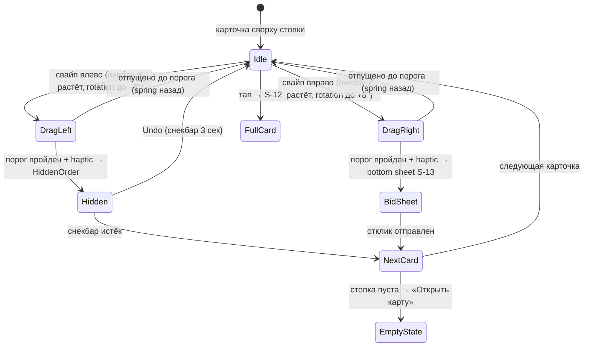
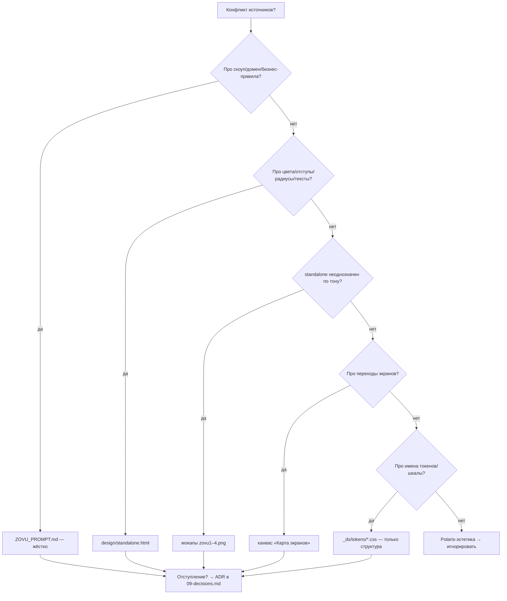

# 06 · Дизайн-система Zovu

> Страница LLM-вики. Соседние страницы: [00-overview.md](00-overview.md) · [05-screens.md](05-screens.md) (карта экранов S-01…S-35) · [07-business-rules.md](07-business-rules.md) (статусы заказов/откликов) · [09-decisions.md](09-decisions.md) (ADR-лог) · [glossary.md](glossary.md).

## 1. Главный принцип: «Apple снаружи, Tinder/Duolingo внутри»

**Визуальный язык** — iOS-минимализм, ровно как на мокапах: белый фон, один акцентный синий, тонкие бордеры (hairlines), много воздуха, SF Pro. **Поведение и характер** — Tinder/Duolingo: свайпы, прогресс, празднования, сочные микровзаимодействия, haptics. Никакого визуального шума — вся «игра» в моушне и физике, не в декоре. (Слой Tinder/Duolingo добавлен поверх ТЗ решением заказчика — ADR-003, см. [09-decisions.md](09-decisions.md).)

## 2. ⚠️ Канон палитры — ADR-006

**Канон цветов и геометрии — токены, фактически применённые в `design/standalone.html`** (готовый React-прототип всех экранов, который видел заказчик). Хексы из `ZOVU_PROMPT.md` §4.1 (`#2563EB`, `#1D4ED8`, `#EFF4FF`, `#0F172A`, `#22C55E`, `#F59E0B`, `#EF4444` и др.) — **УСТАРЕЛИ и не используются**. При любом расхождении промпта и standalone по визуальным значениям побеждает standalone. Зафиксировано как **ADR-006** в [09-decisions.md](09-decisions.md).

## 3. Токены цвета (полная таблица)

Целевой файл в коде: `src/theme/tokens.ts` (+ CSS-переменные `src/styles/tokens.scss`) — **создан в M0**; UI-кит поверх токенов собирается в M1 (см. [10-status.md](10-status.md)).

| Токен | Hex | Применение |
|---|---|---|
| `primary` | `#4C6FFF` | Основной акцент: CTA-кнопки, ссылки, активный таб, выбранные чипы/радио, логотип, статус-пиллы «Новый»/«В работе», цена в акценте |
| `primarySoft` | `#EEF1FF` | Фон выбранных карточек/чипов, подложка акцента, фон статус-пиллов primary, фон иллюстраций Duolingo-слоя |
| `primaryBorderSoft` | `#DDE4FB` | Бордер выбранных карточек/чипов (акцентный hairline поверх `primarySoft`) |
| `ink` | `#141824` | Основной текст: заголовки, названия заказов |
| `inkStrong` | `#16181D` | Максимально тёмный текст: крупные суммы, цены |
| `inkSecondary` | `#6B7280` | Вторичный текст; текст нейтральных статус-пиллов |
| `darkSecondary` | `#3A3F4B` | Тёмно-серый текст средней силы: body-текст «О себе», тёмные подписи-капшены |
| `inkMuted` | `#7A808E` / `#9AA0AD` | Подписи, мета-строки, слоганы, лейблы секций (CAPS-заголовки списков — `#9AA0AD`, сабтайтлы/описания — `#7A808E`) |
| `placeholder` | `#787E8C` | Плейсхолдеры инпутов, мета-строки под заголовками карточек («5 000 ₸ · Бостандыкский р-н»), пояснения к фильтрам |
| `border` | `#E4E6EC` / `#ECEDF1` | Hairline-бордеры карточек и инпутов, 1px |
| `divider` | `#F0F1F4` | Разделители списков; фон нейтральных статус-пиллов |
| `surface` | `#F5F6F8` / `#F7F7F8` | Подложки секций, фоны второго плана |
| `bg` | `#FFFFFF` | Основной фон всех экранов |
| `success` | `#16A34A` | Зелёный: чек верификации, «Выполнен», «Подписка активна», суммы пополнений «+» |
| `successSoft` | `#E7F6EC` | Фон success-пиллов и success-блоков |
| `warning` | `#E8981F` | Янтарный акцент: иконки/индикаторы ожидания |
| `warningText` | `#B45309` | Текст warning-пиллов на `warningSoft` (контрастнее акцента) |
| `warningSoft` | `#FBEFDD` | Фон warning-пиллов («Ожидание ответа», «На рассмотрении») |
| `danger` | `#E24545` | Красный акцент: иконки ошибок, error-бордер инпутов (inset 1.5px на `dangerSoft`) |
| `dangerText` | `#DC2626` | Красные текстовые действия: «Отменить заказ», «Пожаловаться», «Выйти из аккаунта» |
| `dangerSoft` | `#FDECEC` | Фон error-состояний и danger-блоков |

Примечания:
- `primaryPressed` в каноне standalone отсутствует (старый `#1D4ED8` устарел вместе с §4.1): pressed-состояние кнопок передаётся **масштабом 0.97 + haptic**, не сменой цвета — TODO(M1), если отдельный цвет всё же понадобится.
- Двойные хексы (`border`, `surface`, `inkMuted`) — это две реально применённые в прототипе градации; при реализации `tokens.ts` завести обе (например `border` / `borderLight`) — решить в M1.
- Правило «не более 2 акцентных цветов на экране» (см. §10 Запреты) действует поверх всей палитры.

## 4. Статус-пиллы

Спецификация пилла (из секции «СТАТУС-ПИЛЛЫ» в standalone): шрифт **600 12/1**, паддинги **7×12**, радиус **999**. Мнемоника из прототипа: «серый — ожидание · индиго — активные · янтарь — подтверждение · зелёный — выполнено».

Статусы истории: у заказчика — ИЗ-02, у специалиста — ИС-02 (машины состояний — в [07-business-rules.md](07-business-rules.md)).

| Статус | Текст | Фон | Где встречается |
|---|---|---|---|
| Новый | `primary #4C6FFF` | `primarySoft #EEF1FF` | Чип заказа младше 1 минуты в ленте S-11 (С-03) |
| Активный | `inkSecondary #6B7280` | `divider #F0F1F4` | История заказов заказчика (ИЗ-02) |
| Ожидание ответа | `warningText #B45309` | `warningSoft #FBEFDD` | Отклики специалиста S-14 |
| Принят | `success #16A34A` | `successSoft #E7F6EC` | Отклики специалиста S-14 (ИС-02) |
| В работе / Выполняется | `primary #4C6FFF` | `primarySoft #EEF1FF` | Активный заказ S-25, истории обеих ролей |
| Ожидает подтверждения | `warningText #B45309` | `warningSoft #FBEFDD` | Завершение S-26 (ЗВ-01…ЗВ-04) |
| Выполнен / Выполнен (автозакрытие) | `success #16A34A` | `successSoft #E7F6EC` | Истории обеих ролей (ЗВ-02, ЗВ-03) |
| Не выбран | `inkSecondary #6B7280` | `divider #F0F1F4` | Каскадный отказ после принятия чужого отклика |

**Разведение пар одного цвета (M1-polish).** Чтобы статусы одного цвета различались в ленте, пары разведены soft ↔ fill: пассивное/раннее состояние — soft-фон, активное/финальное — заливка. Итог: Новый → primary soft, **В работе → primary fill (белый текст)**; Ожидание ответа → warning soft, **На рассмотрении → тёмный янтарь `#B45309` fill (белый текст)**; Принят → success soft, **Выполнен → success fill (белый текст)**; Не выбран/Отменён → gray soft. Реализовано в `statusPill`-токенах.
| Отменён | `inkSecondary #6B7280` | `divider #F0F1F4` | Отменённые заказы (ЗВ-07) |
| На рассмотрении | `warningText #B45309` | `warningSoft #FBEFDD` | Спор/тикет по заказу (ЗВ-06) |
| Отклик отправлен | TODO(M1) | TODO(M1) | История специалиста (ИС-02); в standalone и промпте цвет не зафиксирован — по логике = «Ожидание ответа» |

Примечание к нейтральным пиллам: конвенция промпта называла пару «inkMuted/surface», но в standalone фактически отрисовано `inkSecondary #6B7280` на `divider #F0F1F4` — **канон — хексы standalone** (ADR-006).

Статусы тикетов поддержки «Новое → В работе → Решено» (СП-06) используют те же пары: Новое → primary/primarySoft, В работе → warning, Решено → success.

## 5. Типографика

Шрифты: системный стек `-apple-system` / **SF Pro Display / SF Pro Text** (iOS) и **Inter** (Android fallback). Кастомные шрифты вне SF/Inter запрещены (§10). Обе локали RU/KZ (НФ-02) — тот же стек.

| Стиль | Размер/интерлиньяж | Вес | Применение |
|---|---|---|---|
| LargeTitle | 28/34 | 700 | Заголовки экранов онбординга и ключевых экранов |
| Title | 22/28 | 700 | Заголовки секций и карточек |
| Headline | 17/22 | 600 | Заголовки строк, имена, названия заказов в списках |
| Body | 16/22 | 400 | Основной текст, описания |
| Caption | 13/18 | 400 | Подписи, мета-информация, время |
| Price | 20/24 | 700 | Цены и суммы; **в standalone вес цены доходит до 800** — для крупных сумм (баланс, цена заказа) допустим и предпочтителен w800 |

Наблюдение из standalone: крупные заголовки и цены идут с отрицательным трекингом (letter-spacing −0.4…−0.6px) — воспроизводить в CSS (`letter-spacing`) для крупных стилей.

## 6. Геометрия

- **Сетка**: база 4pt — все отступы кратны 4 (шкала спейсинга из `_ds/tokens/spacing.css` годится как справочник имён, значения — по standalone).
- **Радиусы** (точные значения, извлечены из standalone в M1): инпуты **13** · CTA-кнопки **15** · OTP-ячейки **14** · карточки **18** · чипы/пиллы **999** · bottom sheets **20–26** (верхние углы). Реализованы в `--r-input/--r-cta/--r-otp/--r-card/--r-chip/--r-sheet`.
- **Высоты**: CTA-кнопки **52** · инпуты **52** · OTP-ячейки **64** (ширина 56).
- **Отступ экрана**: 16–20 по горизонтали; контейнер экрана — колонка ≤ 440px (компонент `Screen`/`DeviceFrame`).
- **Тени**: карточки — БЕЗ 1px-бордера, только мягкая многослойная тень `0 1px 2px rgba(20,24,40,.04), 0 6px 18px -10px rgba(20,24,40,.12)` (`--shadow-soft`). Инпуты/OTP — `inset box-shadow` вместо border. «Новая» карточка — синее кольцо `0 0 0 1.5px primary`. Тяжёлые тени запрещены (§10). **Точные значения всех компонентов** зафиксированы в коде UI-кита (`src/components/ui/*`, витрина `/dev/uikit`).

## 7. Моушн и haptics

База таймингов (из `_ds/tokens/motion.css`, годится как есть): 100–200 мс, `ease cubic-bezier(0.25,0.1,0.25,1)`, `ease-out cubic-bezier(0.19,0.91,0.38,1)`. Поверх — правила §4.2 промпта (в дизайн-экспорте их нет, добавляются в коде):

- Базовые длительности **160–240 мс**, easing `ease-out` (cubic-bezier); переходы страниц — **CSS-переходы роутов** (в iOS-стилистике). Моушн — CSS-трансформы/transitions, сложное покадровое — `requestAnimationFrame`.
- Любая primary-кнопка: pressed → **scale 0.97 + виброотклик через Web Vibration API (`navigator.vibrate`)**. На iOS Safari вибрация недоступна/ограничена — haptics деградируют мягко (остаётся визуальный отклик); это правило про деградацию действует для всех упоминаний haptic в этой дизайн-системе.
- **OTP** (S-03): ячейка подпрыгивает при вводе (scale 1→1.08→1); ошибка — **shake + heavy haptic**.
- **Success-экраны** («Верификация пройдена» S-08, «Заказ выполнен» S-26): зелёный чек с burst-частицами + **confetti** (canvas-confetti или CSS-частицы) + medium haptic.
- **Онбординг специалиста** (S-05…S-08): закруглённый непрерывный progress bar в стиле Duolingo (высота 8px, компонент `ProgressBar`), шаги 1–4, анимированное заполнение `transition width`.
- **Списки**: staggered появление (fade + slide 12px) — CSS-анимации с нарастающей задержкой (`animation-delay`); pull-to-refresh — нативный web / CSS.
- **Балансы/рейтинги** (S-15, S-18): анимированные счётчики (анимация числа через `requestAnimationFrame`), в т.ч. обновление баланса после пополнения S-16 и живой счётчик «Показать N специалистов» на фильтрах S-21.

## 8. Tinder-колода: Order Deck (§4.3, главный экран специалиста)

Экран «Заказы» специалиста (S-11, см. [05-screens.md](05-screens.md)) имеет три вида через segmented control: **Колода (default) / Список / Карта**. Колоды в дизайн-экспорте НЕТ — она добавляется по этой спецификации поверх экранов экспорта (ADR-003).

**Карточка в стопке**: фото заказа (или заглушка категории), чип категории, **цена крупно**, расстояние, описание в 2 строки, «когда удобно».

**Жесты**:
- **Свайп вправо** → bottom sheet отклика S-13 («Принять цену» / «Предложить свою»).
- **Свайп влево** → скрыть заказ (persist в `HiddenOrder`, больше не показывать; см. [03-data-model.md](03-data-model.md)).
- **Тап** → полная карточка заказа S-12.

**Физика**: rotation до **±8°**; полупрозрачные overlay-иконки **✓/✕** растут по мере свайпа; **haptic на пороге срабатывания**; после скрытия — **undo-снекбар 3 секунды**.

**Пустая колода** → дружелюбный empty state + кнопка «Открыть карту».

## 9. Duolingo-слой (§4.4, delight)

Фичефлаг **`gamification`**, по умолчанию **on**:

- **Streak**: дни подряд с ≥ 1 откликом — чип **🔥N** в профиле специалиста S-18; мягкое празднование при +1. Без давления и дарк-паттернов.
- **Крупные дружелюбные иллюстрации** на pending/empty-состояниях (стиль «Проверяем ваши данные» S-07): простые формы, палитра `primarySoft`, реализация кодом/SVG (без растровых ассетов).
- **Празднование первого заказа / первого отклика** (confetti + haptic, как на success-экранах).

Данные streak — поля `streakDays`, `streakLastDate` в `SpecialistProfile` (см. [03-data-model.md](03-data-model.md)).

## 10. Запреты (§4.5 — жёсткие)

1. **Градиенты** и тяжёлые тени — **с одним точечным исключением** (см. ниже).
2. **> 2 акцентных цветов** на одном экране.
3. **Кастомные шрифты** вне SF Pro / Inter.
4. **Больше одной primary-CTA** на экран.
5. **Экраны-простыни**: длинные формы бить на шаги с прогрессом (как онбординг S-05…S-06).
6. Polaris-эстетика в любом виде (см. §11).

**Исключение по градиенту (ADR-009).** В `standalone.html` градиент реально применён в трёх местах, которые заказчик видел и утвердил: **карточка баланса S-15** (`linear-gradient(150deg, #5B7BFF, #4C6FFF)` + цветная тень), **аватар-плейсхолдеры** (`160deg #DCE4FB→#C9D6F7`) и **success/empty-иллюстрации** (`160deg #3FD37A→#22C55E`). Эти градиенты разрешены как часть канона standalone (приоритет источников — §12, handoff §5: точные визуальные значения → standalone). Везде остальное — плоские заливки. Зафиксировано как ADR-009 в [09-decisions.md](09-decisions.md).

## 11. Правило Polaris (handoff §0 — не нарушать)

Дизайн-экспорт технически собран на движке дизайн-системы **Polaris (Shopify)** — папка `design/_ds/`. **Это НЕ визуальный стиль Zovu.** Что запрещено переносить: near-black «brand», плотная админ-типографика Inter 13px, Shopify-иконки, бевел-кнопки, `_ds/_ds_bundle.js` и React-примитивы Polaris в прод.

`design/_ds/` используется **только как техсправочник**: имена токенов, шкала отступов (4px база), тайминги моушна (`tokens/motion.css`). Значения берутся те, что реально применены в `design/standalone.html`. Если сомневаешься между Polaris-значением и standalone-значением — **всегда standalone**. Прототип standalone — React inline (UMD+Babel demo): это визуальная спецификация, его демо-код в прод не переносится как есть; целевой UI пишется заново на **React (Vite + TS, PWA)** по этой спецификации.

## 12. Приоритет источников (handoff §5 — шпаргалка при любом конфликте)

1. **Скоуп, домен, бизнес-правила, исключения из скоупа** → `ZOVU_PROMPT.md` (жёстко); в вики — [01-scope.md](01-scope.md), [07-business-rules.md](07-business-rules.md).
2. **Точные цвета / отступы / радиусы / тексты экранов** → `design/standalone.html`.
3. **Тон и общий вид, если standalone неоднозначен** → мокапы `design/mockups/zovu1–4.png`.
4. **Граф переходов между экранами** → канвас «Карта экранов» (`design/canvases/`); в вики — [05-screens.md](05-screens.md).
5. **Имена токенов и шкалы (структура, не значения)** → `design/_ds/tokens/*.css`.
6. **Polaris-эстетика** (near-black, admin-density, Shopify-иконки, бевел) → **игнорировать всегда**.

Любое отступление → ADR в [09-decisions.md](09-decisions.md), без остановки на вопросы.

## 13. Иконки

Единый линейный **SVG-набор** иконок в iOS-стилистике (например, SF Symbols-подобный или линейный набор вроде Lucide/Feather), совпадающий с мокапами (сверять иконки таббара, категорий и статусов по `design/mockups/zovu1–4.png`). **Polaris/Shopify-иконки не использовать.**

## 14. Дизайн-система в коде (майлстоун M1)

- Токены: `src/theme/tokens.ts` (+ CSS-переменные `src/styles/tokens.scss`) — **создан в M0**.
- UI-kit `src/components/ui/`: Button, TextField/TextArea, OtpInput (плейсхолдер «–», bounce/shake), StatusPill, Chip (тап-таргет ≥44pt), Card, Price (узкая неразрывная шпация U+202F в валюте), Badge, Avatar, SegmentedControl (44pt), BottomSheet, ProgressBar, TabBar, Switch, EmptyState, **Rating (5★, S-27), Slider (S-21), RadioRow/CheckboxRow (S-13/S-16), Celebration (confetti-burst, S-08/S-26)**, Screen, AppBar, Icon.
- Два таббар-шелла (заказчик: Заказы/Отклики/Чаты/Профиль; специалист: Карта/Заказы/Отклики/Профиль).
- Скрытый экран **`/dev/uikit`** со всеми компонентами и состояниями (в т.ч. 4 состояния OTP-ячейки статично, карточка отклика обычная+выбранная, статус-пиллы русскими подписями).
- Каждый экран React (PWA) должен визуально совпадать со своим аналогом в standalone.
- Анимации/haptics/empty states полируются в M8 (см. [10-status.md](10-status.md)).
