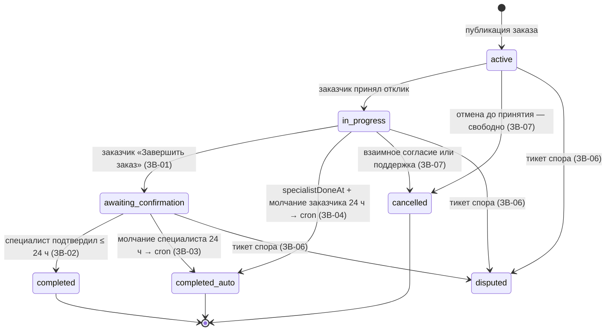
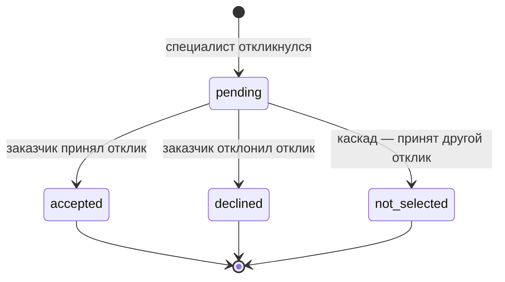

# 07 — Бизнес-правила

> **Source of truth** по поведению домена Zovu. Страница полностью покрывает §6 `ZOVU_PROMPT.md` (баланс/подписка, комиссия, state machine заказа и отклика, оценки и модерация, категории, дипломы, auth) плюс фильтры, ленту и streak. Каждое правило имеет кодовый ID (Б-01, БП-07, ЗВ-03…) — это якоря трассировки для кода и jest-тестов (см. [раздел 12](#12-обязательные-jest-тесты-115-промпта)).
>
> Соседние страницы: модель данных — [03-data-model.md](03-data-model.md), эндпоинты — [04-api.md](04-api.md), экраны S-XX — [05-screens.md](05-screens.md), ADR — [09-decisions.md](09-decisions.md), интерфейсы провайдеров — [08-integrations.md](08-integrations.md), термины — [glossary.md](glossary.md). B2B-модуль исключён полностью — список исключений в [01-scope.md](01-scope.md).

---

## 1. Баланс и подписка (Б-01…Б-07, БП-01…БП-07)

Подписка специалиста стоит **100 ₸/день**. Баланс — целые тенге (`SpecialistProfile.balance: int`, без тиынов). Все движения денег фиксируются в `Transaction` (`topup | subscription | commission | bonus`, поле `balanceAfter`).

1. **Б-01.** После регистрации специалиста: `balance = 0`, подписка **неактивна**, новые отклики **заблокированы**.
2. **Б-03…Б-05, БП-01 (cron подписки и автоприостановка).** Ежедневно в **00:00 Asia/Almaty** cron проходит по всем специалистам с активной подпиской и списывает **100 ₸** (`Transaction: subscription`, сумма −100). Если на момент списания `balance < 100` → подписка переводится в **неактивна** (автоприостановка — БП-01) + push **«Низкий баланс»**. Cron пропускает специалистов с действующим `subscriptionFreeUntil` (бонус ADR-002, см. [раздел 5](#5-категории-к-01к-06-adr-002)).
   - **Б-02.** Пополнение баланса через платёжный интерфейс — S-16 / `POST topup` (ТЗ v1.2:118; в MVP — мок `PaymentProvider`).
   - **Б-06.** История транзакций доступна специалисту — S-15 «История операций» / `GET transactions`.
   - **Б-07.** Специалист видит остаток, дату следующего списания и статус подписки — S-15 / `GET balance`.
3. **БП-07 (активация после пополнения).** Если подписка была неактивна и после пополнения `balance ≥ 100` → **немедленное** списание 100 ₸ и активация подписки; статус в UI — «Подписка активна». Следующее списание — ближайший cron 00:00 (дата показывается на S-15 «Следующее списание <дата> · 100 ₸/день»).
4. **БП-02 + БП-06 (блокировка новых откликов).** При неактивной подписке попытка отклика показывает полноэкранный блок **S-17 «Пополните баланс»** (текст: «Баланс нулевой, поэтому отклики недоступны…», CTA «Пополнить баланс», ссылка «Подробнее о подписке»).
5. **БП-03 (старые отклики живут).** Отклики, отправленные **до** деактивации подписки, остаются активными и видны заказчикам.
6. **БП-04 (принятый — выполняется).** Если заказчик принимает такой «старый» отклик — специалист получает заказ и выполняет его в обычном режиме, несмотря на неактивную подписку.
7. **БП-05 (метка в профиле).** При неактивной подписке в профиле специалиста (S-18) отображается метка **«Подписка неактивна»**.

Пополнение (S-16, Б-02) — мок `PaymentProvider.topup` (мгновенный успех, «Комиссия не взимается»), пресеты 1000/2000/5000/10000 ₸, способы Kaspi / Банковская карта — см. [08-integrations.md](08-integrations.md).

---

## 2. Комиссия за заказ (ADR-001)

Зафиксировано в [09-decisions.md](09-decisions.md) как **ADR-001** (в ТЗ v1.2 комиссии не было, реализовано по мокапам):

1. Процент — env-переменная **`ORDER_COMMISSION_PCT=5`** (можно поставить `0`).
2. Комиссия считается **от цены принятого отклика** (`Bid.price`), а не от бюджета заказа.
3. Списывается с баланса специалиста **в момент принятия отклика заказчиком** — `Transaction: commission` (отрицательная), поле `Bid.commission` фиксирует сумму.
4. **Баланс может уйти в минус** — это допустимо: новые отклики при `balance < 100` и так заблокированы (БП-02), поэтому долг не растёт бесконтрольно.
5. Экран **S-13 (отклик)** показывает «Комиссия сервиса» и «Вы получите» **заранее**, с пересчётом на лету при изменении «Ваша цена» (пример с мокапа: цена 5 000 ₸ → комиссия 250 ₸ → «Вы получите 4 750 ₸»).
6. TODO(M5): правило округления комиссии для цен, не кратных 100/PCT (например 5% от 4 999 ₸), в источниках не зафиксировано — предложение: округлять до целого ₸, зафиксировать ADR.

---

## 3. Жизненный цикл заказа и отклика (state machine)

Предусловия отклика (guard перед `POST orders/:id/bids`):
- специалист прошёл верификацию личности — до этого отклики заблокированы (**В-06**);
- подписка активна, иначе S-17 (**БП-02**);
- заказ виден специалисту: попадает под фильтры заказчика (**Ф-07**, [раздел 8](#8-фильтры-подбора-ф-02ф-05-ф-07ф-09)) и не скрыт свайпом влево (`HiddenOrder`);
- один специалист — один отклик на заказ (уникальность `(orderId, specialistId)`).

### 3.1 Заказ (Order)

Примечания:
- «Зеркальный» кейс ЗВ-04 — не отдельный статус, а поле `Order.specialistDoneAt`: специалист отмечает «Работа выполнена с моей стороны», заказ остаётся `in_progress`; если заказчик бездействует 24 ч — cron закрывает заказ как `completed_auto`.
- `disputed` («На рассмотрении») достижим **из любого активного статуса** (`active`, `in_progress`, `awaiting_confirmation`) через тикет поддержки с привязкой заказа; держится до решения админа. TODO(M7): в источниках не зафиксировано, в какой статус возвращается заказ после решения спора.

### 3.2 Отклик (Bid)

### 3.3 Таблица переходов

| № | Событие | Кто инициирует | Переход (из → в) | Побочные эффекты |
|---|---|---|---|---|
| 1 | Публикация заказа | Заказчик (S-20) | Order: — → `active` | Заказ появляется в ленте/карте/колоде специалистов, проходящих фильтры (Ф-07); первую минуту — в блоке «Новые» (С-03) |
| 2 | Отклик на заказ | Специалист (S-13) | Bid: — → `pending` | Push заказчику «Новый отклик на заказ» (НФ-06); обновление streak специалиста ([раздел 10](#10-streak-геймификация)); комиссия на этом шаге **не** списывается — только превью на S-13 |
| 3 | Принятие отклика | Заказчик (S-24, «Принять») | Bid: `pending` → `accepted`; Order: `active` → `in_progress` | **Каскад:** все остальные `pending`-отклики этого заказа → `not_selected` + push каждому; создаётся чат (Ч-01, S-30 открывается автоматически); `Transaction: commission` — списание комиссии ADR-001 с баланса специалиста (баланс может уйти в минус); push специалисту «Заказ принят» |
| 4 | Отклонение отклика | Заказчик (S-24, «Отклонить») | Bid: `pending` → `declined` | TODO(M4): push специалисту при `declined` в источниках не зафиксирован |
| 5 | «Завершить заказ» | **Только заказчик** (ЗВ-01, S-25) | Order: `in_progress` → `awaiting_confirmation` | Push специалисту; баннер «Ожидает подтверждения» у обеих сторон (S-26) |
| 6 | «Подтвердить выполнение» | Специалист, в течение 24 ч (ЗВ-02) | Order: `awaiting_confirmation` → `completed` | Открывается взаимная оценка (S-27, О-04); после завершения и оценки чат — read-only (Ч-07); инкремент `completedOrdersCount` |
| 7 | Автозакрытие по молчанию специалиста | Система — cron каждые 10 мин (ЗВ-03) | Order: `awaiting_confirmation` → `completed_auto` (если прошло 24 ч) | Окно оценки — 7 дней (ЗВ-05); TODO(M6): push об автозакрытии в источниках не зафиксирован |
| 8 | «Работа выполнена с моей стороны» | Специалист (ЗВ-04) | Order: статус не меняется, ставится `specialistDoneAt` | Push заказчику с просьбой завершить заказ |
| 9 | Автозакрытие по молчанию заказчика | Система — cron каждые 10 мин (ЗВ-04) | Order: `in_progress` → `completed_auto` (если `specialistDoneAt` + 24 ч) | Окно оценки — 7 дней (ЗВ-05) |
| 10 | Отмена до принятия отклика | Заказчик — свободно (ЗВ-07) | Order: `active` → `cancelled` | TODO(M4): судьба `pending`-откликов отменённого заказа в источниках не зафиксирована (предложение: каскад в `not_selected` + push) |
| 11 | Отмена после принятия | Обе стороны: «Предложить отмену» → подтверждение второй стороной; либо через поддержку (ЗВ-07) | Order: `in_progress` → `cancelled` | Push второй стороне; TODO(M7): возврат комиссии при отмене после принятия в источниках не зафиксирован |
| 12 | Спор | Любая сторона — тикет поддержки с привязкой заказа (ЗВ-06, СП-04) | Order: `active`/`in_progress`/`awaiting_confirmation` → `disputed` | Статус-чип «На рассмотрении»; заказ заморожен до решения админа; тикет — в очереди админки |

### 3.4 Правила завершения (ЗВ-01…ЗВ-07) — полный список

- **ЗВ-01.** Кнопку «Завершить заказ» жмёт **только заказчик** (у специалиста её нет).
- **ЗВ-02.** Специалист подтверждает выполнение в течение **24 часов** → `completed`.
- **ЗВ-03.** Специалист молчит 24 ч → cron переводит заказ в `completed_auto` («Выполнен (автозакрытие)»).
- **ЗВ-04.** Зеркальный кейс: специалист отмечает «Работа выполнена с моей стороны» (`specialistDoneAt`); если заказчик бездействует 24 ч → cron → `completed_auto`.
- **ЗВ-05.** После автозакрытия окно взаимной оценки — **7 дней** (см. [раздел 4](#4-оценки-и-модерация-о-01о-05-ом-01ом-08-зв-05)).
- **ЗВ-06.** Спор: любая сторона открывает тикет поддержки с привязкой заказа → заказ получает флаг `disputed` («На рассмотрении») до решения админа.
- **ЗВ-07.** Отмена: до принятия отклика — свободно; после принятия — только по взаимному согласию («Предложить отмену» → подтверждение второй стороной) или через поддержку.

### 3.5 Статусы в историях заказов (ИЗ-02, ИС-02)

**ИЗ-02 — история заказчика** (дословно): Активный / В работе / Ожидает подтверждения / Выполнен / Выполнен (автозакрытие) / Отменён / На рассмотрении.

**ИС-02 — история специалиста** (дословно): Отклик отправлен / Принят / Выполняется / Ожидает подтверждения / Выполнен / Не выбран / Отменён.

Визуал статус-чипов (канон — секция «СТАТУС-ПИЛЛЫ» в `design/standalone.html`, см. [06-design-system.md](06-design-system.md)): Новый → primary `#4C6FFF` на primarySoft `#EEF1FF`; Ожидание ответа / На рассмотрении → warning `#E8981F` (текст на soft — `#B45309`) на warningSoft `#FBEFDD`; Принят / Выполнен → success `#16A34A` на successSoft `#E7F6EC`; Не выбран / Отменён → inkSecondary `#6B7280` на divider `#F0F1F4`; В работе → primary. Радиус пилл — 999.

---

## 4. Оценки и модерация (О-01…О-05, ОМ-01…ОМ-08, ЗВ-05)

1. **О-01…О-04.** Оценка — **1–5★** с подписью (Плохо…Отлично), комментарий **≤ 300 символов** (счётчик вида 97/300), **один раз на заказ с каждой стороны** (уникальность `Review (orderId, fromUserId)`). Обе стороны оценивают друг друга после завершения (S-27).
2. **ЗВ-05.** После автозакрытия (`completed_auto`) окно оценки — **7 дней**. TODO(M6): окно оценки для обычного `completed` в источниках не оговорено (предложение: те же 7 дней, зафиксировать ADR).
3. **ОМ-01, ОМ-02 (пре-модерация текста).** Публикация мгновенная, но текст проходит `Moderator.check(text)` (интерфейс, см. [08-integrations.md](08-integrations.md)). Dev-реализация — **стоп-словарь RU/KZ** (мат, оскорбления, ссылки/спам-паттерны). При срабатывании — блокировка отправки с предложением **переформулировать**. Прод-адаптер `AnthropicModerator` — заглушка с TODO.
4. **ОМ-03, ОМ-04 (жалоба).** Кнопка «Пожаловаться» на каждом отзыве (S-33); причина: оскорбление / ложь / не относится к заказу / иное → жалоба попадает в очередь админа (`ReviewComplaint`). Отзыв **остаётся видимым** до решения.
5. **ОМ-05.** Админ скрывает отзыв (`status: hidden`) или возвращает; уведомления **обеим сторонам**.
6. **ОМ-06.** Скрытый отзыв **исключается из среднего рейтинга** с пересчётом кэшированного `SpecialistProfile.rating`.
7. **ОМ-07.** Автор может **редактировать отзыв 24 ч** после публикации (поле `Review.editableUntil`; `PATCH reviews/:id`).
8. **О-05, ОМ-08.** Заказчик видит рейтинг и отзывы специалиста в карточке отклика (S-23/S-24); **скрытые отзывы исключены** и из списка, и из среднего.

---

## 5. Категории (К-01…К-06, ADR-002)

**К-01. Seed-справочник — 12 категорий (дословно):** Электрика, Сантехника, Уборка, Ремонт, Сборка мебели, Бытовая техника, Отделка, Грузоперевозки, Клининг после ремонта, Компьютерная помощь, Красота, Репетиторство.

1. **К-02.** Специалист может предложить свою категорию: S-18 → «Добавить» → ввод названия (также доступно заказчику при создании заказа: «Предложить свою» в шите справочника на S-20).
2. **К-05.** Предложенная категория получает статус `pending` и **никому не видна** (ни в справочнике, ни в фильтрах).
3. **К-03, К-04.** Админ одобряет/отклоняет предложенную категорию, **SLA ≤ 1 ч** (К-03), автору — push о результате (К-04).
4. **К-06.** Одобренная категория становится доступна **всем** пользователям.
5. **ADR-002 (бонус за одобренную категорию).** Специалист-автор получает **3 дня подписки бесплатно**: `subscriptionFreeUntil = max(now, subscriptionFreeUntil) + 3 дня`; cron подписки **пропускает списание** до этой даты. Зафиксировано в [09-decisions.md](09-decisions.md).
   - TODO(M5): активирует ли бонус неактивную подписку сам по себе (без пополнения до ≥ 100 ₸) — в источниках не зафиксировано.
   - Нумерация сверена с ТЗ v1.2 (`reference/tz-v1.2.txt:237–245`): К-01 — готовый seed-справочник, К-03 — модерация ≤ 1 ч + бонус 3 дня.

---

## 6. Дипломированный специалист (ДС-*, НФ-09)

1. Загрузка диплома: **jpg / png / pdf, ≤ 10 МБ** — валидация **и на клиенте, и на сервере**. Точка входа — S-05 («Загрузить диплом», опционально, шаг анкеты) и повторно из профиля.
2. Статусы: `none → pending → approved | rejected(reason)` (поле `SpecialistProfile.diplomaStatus`, причина отказа обязательна при `rejected`).
3. **SLA проверки — 48 ч** (очередь дипломов в админке).
4. О результате — **push** («Верификация пройдена» — для личности; для диплома — свой текст, см. [05-screens.md](05-screens.md) S-32).
5. При `approved` — бейдж **«Дипломированный ✓»** в профиле (S-18) и в карточке отклика (S-23/S-24); участвует в фильтре Ф-02.
6. После `rejected` возможна **повторная загрузка**.
7. Админ может **отозвать** статус (approved → none/rejected — точная семантика TODO(M7)).
8. **НФ-09.** Файлы дипломов (и верификационные селфи) хранятся в **приватном бакете** MinIO; доступ — только админ-эндпоинтам.

Верификация личности (селфи + селфи с документом, статусы те же `none→pending→approved|rejected`) — отдельный процесс: до её прохождения отклики заблокированы (**В-06**). UI-текст ожидания — «до 24 часов», целевой SLA — 1 ч (дельта №5, [01-scope.md](01-scope.md)).

---

## 7. Auth и OTP (НФ-05)

1. OTP — **4 цифры**, TTL **2 минуты**, повторная отправка через **45 секунд** (таймер на S-03 «Отправить код повторно 00:45»).
2. **5 неверных попыток → код сгорает**, нужен новый запрос кода.
3. В dev-режиме код всегда **`1111`** и печатается в лог API (`SmsProvider` — мок, см. [08-integrations.md](08-integrations.md)).
4. JWT: **access 15 мин / refresh 30 дней**, refresh-**ротация** при каждом обновлении.
5. **Один аккаунт = один номер телефона** (`User.phone` uniq). Роли — **флаги на пользователе** (`isClient`, `isSpecialist`, `activeRole`), переключение без релогина (Р-01…Р-05: профиль/баланс/история ролей раздельны, см. S-34).
6. Хранение кода — `OtpCode` (`codeHash`, `expiresAt`, `attempts`); cron каждую минуту чистит протухшие OTP.

---

## 8. Фильтры подбора (Ф-01…Ф-05, Ф-07…Ф-10)

**Ф-01.** Панель «Фильтры подбора» (S-21) доступна заказчику с экрана создания заказа (иконка ⓘ на S-20) и с экрана опубликованного заказа. Фильтры задаёт **заказчик**, хранятся в `Order.filters` (json):

1. **Ф-02.** «Только дипломированные» — свитч (`certifiedOnly`): заказ видят только специалисты с `diplomaStatus = approved`.
2. **Ф-03.** «Мин. рейтинг» — 1.0–5.0, шаг 0.5 (`minRating`).
3. **Ф-04.** «Опыт работы» — ≥ 5 / ≥ 20 / ≥ 50 завершённых заказов (`minOrders`).
4. **Ф-05.** «Расстояние» — слайдер 1–50 км (`maxDistanceKm`); гео-выборка PostGIS `ST_DWithin`.
5. **Ф-07 (ключевое).** Специалист, **не проходящий фильтры, заказ не видит вообще** — ни в ленте, ни на карте, ни в колоде. Фильтрация — на сервере, в выдаче `orders/feed` / `orders/nearby-map`.
6. **Ф-08.** Если за **10 минут** после публикации нет ни одного отклика → заказчику push **«Смягчите фильтры»** (cron каждые 10 мин).
7. **Ф-09 (low priority).** «Сохранить как пресет» — сохранённые наборы фильтров заказчика.
8. **Ф-10.** В выдаче откликов заказчику показываются метрики специалиста: ★рейтинг (кол-во оценок), N выполненных заказов, расстояние, бейдж «Дипломированный ✓» (S-23/S-24).
9. **Ф-06 НЕ СУЩЕСТВУЕТ.** Фильтр «Тип исполнителя» удалён вместе с исключённым B2B-модулем — см. [01-scope.md](01-scope.md). Не реализовывать ни в каком виде.

На S-21 живой счётчик «Показать N специалистов» пересчитывается при изменении фильтров.

---

## 9. Лента специалиста (С-03, С-04)

1. **С-03.** Блок **«Новые»** — заказы **младше 1 минуты**, показываются отдельным блоком **сверху** ленты (S-11, чип «Новые (N)»).
2. **С-04.** По истечении минуты заказы **перетекают в общий список** (без дублирования).
3. Сортировка общего списка — **по расстоянию** от специалиста.
4. В ленту/карту/колоду попадают только заказы: `status = active`, в категориях специалиста, проходящие фильтры заказчика (Ф-07) и не скрытые свайпом влево (`HiddenOrder`).

---

## 10. Streak (геймификация)

Фичефлаг `gamification` (по умолчанию **on**), детали UI — [06-design-system.md](06-design-system.md).

1. Streak — **дни подряд с ≥ 1 откликом**. Поля: `SpecialistProfile.streakDays`, `streakLastDate`.
2. Алгоритм обновления при создании отклика: если `streakLastDate` = сегодня → без изменений; если = вчера → `streakDays + 1`, обновить дату; иначе → `streakDays = 1`, обновить дату. Граница суток — Asia/Almaty (рабочее допущение по аналогии с cron подписки; TODO(M5): зафиксировать ADR).
3. UI: чип **🔥N** в профиле специалиста (S-18), мягкое празднование при +1 — без давления и дарк-паттернов.

---

## 11. Поддержка — правила уровня домена (СП-08, СП-09, ADR-007)

Экран и сценарии поддержки (S-31: категории обращений, вложения ≤ 5, привязка заказа, статусы `new → in_progress → resolved`, оценка после закрытия) — в [05-screens.md](05-screens.md). Здесь — правила, влияющие на домен:

1. **СП-08 (SLA первого ответа).** Целевое время первого ответа поддержки — **≤ 4 ч в рабочее время** (ТЗ v1.2:844). В MVP не форсируется кодом: очередь тикетов в админке сортируется по возрасту, SLA — ориентир для оператора (график работы поддержки в ТЗ не определён — открытый вопрос № 9). Зафиксировано в ADR-007.
2. **СП-09 (блокировка/предупреждение).** Служба поддержки может **предупредить** пользователя (push с текстом причины) или **заблокировать** его при нарушениях: поля `User.blockedAt`, `blockedReason`. Заблокированный пользователь: вход и просмотр разрешены, но создание заказов, откликов, сообщений и отзывов возвращает 403 с текстом причины. Снятие блокировки — тем же админ-действием. Детали — ADR-007, admin-эндпоинты — [04-api.md](04-api.md).

---

## 12. Обязательные jest-тесты (§11.5 промпта)

Каждое правило выше — якорь для теста на бэкенде. Минимальный обязательный набор (зелёный после каждого майлстоуна):

| # | Тест | Правила-якоря |
|---|---|---|
| 1 | Cron подписки: списание 100 ₸ в 00:00 Asia/Almaty; при `balance < 100` — деактивация + push «Низкий баланс» (фейковое время) | Б-01, Б-03…Б-05 |
| 2 | Cron пропускает списание при действующем `subscriptionFreeUntil`; бонус = `max(now, freeUntil) + 3d` | ADR-002, К-04…К-06 |
| 3 | Пополнение при неактивной подписке до `balance ≥ 100` → немедленное списание 100 ₸ + активация | БП-07 |
| 4 | Блокировка нового отклика при неактивной подписке; старые `pending`-отклики остаются видимыми; принятый выполняется | БП-02…БП-04 |
| 5 | Каскад: принятие одного отклика переводит все прочие `pending` → `not_selected` + push каждому; создаётся чат | §6.3, Ч-01 |
| 6 | Списание комиссии `ORDER_COMMISSION_PCT` от цены отклика в момент принятия; баланс уходит в минус без ошибки; при `PCT=0` транзакции нет | ADR-001 |
| 7 | Автозакрытие ЗВ-03: `awaiting_confirmation` + 24 ч молчания специалиста → `completed_auto` (фейковое время) | ЗВ-03 |
| 8 | Автозакрытие ЗВ-04: `specialistDoneAt` + 24 ч молчания заказчика → `completed_auto` | ЗВ-04 |
| 9 | Окно оценки 7 дней после `completed_auto`: на 7-й день отзыв принимается, на 8-й — отклоняется | ЗВ-05 |
| 10 | Однократность отзыва: второй отзыв той же стороны на тот же заказ отклоняется | О-04 |
| 11 | Скрытый отзыв исключается из среднего рейтинга (пересчёт `rating`) и из выдачи в карточке отклика | ОМ-06, ОМ-08, О-05 |
| 12 | Фильтры ленты Ф-07: специалист вне `certifiedOnly` / `minRating` / `minOrders` / `maxDistanceKm` не получает заказ в `orders/feed`, `nearby-map` и колоде | Ф-02…Ф-05, Ф-07 |

Рекомендуемые дополнительные тесты (не блокируют DoD, но закрывают правила этой страницы): OTP — TTL 2 мин / 5 попыток / resend 45 с (НФ-05); `Moderator.check` — стоп-словарь блокирует и RU, и KZ (ОМ-01/ОМ-02); ЗВ-01 — «Завершить» доступно только заказчику; В-06 — отклик неверифицированного специалиста отклоняется; Ф-08 — push «Смягчите фильтры» через 10 мин без откликов; streak — инкремент/сброс по датам.
