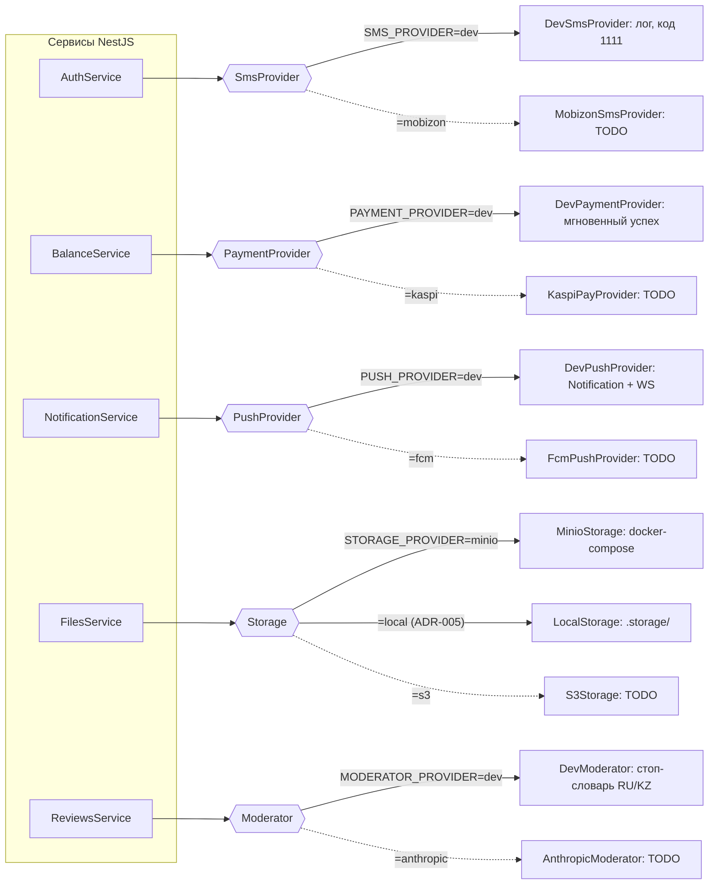
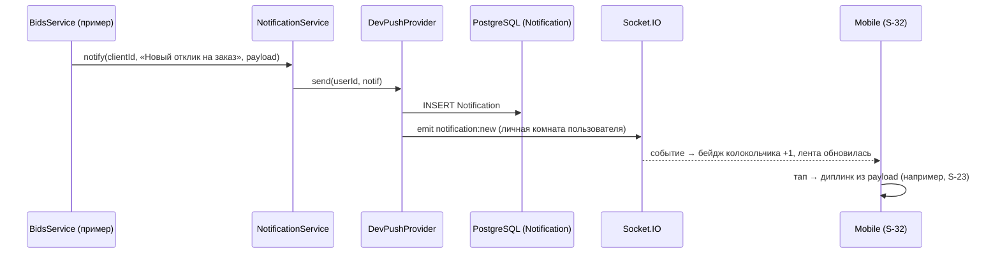

# 08 — Интеграции: всё за интерфейсами

> Источник: `ZOVU_PROMPT.md` §9 и Приложение B (дельта №4). Принцип: **любая внешняя система (SMS, платежи, push, файлы, ИИ-модерация, карты) спрятана за интерфейсом**. По умолчанию работает dev-мок; прод-адаптер существует только как заглушка с `TODO` и **никогда не нужен для запуска демо**. Выбор реализации — через env-переменные (см. [02-architecture.md](02-architecture.md) и `.env.example` в корне).

Связанные страницы: бизнес-правила, которые дергают провайдеры (подписка БП-07, модерация ОМ-01/ОМ-02) — в [07-business-rules.md](07-business-rules.md); модели `Notification`, `Transaction`, `Device`, `OtpCode` — в [03-data-model.md](03-data-model.md); эндпоинты и WS-события — в [04-api.md](04-api.md); экраны, где виден результат моков (S-03, S-07, S-16, S-17, S-32) — в [05-screens.md](05-screens.md); ADR-001 (комиссия) и ADR-005 (фоллбэк Storage без Docker) — в [09-decisions.md](09-decisions.md).

---

## 1. Сводная таблица

| Интерфейс | Ключевой метод | Dev-мок (по умолчанию) | Прод-адаптер (заглушка + TODO) | Env-переключатель |
|---|---|---|---|---|
| `SmsProvider` | `send(phone, code)` | `DevSmsProvider` — лог в консоль API, код всегда `1111` | `MobizonSmsProvider` — КЗ-шлюз (казахстанские сотовые операторы режут SMS с зарубежных шлюзов) | `SMS_PROVIDER=dev\|mobizon` |
| `PaymentProvider` | `topup(userId, amount, method)` | `DevPaymentProvider` — мгновенный успех | `KaspiPayProvider` | `PAYMENT_PROVIDER=dev\|kaspi` |
| `PushProvider` | `send(userId, notif)` | `DevPushProvider` — запись в `Notification` + WS-эмит | `FcmPushProvider` (по `Device.fcmToken`) | `PUSH_PROVIDER=dev\|fcm` |
| `Storage` | `put / getSignedUrl / delete` | MinIO из `docker-compose.yml`, приватный бакет для документов (НФ-09) | `S3Storage`; плюс dev-фоллбэк без Docker — `LocalStorage` (локальная ФС, ADR-005) | `STORAGE_PROVIDER=minio\|local\|s3` |
| `Moderator` | `check(text)` | `DevModerator` — стоп-словарь RU/KZ (мат, оскорбления, ссылки, спам-паттерны) | `AnthropicModerator` | `MODERATOR_PROVIDER=dev\|anthropic` |
| Карты (web, TS) | `MapTilesConfig` | Leaflet + OSM-тайлы | адаптеры под 2GIS / Google (заглушки) | конфиг на стороне web-клиента, не в API `.env` (см. §8) |

**Главное правило: ни один прод-ключ не нужен для демо.** Полный happy-path (Definition of Done, `ZOVU_PROMPT.md` §12) проходит целиком на dev-моках.

---

## 2. Как устроен выбор реализации

Каждый интерфейс живёт в `apps/api/src/integrations/<name>/`. Реализация биндится один раз на старте API через Nest custom provider (`useFactory` читает env):

```ts
// apps/api/src/integrations/sms/sms.module.ts
export const SMS_PROVIDER = Symbol('SMS_PROVIDER');

@Module({
  providers: [
    {
      provide: SMS_PROVIDER,
      useFactory: (cfg: ConfigService): SmsProvider =>
        cfg.get('SMS_PROVIDER') === 'mobizon'
          ? new MobizonSmsProvider(cfg)
          : new DevSmsProvider(cfg),
      inject: [ConfigService],
    },
  ],
  exports: [SMS_PROVIDER],
})
export class SmsModule {}
```



**Правила для всех адаптеров:**

1. **Заглушка** = класс, который компилируется, реализует интерфейс, но в каждом методе бросает `NotImplementedException('TODO: <что подключить>')` + `// TODO`-комментарий с ссылкой на эту страницу. Прод-адаптеры недостижимы в демо-конфигурации.
2. **Никакой бизнес-логики внутри адаптеров.** Провайдер делает ровно одно внешнее действие. Активация подписки после пополнения (БП-07) — в `BalanceService`, а не в `PaymentProvider`; TTL и попытки OTP (НФ-05) — в `AuthService`, а не в `SmsProvider`. Так смена dev→prod не трогает бизнес-правила.
3. Новая внешняя зависимость появляется **только** через этот паттерн + строка в таблице §1 + при отступлении — ADR в [09-decisions.md](09-decisions.md).

---

## 3. `SmsProvider`

```ts
// apps/api/src/integrations/sms/sms-provider.interface.ts
export interface SmsProvider {
  /**
   * Отправить SMS с OTP-кодом. Ошибка отправки не должна раскрывать,
   * зарегистрирован ли номер (безопасность auth-флоу).
   */
  send(phone: string, code: string): Promise<void>;
}
```

### Dev-мок `DevSmsProvider` (по умолчанию)

- Ничего никуда не шлёт. Пишет в консоль API строку вида:
  `[DevSmsProvider] SMS → +77021234567: «Ваш код Zovu: 1111»`.
- Код всегда равен `DEV_OTP_CODE` (по умолчанию `1111`) — им можно войти с любым номером на экране S-03.
- Вся OTP-механика (НФ-05) живёт выше провайдера, в `AuthService`: код 4 цифры, хранится хешем в `OtpCode.codeHash`, TTL **2 минуты**, resend через 45 с, 5 неверных попыток → код сгорает. Крон каждую минуту чистит протухшие OTP (см. [04-api.md](04-api.md)).

### Прод-заглушка `MobizonSmsProvider`

- Обоснование выбора шлюза: Mobizon — казахстанский SMS-шлюз; сообщения с зарубежных шлюзов казахстанские операторы часто отбрасывают, поэтому дефолтный «международный» провайдер не подходит.
- Заглушка: `NotImplementedException`. Env-ключи шлюза (API-ключ и т.п.) появятся вместе с реализацией — TODO(M-прод, вне скоупа MVP).

---

## 4. `PaymentProvider`

```ts
// apps/api/src/integrations/payment/payment-provider.interface.ts
export type TopupMethod = 'kaspi' | 'card'; // радио на S-16: Kaspi / Банковская карта

export interface TopupResult {
  ok: true;
  externalId: string; // id платежа во внешней системе; в dev — сгенерированный uuid
}

export interface PaymentProvider {
  /** Провести пополнение. amount — целые ₸ (тиын не используем, см. 03-data-model.md). */
  topup(userId: string, amount: number, method: TopupMethod): Promise<TopupResult>;
}
```

### Dev-мок `DevPaymentProvider` (по умолчанию)

- Мгновенный успех, без внешних вызовов и задержек: возвращает `{ ok: true, externalId: uuid }`.
- Всё остальное делает `BalanceService` **после** ответа провайдера (это бизнес-логика, не интеграция):
  1. создаёт `Transaction { type: 'topup', amount: +amount, balanceAfter }`;
  2. БП-07: если подписка была неактивна и после пополнения `balance ≥ 100` → немедленное списание 100 ₸ (`Transaction { type: 'subscription' }`) и активация подписки;
  3. мобильный клиент на S-16 получает успех → возврат на S-15 с анимированным счётчиком баланса; блокировка S-17 снимается.
- Логирует в консоль: `[DevPaymentProvider] topup userId=<id> +5000 ₸ via kaspi → ok`.

### Прод-заглушка `KaspiPayProvider`

- `NotImplementedException` + TODO. Реальные платежи — вне скоупа ([01-scope.md](01-scope.md)). Процент комиссии за заказ (ADR-001, `ORDER_COMMISSION_PCT`) к провайдеру платежей отношения не имеет — комиссия списывается с внутреннего баланса при принятии отклика (см. [07-business-rules.md](07-business-rules.md)).

---

## 5. `PushProvider`

```ts
// apps/api/src/integrations/push/push-provider.interface.ts
export interface PushNotif {
  type: string;                       // машинный тип: 'bid_new', 'bid_accepted', 'low_balance', ...
  title: string;                      // «Новый отклик на заказ»
  body: string;
  payload?: Record<string, unknown>;  // данные для диплинка: orderId, bidId, ticketId...
}

export interface PushProvider {
  /** Доставить уведомление пользователю на все его устройства. */
  send(userId: string, notif: PushNotif): Promise<void>;
}
```

### Dev-мок `DevPushProvider` (по умолчанию)

Делает два действия — поэтому «push» полностью работает в демо без FCM:

1. **Пишет строку в таблицу `Notification`** (`userId`, `type`, `title`, `body`, `payload`, `readAt = null`) — она появляется в ленте S-32 и увеличивает бейдж колокольчика.
2. **Эмитит WS-событие** `notification:new` с телом уведомления в личную комнату пользователя через Socket.IO — открытое приложение обновляет бейдж и ленту мгновенно, без pull-to-refresh. Точное имя неймспейса фиксируется в [04-api.md](04-api.md) при реализации M6 — TODO(M6).
3. Логирует: `[DevPushProvider] → userId=<id> [bid_new] «Новый отклик на заказ»`.



### Кто и когда зовёт push (трассировка)

| Событие | Получатель | ID требования |
|---|---|---|
| Новый отклик на заказ | заказчик | НФ-06 |
| Отклик принят («Заказ принят») | специалист | НФ-06 |
| Каскад «Не выбран» при принятии чужого отклика | остальные специалисты с pending-откликами | §6.3 промпта |
| Заказчик нажал «Завершить» → просьба подтвердить | специалист | ЗВ-01/ЗВ-02 |
| Автозакрытие через 24 ч | обе стороны | ЗВ-03/ЗВ-04 |
| Низкий баланс / подписка отключена кроном | специалист | Б-05 |
| Результат верификации (пройдена / отклонена) | специалист | В-06, S-07→S-08 |
| Результат проверки диплома | специалист | ДС-* |
| Новое сообщение в чате | собеседник | Ч-05 |
| 10 минут нет откликов → «Смягчите фильтры» | заказчик | Ф-08 |
| Категория одобрена / отклонена админом | автор предложения | К-04 |
| Решение по жалобе на отзыв | обе стороны | ОМ-05 |

### Прод-заглушка `FcmPushProvider`

- `NotImplementedException` + TODO. При реализации будет слать по токенам из `Device` (`fcmToken`, `platform`), которые мобильный клиент регистрирует через `POST me/devices` (см. [04-api.md](04-api.md)). Запись в `Notification` при этом сохраняется — лента S-32 работает одинаково в dev и prod.

---

## 6. `Storage`

```ts
// apps/api/src/integrations/storage/storage.interface.ts
export type Bucket = 'public' | 'private';
// public  → фото заказов (S-20, сжатие на клиенте — НФ-08)
// private → селфи, селфи с документом, дипломы (НФ-09)

export interface StoredFile {
  bucket: Bucket;
  key: string;    // например 'orders/<orderId>/<uuid>.jpg'
  size: number;   // байты
  mime: string;
}

export interface Storage {
  put(bucket: Bucket, key: string, data: Buffer, mime: string): Promise<StoredFile>;
  /** Временная ссылка на чтение. Для private — только из админ-эндпоинтов (НФ-09). */
  getSignedUrl(bucket: Bucket, key: string, ttlSec?: number): Promise<string>;
  delete(bucket: Bucket, key: string): Promise<void>;
}
```

Валидации файлов (живут в сервисах, не в адаптере): дипломы и документы верификации — jpg/png/pdf ≤ 10 МБ, проверка и на клиенте, и на сервере (ДС-*); фото заказа — до 5 штук, сжимаются на клиенте перед загрузкой (НФ-08).

Соглашение по ключам (фиксируется здесь, детали моделей — [03-data-model.md](03-data-model.md)):

| Тип файла | Бакет | Ключ |
|---|---|---|
| Фото заказа | public | `orders/<orderId>/<uuid>.jpg` |
| Селфи / селфи с документом | private | `verification/<userId>/<uuid>.jpg` |
| Диплом | private | `diplomas/<userId>/<uuid>.<ext>` |
| Вложения тикетов поддержки (СП-04, ≤ 5) | private | `support/<ticketId>/<uuid>.<ext>` |

### Реализация по умолчанию: `MinioStorage` (`STORAGE_PROVIDER=minio`)

- MinIO поднимается из `docker-compose.yml`: S3-API на `:9000`, web-консоль на `:9001`, креды dev `zovu / zovu_dev_secret`.
- Два бакета из `.env`: `MINIO_BUCKET_PUBLIC=zovu-public` (публичное чтение — фото заказов) и `MINIO_BUCKET_PRIVATE=zovu-private` (никакого публичного доступа; чтение только по presigned URL, которые выдают исключительно админ-эндпоинты — НФ-09). Бакеты создаются автоматически при старте API, если их нет.

### Dev-фоллбэк: `LocalStorage` (`STORAGE_PROVIDER=local`, ADR-005)

Для машин без Docker (см. [09-decisions.md](09-decisions.md), ADR-005):

- Файлы кладутся в локальную ФС: `<LOCAL_STORAGE_DIR>/<bucket>/<key>` (по умолчанию `.storage/`, каталог в `.gitignore`).
- Тот же интерфейс `Storage`; `getSignedUrl` возвращает URL API-роута, который отдаёт файл с теми же правилами доступа (private — только с правами админа). Точный роут фиксируется в [04-api.md](04-api.md) при реализации M3 — TODO(M3).

### Прод-заглушка `S3Storage`

- `NotImplementedException` + TODO. Благодаря S3-совместимости MinIO прод-переход — это в основном смена endpoint/кредов.

---

## 7. `Moderator`

```ts
// apps/api/src/integrations/moderator/moderator.interface.ts
export interface ModerationVerdict {
  ok: boolean;        // true — текст чистый, публикуем
  reasons: string[];  // сработавшие категории: 'profanity' | 'insult' | 'link' | 'spam'
}

export interface Moderator {
  check(text: string): Promise<ModerationVerdict>;
}
```

Точки вызова (см. [07-business-rules.md](07-business-rules.md), §6.4 промпта): `POST reviews` и `PATCH reviews/:id` (правка в окно 24 ч, ОМ-07). При `ok: false` публикация **блокируется** и пользователю предлагается переформулировать текст (ОМ-01, ОМ-02) — отзыв не сохраняется. Прошедший проверку отзыв публикуется мгновенно; жалобы и пост-модерация админом (ОМ-03…ОМ-06) — отдельный контур, без участия `Moderator`.

### Dev-мок `DevModerator` (по умолчанию)

Стоп-словарь RU/KZ, четыре категории:

| Категория | Что ловит | `reasons` |
|---|---|---|
| Мат | обсценная лексика RU и KZ (со стемами/вариациями написания) | `profanity` |
| Оскорбления | прямые оскорбительные слова RU/KZ | `insult` |
| Ссылки | URL-паттерны: `http(s)://`, `www.`, `t.me/`, `wa.me/` и т.п. | `link` |
| Спам-паттерны | повторяющиеся символы/слова, телефоны и явные рекламные конструкции | `spam` |

- Проверка регистронезависимая, по нормализованному тексту.
- Логирует срабатывания: `[DevModerator] blocked: reasons=[profanity] textHash=<...>` (сам текст в лог не пишем).
- Точный состав словаря и файл, где он лежит, — TODO(M6).

### Прод-заглушка `AnthropicModerator`

- `NotImplementedException` + `// TODO: классификация текста через Claude API`. Реальный LLM-модератор — вне скоупа MVP ([01-scope.md](01-scope.md)).

---

## 8. Карты (web) — `MapTilesConfig`

Единственная интеграция на стороне **web-клиента** (ADR-008), а не API. Карта используется на S-10 (карта специалиста), S-11 (вид «Карта» в сегменте колоды) и S-22 (карта заказчика); гео-позиция — браузерный Geolocation API; гео-выдача заказов считает API на PostGIS (см. [02-architecture.md](02-architecture.md)).

```ts
// apps/web/src/features/map/map-tiles-config.ts
export interface MapTilesConfig {
  urlTemplate: string;   // 'https://tile.openstreetmap.org/{z}/{x}/{y}.png'
  subdomains: string[];  // [] для OSM
  attribution: string;   // '© OpenStreetMap contributors'
}

// Dev/демо по умолчанию.
export const osmTilesConfig: MapTilesConfig = { /* значения выше */ };

// Прод-заглушки: TODO(M4) — тайлы 2GIS (КЗ-детализация) или Google.
export const twoGisTilesConfig: MapTilesConfig = { /* TODO */ };
export const googleTilesConfig: MapTilesConfig = { /* TODO */ };
```

- Leaflet получает конфиг из модуля; компоненты карты от источника тайлов не зависят.
- OSM-тайлы не требуют ключа — правило «ни одного прод-ключа для демо» соблюдено и на клиенте.
- Механизм выбора конфига (env `VITE_MAP_TILES` / константа) фиксируется при реализации M4 — TODO(M4).
- Если тайл-сервер OSM недоступен из окружения разработки — заменить источник и записать ADR (§11.7 промпта).

---

## 9. Env-переменные интеграций (канон — `.env.example` в корне)

| Переменная | Значения | Dev-дефолт | Что делает |
|---|---|---|---|
| `SMS_PROVIDER` | `dev` \| `mobizon` | `dev` | биндинг `SmsProvider` |
| `DEV_OTP_CODE` | строка из 4 цифр | `1111` | код `DevSmsProvider` + печать в лог |
| `PAYMENT_PROVIDER` | `dev` \| `kaspi` | `dev` | биндинг `PaymentProvider` |
| `PUSH_PROVIDER` | `dev` \| `fcm` | `dev` | биндинг `PushProvider` |
| `MODERATOR_PROVIDER` | `dev` \| `anthropic` | `dev` | биндинг `Moderator` |
| `STORAGE_PROVIDER` | `minio` \| `local` \| `s3` | `minio` | биндинг `Storage`; `local` — фоллбэк без Docker (ADR-005) |
| `MINIO_ENDPOINT` | URL | `http://localhost:9000` | S3-API MinIO |
| `MINIO_ACCESS_KEY` / `MINIO_SECRET_KEY` | строки | `zovu` / `zovu_dev_secret` | dev-креды из docker-compose |
| `MINIO_BUCKET_PUBLIC` | имя бакета | `zovu-public` | фото заказов |
| `MINIO_BUCKET_PRIVATE` | имя бакета | `zovu-private` | документы верификации и дипломы (НФ-09) |
| `LOCAL_STORAGE_DIR` | путь | `.storage` | корень `LocalStorage` при `STORAGE_PROVIDER=local` |
| `AUTO_APPROVE_VERIFICATION` | `true` \| `false` | `true` | dev-автоодобрение верификации (§10) |

Env читается один раз на старте API; смена провайдера — рестарт процесса. Секреты — только `.env` (в git не попадает), полный образец — `.env.example`.

---

## 10. `AUTO_APPROVE_VERIFICATION` — dev-автоодобрение

Не провайдер, а dev-удобство поверх очереди верификации, чтобы онбординг-демо шёл без открытия админки:

- При `AUTO_APPROVE_VERIFICATION=true` (dev-дефолт): после отправки селфи + селфи с документом (S-06, `POST specialist/verification`) API через **~5 секунд** переводит `VerificationRequest` в `approved` и шлёт push «Верификация пройдена» через `PushProvider`. Экран S-07 «Проверяем ваши данные» ловит это по push + polling и уводит на S-08 (confetti). Блокировка откликов (В-06) снимается.
- При `false` — заявка честно висит в очереди мини-админки до ручного решения (SLA-цель — 1 ч, в UI текст «до 24 часов»; см. дельту №5 в [01-scope.md](01-scope.md)).
- Флаг относится **только к верификации личности**. Дипломы (ДС-*, SLA 48 ч) и предложенные категории (К-05, SLA ≤ 1 ч) всегда идут через админ-очереди — в демо их одобряют вручную из админки.

---

## 11. Чек-лист при добавлении/изменении интеграции

1. Интерфейс в `apps/api/src/integrations/<name>/` (или `apps/web/src/features/<name>/` для клиентских интеграций вроде карт), dev-мок работает без ключей и сети.
2. Прод-адаптер — заглушка с `NotImplementedException` и `TODO`.
3. Env-переключатель добавлен в `.env.example` и в таблицу §9.
4. Строка в сводной таблице §1; поведение мока описано (что логируется, что эмитится).
5. Бизнес-логика — в сервисах, не в адаптере.
6. Расхождение кода и этой страницы — баг: чинится код или страница (правило вики №1).
