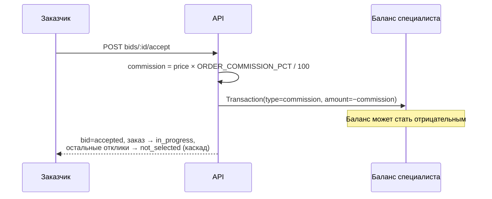
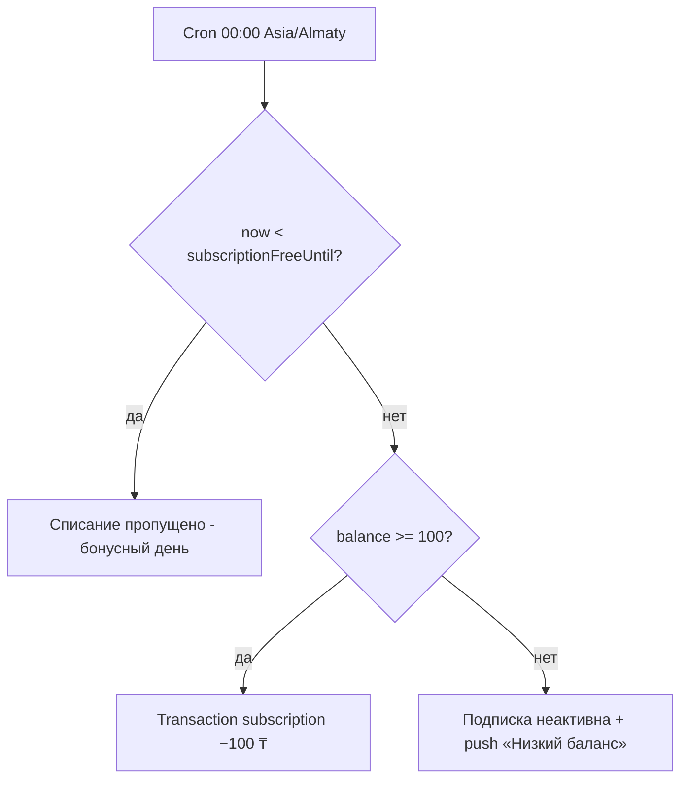

# 09 — Журнал архитектурных решений (ADR)

Здесь фиксируются все отступления от `ZOVU_PROMPT.md` и от ТЗ v1.2, а также значимые технические решения. Правило проекта: любое отступление от промпта или ТЗ заносится сюда **без остановки на вопросы** (ZOVU_PROMPT.md §3, правило 3; §11, правило 2). Дельты от ТЗ, утверждённые заказчиком заранее, перечислены в [01-scope.md](01-scope.md); ADR ниже раскрывают их детали и добавляют решения, принятые в ходе разработки.

**Формат записи:** `## ADR-NNN — заголовок` → Дата → Статус → Контекст → Решение → Последствия. Статусы: `accepted` (действует), `superseded by ADR-XXX` (заменено), `rejected` (отклонено). Номера — сквозные, не переиспользуются.

Связанные страницы: бизнес-правила — [07-business-rules.md](07-business-rules.md), модель данных — [03-data-model.md](03-data-model.md), токены и стиль — [06-design-system.md](06-design-system.md), интеграции и dev-моки — [08-integrations.md](08-integrations.md), окружение и запуск — [02-architecture.md](02-architecture.md), прогресс — [10-status.md](10-status.md).

---

## ADR-001 — Комиссия за заказ

- **Дата:** 2026-07-05
- **Статус:** accepted

### Контекст

В ТЗ v1.2 комиссия за заказ отсутствует. На мокапах заказчика она есть и показана явно: экран отклика содержит строки «Комиссия сервиса 250 ₸» и «Вы получите 4 750 ₸», а в истории операций баланса есть транзакция «Комиссия за заказ −250 ₸». Конфликт ТЗ ↔ мокапы разрешён заказчиком в пользу мокапов (ZOVU_PROMPT.md §6.2, Приложение B.2 — «уже решено, не переспрашивать»).

### Решение

Реализуем комиссию по мокапам:

1. Процент — env-переменная **`ORDER_COMMISSION_PCT=5`** (допустимо `0` — комиссия выключается без изменения кода).
2. Комиссия рассчитывается **от цены принятого отклика** (не от бюджета заказа).
3. Списывается **с баланса специалиста в момент принятия отклика заказчиком** (`POST bids/:id/accept`), транзакцией типа `commission` (см. [03-data-model.md](03-data-model.md), сущность `Transaction`).
4. **Баланс может уйти в минус** — это допустимо: новые отклики при `balance < 100` и так заблокированы правилами подписки (Б-01, БП-02, экран S-17).
5. Экран отклика **S-13** показывает «Комиссия сервиса» и «Вы получите» с пересчётом на лету **до** отправки отклика (см. [05-screens.md](05-screens.md)).

### Последствия

- В `Bid` хранится поле `commission` (снимок на момент отклика) — смена `ORDER_COMMISSION_PCT` не меняет уже отправленные отклики.
- Обязателен jest-тест списания комиссии (ZOVU_PROMPT.md §11, правило 5).
- Полная логика денег — в [07-business-rules.md](07-business-rules.md); история операций видна на экране S-15.

---

## ADR-002 — Бонус за одобренную категорию: 3 дня подписки бесплатно

- **Дата:** 2026-07-05
- **Статус:** accepted

### Контекст

Специалист может предложить свою категорию (К-02); до одобрения она в статусе `pending` и никому не видна (К-05); админ одобряет или отклоняет с SLA ≤ 1 ч, специалист получает push (К-04); одобренная категория становится доступна всем (К-06). Промпт (§6.5) вводит поощрение за полезный вклад в справочник и фиксирует механизм.

### Решение

За **одобренную** новую категорию специалист получает **3 дня подписки бесплатно**:

- Поле `SpecialistProfile.subscriptionFreeUntil` обновляется по формуле **`subscriptionFreeUntil = max(now, freeUntil) + 3d`** — бонусы суммируются, а не перезаписывают друг друга.
- Ежедневный cron списания подписки (00:00 Asia/Almaty, Б-03) **пропускает списание**, пока `now < subscriptionFreeUntil`.

### Последствия

- Бонус **не пополняет баланс деньгами** — он освобождает от ежедневного списания; тип транзакции `bonus` в [03-data-model.md](03-data-model.md) зарезервирован для подобных начислений.
- Обязательны jest-тесты крона подписки с учётом `freeUntil` (ZOVU_PROMPT.md §11, правило 5), включая суммирование бонусов через `max(now, freeUntil)`.
- Взаимодействие с БП-07 (немедленная активация после пополнения) описано в [07-business-rules.md](07-business-rules.md).

---

## ADR-003 — Tinder-колода и Duolingo-delight поверх ТЗ

- **Дата:** 2026-07-05
- **Статус:** accepted

### Контекст

ТЗ v1.2 описывает ленту заказов как список/карту и не содержит ни свайп-механики, ни геймификации. Заказчик выдвинул **стилевое требование** (Приложение B.3 промпта, решено заранее): поведение и характер приложения — Tinder/Duolingo, при этом визуальный язык — строго iOS-минимализм по мокапам. В design-экспорте колода **не отрисована** (ZOVU_DESIGN_HANDOFF.md §3) — она добавляется по спецификации промпта §4.3 поверх существующих экранов специалиста.

### Решение

1. **Order Deck (Tinder-механика, §4.3):** экран «Заказы» специалиста (S-11) получает segmented control **Колода (default) / Список / Карта**. Свайп вправо → bottom sheet отклика («Принять цену» / «Предложить свою»), свайп влево → скрыть заказ (persist в `HiddenOrder`), тап → полная карточка (S-12). Физика: rotation до ±8°, overlay-иконки ✓/✕, haptic на пороге, undo-снекбар 3 сек.
2. **Duolingo-слой (§4.4):** фичефлаг `gamification` (по умолчанию **on**) — streak 🔥N (дни подряд с ≥ 1 откликом), празднование первого заказа/отклика, дружелюбные иллюстрации на pending/empty, толстый progress bar онбординга специалиста (шаги 1–4).
3. **Визуальный слой строго iOS-минимализм:** вся «игра» — в моушне, физике и haptics, не в декоре. Запреты §4.5 действуют: без градиентов, тяжёлых теней, > 2 акцентов на экран, кастомных шрифтов вне SF/Inter.

### Последствия

- Новые сущности/поля: `HiddenOrder` (свайп влево), `streakDays` + `streakLastDate` в `SpecialistProfile` — см. [03-data-model.md](03-data-model.md); эндпоинт `POST orders/:id/hide` — см. [04-api.md](04-api.md).
- Колода реализуется по §4.3 промпта, а не срисовывается с экспорта; стилевые токены — из [06-design-system.md](06-design-system.md).
- Геймификация отключается одним флагом без ломки остального UI.

---

## ADR-004 — Переименование design-ассетов в латиницу

- **Дата:** 2026-07-05
- **Статус:** accepted

### Контекст

Экспорт из Claude Design и исходные материалы заказчика пришли с кириллическими именами файлов и `#U…`-escape-последовательностями в путях. Flutter-ассеты и git капризны к таким именам (проблемы с экранированием, кроссплатформенными путями и pubspec-декларациями). ZOVU_DESIGN_HANDOFF.md §1 прямо предписывает переименовать файлы латиницей и зафиксировать маппинг здесь.

### Решение

Все design-ассеты переименованы латиницей. Таблица маппинга (исходное имя → новый путь):

| Было | Стало |
|---|---|
| «Zovu App standalone.html» | `design/standalone.html` |
| «Zovu - Заказчик.dc.html» | `design/canvases/client.dc.html` |
| «Карта экранов» | `design/canvases/screen-map.dc.html` |
| «Ключевые экраны» | `design/canvases/key-screens.dc.html` |
| «Компоненты» | `design/canvases/components.dc.html` |
| «Общие» | `design/canvases/shared.dc.html` |
| «Онбординг» | `design/canvases/onboarding.dc.html` |
| «Онбординг-print-1t3mrxo» | `design/canvases/onboarding-print.dc.html` |
| «Приложение» | `design/canvases/app.dc.html` |
| «Прототип» | `design/canvases/prototype.dc.html` |
| «Состояния» | `design/canvases/states.dc.html` |
| «Состояния-print-k85lc1» | `design/canvases/states-print.dc.html` |
| «Специалист» | `design/canvases/specialist.dc.html` |
| «Специалист-print-1505hn5» | `design/canvases/specialist-print.dc.html` |
| `uploads/zovu1.png` … `uploads/zovu4.png` | `design/mockups/zovu1.png` … `design/mockups/zovu4.png` |
| `screenshots/` | `design/screenshots/` |
| `uploads/tz.txt` | `docs/reference/tz-v1.2.txt` |

### Последствия

- Все ссылки в вики и коде указывают **только** на новые латинские пути; исходные кириллические имена существуют только в этой таблице.
- Роль каждого ассета (что канон, что справочник) описана в [06-design-system.md](06-design-system.md) и ZOVU_DESIGN_HANDOFF.md §1: `design/standalone.html` — канон стиля, `design/mockups/zovu1–4.png` — арбитр тона, `design/_ds/` — только техсправочник Polaris (эстетику не переносить).

---

## ADR-005 — Dev-окружение без Docker

- **Дата:** 2026-07-05
- **Статус:** accepted

### Контекст

Канон промпта (§2, §11 правило 8): `docker-compose.yml` с postgres+postgis и minio, запуск через `docker compose up -d`. На фактической dev-машине (Windows 11) **нет Docker** и не было Flutter. Останавливаться и переспрашивать нельзя (§11, правило 7) — фиксируем замену аналогами за интерфейсами.

### Решение

1. **Flutter SDK** устанавливается в `%LOCALAPPDATA%\flutter`.
2. **`docker-compose.yml` остаётся каноном** для машин с Docker — из репозитория не удаляется и поддерживается актуальным.
3. Локально вместо контейнеров:
   - **PostgreSQL 17** — нативная Windows-служба `postgresql-x64-17`;
   - **Storage-адаптер локальной файловой системы** вместо MinIO — за интерфейсом `Storage` из [08-integrations.md](08-integrations.md), выбор реализации через env;
   - если **PostGIS для PG17 недоступен** — гео-запросы реализуются через contrib-модули `cube`/`earthdistance`, спрятанные за интерфейсом гео-репозитория; **API и формы запросов не меняются** (лента `orders/feed`, карта `orders/nearby-map`, фильтр расстояния Ф-05 работают одинаково при обеих реализациях).

### Последствия

- Появляются два пути запуска (Docker-канон и локальный Windows) — оба должны быть описаны в [02-architecture.md](02-architecture.md) и README.
- Интерфейс гео-репозитория обязателен: переключение PostGIS ↔ cube/earthdistance не должно затрагивать вызывающий код (см. [04-api.md](04-api.md)).
- Приватность файлов документов (НФ-09) должна соблюдаться и в ФС-адаптере: доступ к файлам верификации/дипломов — только через админ-эндпоинты.
- Риск дрейфа поведения между локальным и Docker-окружением гасится тестами бизнес-правил (§11, правило 5), которые не зависят от способа поднятия инфраструктуры.

---

## ADR-006 — Палитра из standalone.html — канон

- **Дата:** 2026-07-05
- **Статус:** accepted

### Контекст

ZOVU_PROMPT.md §4.1 задаёт палитру хексами (`#2563EB`, `#0F172A`, `#E2E8F0` и др.), но фактический прототип `design/standalone.html` — то, что видел и одобрил заказчик, — использует другие значения. ZOVU_DESIGN_HANDOFF.md (§0, §2, §5) фиксирует приоритет: точные цвета/отступы/радиусы — из standalone; при любом сомнении — standalone.

### Решение

**Хексы §4.1 промпта объявляются устаревшими.** Канон палитры — значения, извлечённые из `design/standalone.html` (частотный анализ применённых стилей подтверждает):

| Токен | Значение |
|---|---|
| `primary` | `#4C6FFF` |
| `primarySoft` | `#EEF1FF` |
| `primaryBorderSoft` | `#DDE4FB` |
| `ink` | `#141824` |
| `inkStrong` | `#16181D` |
| `inkSecondary` | `#6B7280` |
| `inkMuted` | `#7A808E` / `#9AA0AD` |
| `placeholder` | `#787E8C` |
| `darkSecondary` | `#3A3F4B` |
| `border` | `#E4E6EC` / `#ECEDF1` |
| `divider` | `#F0F1F4` |
| `surface` | `#F5F6F8` / `#F7F7F8` |
| `bg` | `#FFFFFF` |
| `success` / `successSoft` | `#16A34A` / `#E7F6EC` |
| `warning` / `warningSoft` | `#E8981F` (текст на soft — `#B45309`) / `#FBEFDD` |
| `danger` / `dangerSoft` | `#E24545` / `#DC2626` / `#FDECEC` |

Дополнительно извлечены токены, **отсутствовавшие в handoff §2**: `danger #E24545`/`#DC2626` + `dangerSoft #FDECEC`, `inkMuted #7A808E`, `placeholder #787E8C`, `darkSecondary #3A3F4B`, `primaryBorderSoft #DDE4FB`.

Геометрия (тоже по standalone): радиусы — чипы/пиллы 999, CTA-кнопки 14, карточки 16–18, инпуты 12, bottom sheets 20; высота CTA и инпутов 52. Шрифт: `-apple-system` / SF Pro Display / SF Pro Text / Inter.

### Последствия

- В `apps/web/src/theme/tokens.ts` (CSS-переменные) и в [06-design-system.md](06-design-system.md) идут **только** standalone-значения; хексы §4.1 промпта (`#2563EB` и др.) нигде в коде не используются.
- Статус-пиллы (Новый → primary/primarySoft; Ожидание ответа → warning/warningSoft; Принят/Выполнен → success/successSoft; **Не выбран/Отменён → inkSecondary `#6B7280` на divider `#F0F1F4`**; В работе → primary; На рассмотрении → warning/warningSoft) сверяются с секцией «СТАТУС-ПИЛЛЫ» в `design/standalone.html`. Устаревшая пара «inkMuted/surface» из §4.1 промпта не используется.
- `primaryPressed` из §4.1 (`#1D4ED8`) устарел вместе с остальной палитрой; отдельный pressed-хекс из standalone не извлечён — pressed-состояние решается моушном (scale 0.97 + haptic, §4.2). TODO(M1): при сборке UI-kit решить, нужен ли отдельный pressed-цвет, и если да — извлечь из standalone.
- Каждый экран PWA визуально сверяется со своим аналогом в standalone (ZOVU_DESIGN_HANDOFF.md §4.3).

---

## ADR-007 — Правила поддержки СП-08 и СП-09 (SLA и блокировка)

- **Дата:** 2026-07-05
- **Статус:** accepted

### Контекст

`01-scope.md` заявляет в скоупе весь диапазон поддержки СП-01…СП-10, но два правила не были детализированы на страницах вики: **СП-08** (целевое время первого ответа поддержки ≤ 4 ч в рабочее время, `reference/tz-v1.2.txt:844`) и **СП-09** (служба поддержки может предупредить/заблокировать пользователя при нарушениях, `tz-v1.2.txt:847`). График работы поддержки в ТЗ не определён (открытый вопрос № 9).

### Решение

1. **СП-08** — SLA-ориентир, не форсируется кодом в MVP: очередь тикетов в админке сортируется по возрасту, «≤ 4 ч в рабочее время» — цель для оператора. Рабочее время не задаётся до появления реального регламента.
2. **СП-09** — реализуется как поля `User.blockedAt`, `User.blockedReason` + admin-действия `warn` / `block` / `unblock` в очереди `users` (см. [04-api.md](04-api.md) §3.12). Заблокированный пользователь: вход и просмотр разрешены, но `POST` на создание заказов, откликов, сообщений, отзывов и тикетов возвращает **403** с текстом причины. Все действия пишутся в аудит-лог (НФ-13).

### Последствия

- Правила добавлены в [07-business-rules.md](07-business-rules.md) §11; экран поддержки — [05-screens.md](05-screens.md) S-31; admin-очередь `users` — [04-api.md](04-api.md).
- Модель данных: `User` получает `blockedAt`, `blockedReason` (TODO(M7) в Prisma-схеме, см. [03-data-model.md](03-data-model.md)).

---

## ADR-008 — Клиентское приложение на React PWA вместо Flutter

- **Дата:** 2026-07-05
- **Статус:** accepted (заменяет требование стека mobile из ZOVU_PROMPT.md §2)

### Контекст

`ZOVU_PROMPT.md` §2 предписывает клиентское приложение на Flutter (iOS/Android). Практические факторы MVP на dev-машине (Windows 11):

1. **Дизайн-канон — уже React.** `design/standalone.html` — готовый React-прототип всех экранов (ZOVU_DESIGN_HANDOFF.md §1). PWA строится прямо поверх него; Flutter требует переписывания каждого экрана на Dart.
2. **Нет нативного тулчейна.** На машине нет Android SDK и эмулятора; Flutter SDK (~1 ГБ) не докачивается стабильно. Flutter здесь способен только на Web/Windows-desktop — то есть тоже «браузерный» рантайм, но с более тяжёлым тулчейном и худшим попаданием в дизайн.
3. **Демо-требование.** «Happy path на двух устройствах» (§12) в PWA = две вкладки браузера.
4. Промпт прямо разрешает замену стека при недоступности/конфликте с записью в ADR (§2, последний абзац; §11, правило 7).

### Решение

Клиентское приложение — **Vite + React + TS PWA** (`apps/web`). Стек фронта:

- Роутинг — **React Router** (пути S-XX сохраняются как в [05-screens.md](05-screens.md)).
- Серверное состояние — **TanStack Query** (кэш владеет server-state); UI-состояние — **Zustand**.
- i18n — **i18next / react-i18next**, ресурсы ru (канон) + kk (черновик, `// TODO native review`).
- Реалтайм — **socket.io-client** (WS `/chat`); HTTP — **axios**; валидация — **zod**.
- PWA — **vite-plugin-pwa** (манифест + service worker, устанавливаемость).
- Токены дизайна — CSS-переменные из `apps/web/src/theme/tokens.ts` (значения — канон standalone, ADR-006).
- Tinder-колода (§4.3) — жесты через pointer events + CSS-трансформы (аналог reanimated-физики).

**Бэкенд (NestJS + Prisma + PostGIS), модель данных, API-контур, бизнес-правила и вся вики от смены фронта не меняются.** Замена — только клиентский слой.

### Последствия

- `apps/mobile` (Flutter) → `apps/web` (React PWA). Затронуты страницы: [02-architecture.md](02-architecture.md) (стек mobile), [05-screens.md](05-screens.md) (GoRouter → React Router), [06-design-system.md](06-design-system.md) (tokens.dart → tokens.ts, виджеты → React-компоненты), [10-status.md](10-status.md).
- CLAUDE.md и README обновлены под PWA-команды.
- Майлстоуны M1–M8 сохраняют смысл и покрытие экранов; меняется только технология реализации фронта. Тесты бизнес-правил (jest, бэкенд) — без изменений.
- Обратимость: API стабилен и стек-независим, поэтому позднейший порт на нативный Flutter — чистая замена фронта без переработки бэкенда. При таком порте этот ADR получит `superseded by`.

---

## ADR-009 — Точечное исключение по градиенту (канон standalone)

- **Дата:** 2026-07-05
- **Статус:** accepted

### Контекст

`ZOVU_PROMPT.md` §4.5 и [06-design-system.md](06-design-system.md) §10 запрещают градиенты. Однако извлечение точных стилей из `design/standalone.html` (M1) показало, что градиент **реально применён** в трёх местах, которые заказчик видел и утвердил на прототипе. Приоритет источников (handoff §5, [06-design-system.md](06-design-system.md) §12): точные визуальные значения берутся из standalone.

### Решение

Разрешить градиент **только** в трёх канонических местах standalone; в остальном UI — строго плоские заливки:

1. **Карточка баланса S-15** — `linear-gradient(150deg, #5B7BFF, #4C6FFF)` + цветная тень `0 18px 34px -16px rgba(76,111,255,.6)`.
2. **Аватар-плейсхолдеры** — `linear-gradient(160deg, #DCE4FB, #C9D6F7)`.
3. **Success / empty иллюстрации** — `linear-gradient(160deg, #3FD37A, #22C55E)`.

### Последствия

- Запрет §10 в [06-design-system.md](06-design-system.md) дополнен этим исключением. Balance card реализуется в M5 с градиентом; аватар-плейсхолдер и success-иллюстрации — по мере появления экранов.
- Любой другой градиент в UI остаётся нарушением дизайн-системы.

---

## Как добавить новый ADR

1. Следующий свободный номер `ADR-NNN`, дата — текущая, статус `accepted` (или `rejected`, если решение осознанно отклонено).
2. Обязательные поля: Контекст (почему возник вопрос, что говорят источники), Решение (что делаем, конкретно и проверяемо), Последствия (что меняется в коде/вики/тестах, ссылки на затронутые страницы).
3. Если новый ADR отменяет старый — старому ставится `superseded by ADR-NNN`, текст старого не удаляется.
4. Затронутые страницы вики обновляются в том же коммите; прогресс — в [10-status.md](10-status.md).
