# 10 — Статус проекта

> Снимок прогресса Zovu на **2026-07-05**.
>
> **Правило ведения:** эта страница обновляется после **каждого** майлстоуна (см. [ZOVU_PROMPT.md](../ZOVU_PROMPT.md) §3, правило 2 и §10). Вместе с ней обновляются все затронутые страницы вики; любое отступление от промпта фиксируется как ADR в [09-decisions.md](09-decisions.md).

Навигация: [00-overview.md](00-overview.md) · [01-scope.md](01-scope.md) · [02-architecture.md](02-architecture.md) · [09-decisions.md](09-decisions.md)

---

## 1. Майлстоуны M0–M8

Названия и состав — из ZOVU_PROMPT.md §10 (source of truth плана работ).

| # | Майлстоун | Статус | Кратко |
|---|---|---|---|
| M0 | **Phase 0: `docs/` вики + `CLAUDE.md` + скелет монорепо + docker-compose (postgres+postgis, minio) + `.env.example`** | ✅ done | Вики (12 страниц) написана и проверена двумя критиками, design-ассеты латиницей, скелет монорепо (apps/api, apps/admin, apps/web) собран, `docker-compose`/`.env.example`/`CLAUDE.md`/`README` на месте, `apps/web` собирается. |
| M1 | **Дизайн-система React** | ✅ done | Дизайн-токены (`tokens.ts` + `tokens.scss`), UI-kit из 18 компонентов (Button, TextField/TextArea, OtpInput, StatusPill, Chip, Card, Price, Badge, Avatar, SegmentedControl, BottomSheet, ProgressBar, TabBar, Switch, EmptyState, Screen, AppBar, Icon) — значения сверены с точной спецификацией standalone, два таббар-шелла (специалист/заказчик) + `DeviceFrame`, каркас React Router со всеми S-роутами S-01…S-35 (заглушки `ScreenStub`), i18next ru/kk (типобезопасный), витрина `/dev/uikit`. `npm run build` зелёный. |
| M2 | **API-ядро** | ✅ done | Prisma-схема (18 сущностей + AdminAudit) + миграции; гео-фоллбэк `cube`/`earthdistance` вместо PostGIS (ADR-005, проверено на локальном PG17 :5434); auth OTP+JWT с refresh-ротацией (НФ-05); users/me/roles + анкета специалиста; категории + seed (12); интеграции за интерфейсами (SMS/moderator/storage/push/payment — dev-моки); Swagger + экспорт `docs/api/openapi.json`. Smoke-тест всего auth-флоу прошёл вживую; 10 jest-тестов зелёные. |
| M3 | **Онбординг** | ✅ done | S-01…S-08 end-to-end на реальном API: Welcome/Phone(+7 маска)/OTP(таймер 45с, авто-верификация)/Role/Анкета(категории, прогресс)/Верификация(2 файла)/Pending(polling)/Success(haptic). web→API слой (axios + refresh-интерцептор, Zustand auth-стор, TanStack Query). Backend: verification/diploma (multipart, Storage local-адаптер, приватный бакет НФ-09), `AUTO_APPROVE_VERIFICATION` (~5с). Guards роутов (RequireAuth, RootRedirect по роли). E2E specialist-флоу проверен вживую (профиль→загрузка→авто-approve). Очередь верификации в админке — TODO(M7). |
| M4 | **Заказы** | ✅ done | Backend: orders (создание, feed с гео-фоллбэком earth_distance/haversine + фильтры Ф-02…Ф-05/Ф-07, блок «Новые» С-03, hide-свайп), bids (отклик с комиссией ADR-001, **каскад «Не выбран»** при принятии + чат + списание комиссии, decline, streak). Web: Tinder-колода со свайпами (§4.3: rotation, overlay ✓/✕, haptic, undo-снекбар), S-11 лента (Колода/Список/сегмент), S-20 создание заказа, S-12 карточка + S-13 отклик (RespondSheet с «Вы получите»), S-14 отклики, S-23/S-24 отклики заказчику + принятие. 21 jest-тест (+ Ф-07 фильтры, каскад); e2e-smoke всего флоу прошёл вживую. Карта (S-10/S-22) и фильтры-UI (S-21) — TODO(M8). |
| M5 | **Деньги** | ⏳ pending | Транзакции, cron подписки (Б-03…Б-05, + `subscriptionFreeUntil`), пополнение-мок, блокировки S-17 (БП-02/БП-06), активация БП-07, комиссия при принятии (ADR-001), экраны S-15/S-16, streak. |
| M6 | **Сделка** | ⏳ pending | Чат WS + read-статусы (Ч-*), уведомления (лента + бейдж, НФ-06), завершение с таймерами 24 ч (ЗВ-02/ЗВ-03/ЗВ-04), отзывы + стоп-словарь + жалобы (О-*, ОМ-*), S-25…S-27, S-30, S-32, S-33. |
| M7 | **Поддержка** | ⏳ pending | S-31 + админ-очередь тикетов (СП-*), роль/настройки (S-34, S-35, Р-*), админка целиком (5 очередей + аудит-лог НФ-13), отмена/спор заказа (ЗВ-06/ЗВ-07). |
| M8 | **Polish** | ⏳ pending | Анимации/haptics/empty states по §4 промпта, seed демо-данных (Алматы), e2e happy-path скрипт, финальное обновление вики и README. |

```mermaid
flowchart LR
    M0["M0 — Phase 0<br/>✅ done"] --> M1["M1 — Дизайн-система React<br/>✅ done"]
    M1 --> M2["M2 — API-ядро<br/>✅ done"]
    M2 --> M3["M3 — Онбординг<br/>✅ done"]
    M3 --> M4["M4 — Заказы<br/>✅ done"]
    M4 --> M5["M5 — Деньги"]
    M5 --> M6["M6 — Сделка"]
    M6 --> M7["M7 — Поддержка"]
    M7 --> M8["M8 — Polish"]
    style M0 fill:#EEF1FF,stroke:#4C6FFF,color:#141824
    style M1 fill:#EEF1FF,stroke:#4C6FFF,color:#141824
    style M2 fill:#EEF1FF,stroke:#4C6FFF,color:#141824
    style M3 fill:#EEF1FF,stroke:#4C6FFF,color:#141824
    style M4 fill:#EEF1FF,stroke:#4C6FFF,color:#141824
```

**Гейт выхода из каждого M** (ZOVU_PROMPT.md §10): `apps/web` собирается (`npm run build` без ошибок) + ESLint/Prettier, jest-тесты бизнес-правил зелёные, обновлён этот файл, один conventional commit (пример: `feat(m4): orders, deck & bids`).

---

## 2. Сделано (на 2026-07-05)

- **git init** в `mvp3` — репозиторий инициализирован, ветка `main`.
- **Design-ассеты скопированы с латинскими именами** — экспорт из Claude Design (`design/standalone.html`, `canvases/`, `screenshots/`, `mockups/`, `_ds/`) перенесён в репо; файлы с `#U….`-escape'ами/кириллицей переименованы латиницей, маппинг зафиксирован в **ADR-004** ([09-decisions.md](09-decisions.md)).
- **Палитра извлечена из `design/standalone.html`** — канон цветов/радиусов (primary `#4C6FFF` и т.д.), заменяющий устаревшие хексы ZOVU_PROMPT.md §4.1 (`#2563EB` и др.), зафиксирован как **ADR-006**; токены описаны в [06-design-system.md](06-design-system.md).
- **Стек фронта: React PWA вместо Flutter** — клиентское приложение переехало с Flutter на Vite + React + TS PWA (`apps/mobile` → `apps/web`); зафиксировано как **ADR-008** ([09-decisions.md](09-decisions.md)). Бэкенд, модель данных, API-контур и бизнес-правила не меняются.
- **Вики написана и проверена** — 12 страниц (00–10 + [glossary.md](glossary.md)), прошли две независимые критические вычитки (Phase 0, эта страница включительно).
- **Скелет монорепо собран** — `apps/api` (NestJS), `apps/admin` (Vite + React), `apps/web` (React PWA).
- **Инфра и конфиги на месте** — `docker-compose.yml` (postgres+postgis, minio), `.env.example`, корневой `CLAUDE.md`, `README`.
- **Дизайн-токены сгенерированы** — `apps/web/src/theme/tokens.ts` + `tokens.scss` (значения — канон standalone, ADR-006).
- **`apps/web` собирается** — `npm run build` проходит без ошибок (зелёный).
- **M1 — дизайн-система React готова** — UI-kit из 18 компонентов (`src/components/ui/*`, значения сверены с точной спецификацией `standalone.html`), два таббар-шелла + `DeviceFrame`, React Router со всеми S-роутами (заглушки `ScreenStub`), типобезопасный i18next (ru-канон + kk-черновик), витрина `/dev/uikit`, утилиты (haptics через Web Vibration API, форматтеры ₸/расстояние/комиссия), линейный SVG-набор иконок. Извлечён точный спек компонентов из standalone (агент); зафиксировано **ADR-009** (точечное исключение по градиенту: balance card, аватары, success-иллюстрации).

---

## 3. Дальше

1. **M5 — Деньги:** транзакции + экран баланса S-15 (градиент balance card, ADR-009), cron подписки 00:00 Almaty (Б-03…Б-05 + `subscriptionFreeUntil`), пополнение-мок S-16, блокировка отклика при неактивной подписке S-17 (БП-02/БП-06), активация БП-07, streak-чип в профиле S-18. Комиссия при принятии уже списывается (сделано в M4-каскаде).

Дальше по цепочке M6 → M8 без пауз на подтверждение (правило работы №1 из ZOVU_PROMPT.md §11).

---

## 4. Известные риски и долги

| Риск / долг | Детали | Митигция / где отслеживается |
|---|---|---|
| **Docker не установлен на машине** | `docker compose up` для postgres+postgis и minio может не подняться локально. | **ADR-005** в [09-decisions.md](09-decisions.md) — фоллбэки (локальный PG, файловое хранилище вместо MinIO в dev). |
| **Клиент — PWA, не натив** | Клиентское приложение — React PWA (две вкладки браузера вместо двух устройств для демо), нативной сборки под iOS/Android в MVP нет. | Подход зафиксирован **ADR-008**; API стек-независим, поэтому нативный порт (напр., Flutter) возможен позже поверх того же бэкенда без его переработки. |
| **PostGIS недоступен — используется фоллбэк** | На локальном PG17 (:5434) PostGIS-расширения нет; используются `cube`/`earthdistance` (ADR-005). Проверено в M2: `earth_distance` корректно считает дистанцию (5444 м между двумя точками Алматы). Гео-выдача feed/map (M4) будет на `ll_to_earth`/`earth_distance`. | **ADR-005**; для прод-БД с PostGIS форма гео-запросов инкапсулирована в гео-репозитории. |
| **Локальный PG-кластер вместо службы** | Служба `postgresql-x64-17` не стартует без прав администратора; поднят собственный кластер в `%LOCALAPPDATA%\zovu-pgdata` на порту 5434 (`pg_ctl`). | Стартовать перед dev-сессией: `pg_ctl -D %LOCALAPPDATA%\zovu-pgdata -o "-p 5434" start`. Зафиксировать в ADR-005/README при финализации. |
| **kk-переводы черновые** | Все казахские строки в ресурсах i18next — машинный черновик с пометкой `// TODO native review` (правило №4, ZOVU_PROMPT.md §11). | Нативная вычитка до релиза; трекается в ресурсах i18next (kk). |
| **`openapi.json` ещё не существует** | [04-api.md](04-api.md) ссылается на `docs/api/openapi.json`, который появится только в **M2** (экспорт из Swagger). | До M2 контур API — по [04-api.md](04-api.md). |

---

## 5. История обновлений страницы

| Дата | Событие |
|---|---|
| 2026-07-05 | Страница создана в рамках M0 (Phase 0). Статус: M0 in progress, M1–M8 pending. |
| 2026-07-05 | M0 закрыт (✅ done): скелет монорепо (apps/api, apps/admin, apps/web), docker-compose, .env.example, CLAUDE.md, README, дизайн-токены, `apps/web` собирается. Учтён **ADR-008** (Flutter → React PWA): M1 стал «Дизайн-система React», секции «Сделано», «Дальше» и «Риски» обновлены. |
| 2026-07-05 | M1 закрыт (✅ done): UI-kit (18 компонентов), 2 таббар-шелла + DeviceFrame, React Router (все S-роуты, заглушки), i18next ru/kk, `/dev/uikit`, утилиты/иконки. Извлечён точный спек компонентов из standalone; добавлен **ADR-009** (исключение по градиенту). `npm run build` зелёный. Следующий — M2 (API-ядро). |
| 2026-07-05 | M2 закрыт (✅ done): Prisma-схема (18+1 сущностей) + миграции на локальном PG17 :5434, гео-фоллбэк cube/earthdistance (ADR-005, проверен вживую), auth OTP+JWT+refresh-ротация (НФ-05), users/me/roles + анкета специалиста, категории + seed (12), интеграции за интерфейсами (dev-моки), Swagger + `docs/api/openapi.json`. Smoke-тест auth-флоу прошёл; 10 jest-тестов зелёные. Следующий — M3 (онбординг). |
| 2026-07-05 | M3 закрыт (✅ done): онбординг S-01…S-08 на реальном API (web→API слой, auth-стор, guards), verification/diploma с загрузкой файлов и AUTO_APPROVE; e2e specialist-флоу проверен вживую; openapi.json — 11 путей. Следующий — M4 (заказы). |
| 2026-07-05 | M1-polish (ревью заказчика): статус-пиллы разведены soft/fill, узкая шпация в валюте, чипы/segmented 44pt, компоненты Rating/Slider/Radio/Checkbox/Celebration, OTP-плейсхолдер, витрина с рус. подписями. Коммит 3949745. |
| 2026-07-05 | M4 закрыт (✅ done): orders+bids+**каскад** на реальном API (гео-фоллбэк, фильтры Ф-07, комиссия ADR-001), Tinder-колода §4.3, экраны заказчика/специалиста; 21 jest-тест + e2e-smoke всего флоу вживую. Следующий — M5 (деньги). |
