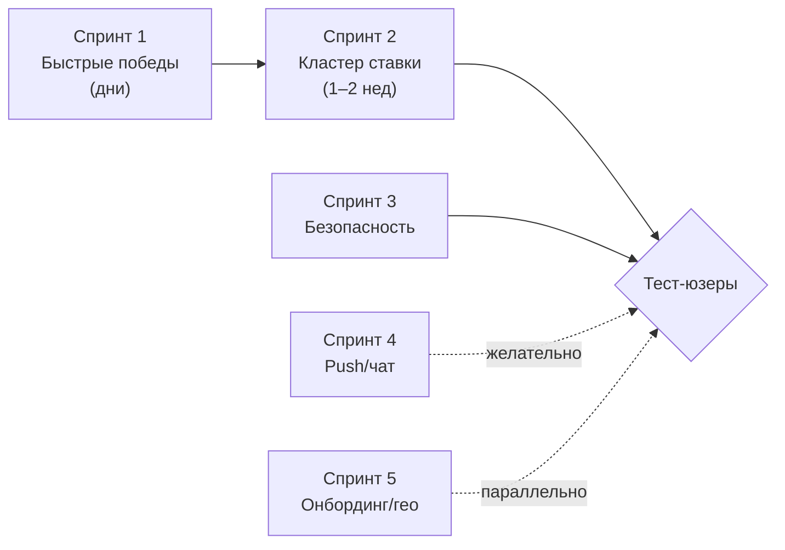

# 11 — UX-роадмап (готовность к тест-юзерам)

> **Источник:** бенчмарк-исследование 13 приложений и UX-измерений (inDrive, YouDo, Profi.ru,
> Яндекс.Услуги, TaskRabbit, Thumbtack, Uber/Bolt, Kaspi.kz + онбординг/доверие/микро-UX/
> мессенджинг/уведомления), 2026-07-07. **Скоуп:** только UX и флоу; **платежи/эскроу/чаевые
> исключены** решением заказчика. **Цель:** довести Zovu до состояния «не стыдно пустить
> реальных тест-юзеров».
>
> Эта страница — план работ после M8. Каждый пункт привязан к экрану ([05-screens.md](05-screens.md)),
> бизнес-правилам ([07-business-rules.md](07-business-rules.md)) и дизайн-системе
> ([06-design-system.md](06-design-system.md)). Прогресс отражается в [10-status.md](10-status.md).

## Главный вывод

Наши флоу **функционально полные**, но выглядят «до-MVP», потому что **самые тревожные и
самые доверительные моменты — самые сырые**, а лучшие конкуренты вкладываются сильнее всего
именно туда:

- **Пост-публикация («ждём отклики»)** — у нас голый `Загрузка…`, читается как «сломалось».
- **Экран откликов (S-23)** — главный экран любого аукциона — у нас имя + цена + иконка-заглушка.
- Нет скелетонов, нет реальных фото, нет автокомплита адреса, push — мок, empty-states пустые.

Хорошая новость: наша обратная-аукцион петля = модель **inDrive**, которую казахстанцы уже
знают. Поэтому почти всё ниже — **слои доверия и полировки поверх готового скелета**, а не
новые флоу.

**Легенда усилий:** `S` — часы–день · `M` — день–неделя · `L` — неделя+ или нужна инфраструктура.

---

## Спринт 1 — Быстрые победы (дни, без новой инфраструктуры)

Цель: убрать ощущение «сырое» до того, как тест-юзер зайдёт. Всё делается на существующих
данных и компонентах.

| № | Пробел | Экран | Сейчас | Как у лучших | Что делаем | Impact | Effort |
|---|---|---|---|---|---|---|---|
| 1 | **Экран ожидания откликов** | пост-публикация / S-23 (пусто) | `Загрузка…` | inDrive «ищем рядом…», YouDo «первые предложения за 5–10 мин, в среднем 3+», Uber «Connecting you…» | «Ищем специалистов рядом…» + текст-обещание + счётчик откликов + скелетон-карточки, наполняются по существующему Socket.IO. При 0 откликов за окно → CTA «расширить радиус/поднять бюджет», не мёртвый список | high | S |
| 2 | **Человеческие статусы** | списки откликов/заказов (обе роли) | риск утечки enum (`not_selected`, `active`) | Яндекс.Услуги ролевые формулировки «Вы откликнулись» / «Ожидание» / «Выполнен»; NN/g «never expose backend enums» | маппинг всех статусов в человеческие ролевые RU/KK-строки (чистый i18n) | high | S |
| 3 | **Бейдж верификации** | карточка отклика S-23/S-24 + профиль | верификация — невидимый бэкенд-гейт; голая «5.0» у новичков | TaskRabbit «Background checked», Яндекс verified, Kaspi **прячет рейтинг при <3 отзывов** | именной бейдж «Личность подтверждена» на карточке+профиле; честный «Новый специалист» + прятать среднее до N отзывов | high | S |
| 4 | **Подсказка бюджета + микрокопирайт** | S-20 бюджет; sheet отклика | пустое поле (паралич «назови цену») | inDrive редактируемый «рекомендованный тариф» + «низкие ставки редко принимают» | предзаполнить редактируемый бюджет по категории/гео + «слишком низкая цена — меньше откликов»; у специалиста «цена выше бюджета — реже принимают» | high | M |
| 5 | **Единый формат денег** | везде с суммами | риск «15000» без разделителей | inDrive UX-writing, Kaspi (цена всегда форматирована) | один форматтер, `15 000 ₸` везде (частично уже есть — довести до 100%) | medium | S |
| 6 | **Настоящие empty-states = скрытый онбординг** | все списки обеих ролей | пустые заглушки; онбординга нет вообще | Slack/Trello сеют контекст; Profi контекстный ассистент | 3-частный first-use empty-state (иконка + что здесь + CTA); пустой S-23/лента учат, как работает аукцион; различать first-use / нет-результатов / очищено | high | M |
| 7 | **Тумблер «Принимаю заказы»** | лента специалиста (шапка) | нет концепции доступности/онлайна | inDrive online/offline gating; TaskRabbit availability | постоянный тумблер онлайн/офлайн вверху ленты | medium | S |
| 8 | **Структурированный отклик** | sheet отклика специалиста | по сути цена + комиссия | Яндекс пре-промпты «когда готов» + «есть материалы»; YouDo питч | добавить в sheet: когда готов приступить, есть материалы/инструмент (да/нет), короткий питч, опц. окно актуальности 1–48 ч (отклики сами истекают) | medium | S |
| 9 | **OTP-автозаполнение + phone-first** | S-02/S-03 | OTP без автоподстановки | Uber phone-first (убрали развилку «Вход/Регистрация»); WebOTP / `autocomplete="one-time-code"` | `one-time-code` автозаполнение + авто-сабмит (+12–20% завершений), phone-first вход | high | M |
| 10 | **Pull-to-refresh** | все серверные списки | нет | стандарт iOS/Android | spring pull-to-refresh на каждый список; рестрейн-haptics (no-op на iOS PWA) | low | S |
| 11 | **Сохранение черновика заказа** | S-20 (если sheet/скролл) | случайный свайп-вниз стирает форму | YouDo выпустил патч именно про swipe-down на создании | сохранять черновик при закрытии + «продолжить», либо confirm-to-discard | low | S |

**Definition of Done спринта 1:** первый заход тест-юзера не выглядит «сломанным/пустым»;
списки читаемы; новичок понимает модель аукциона без обучающей стены.

---

## Спринт 2 — Кластер «решение о ставке» (сердце маркетплейса)

Цель: сделать премиальным путь **ждёшь → выбираешь → принял → ведёшь до конца**. Это то,
ради чего люди останутся. `inDrive` вкладывается сюда сильнее всего.

| № | Пробел | Экран | Сейчас | Как у лучших | Что делаем | Impact | Effort |
|---|---|---|---|---|---|---|---|
| 12 | **Система скелетонов** | лента, заказы, отклики, деталь, чат, профиль, уведомления | центрированный `Загрузка…` | LinkedIn/Instagram/Kaspi (воспринимается ~30% быстрее) | 4 переиспользуемых архетипа (list-row / card / detail / chat-bubble) под реальный layout; спиннер — только внутри блокирующей кнопки; определённый прогресс-бар на загрузке фото | high | M |
| 13 | **Реальные фото** | карточка отклика, профиль, активный заказ, галерея заказа | иконки-заглушки | TaskRabbit (фото мастера + галерея Task Details); Kaspi/Thumbtack реальные превью | подтянуть фото специалиста на карточку+активный заказ (fallback — инициалы-аватар, не иконка); 5 фото заказа — постоянная галерея на S-24 и у специалиста; grow-from-grid переход в полноэкранный просмотр | high | M |
| 14 | **Карточка отклика из 4 сигналов** | S-23 + S-24 | имя + цена, решать внутри S-24 | inDrive 4-сигнальная карточка (цена+рейтинг+ETA+бейдж); Kaspi «цена не без рейтинга» | пересобрать S-23: цена, фото, рейтинг(+кол-во отзывов), расстояние/ETA, бейдж категории/верификации — всё **без открытия S-24**; строка-обоснование «5.0 · отвечает ~10 мин · 3 заказа рядом» | high | M |
| 15 | **Таймлайн статуса заказа** | активный заказ (обе роли) | статичные enum-пиллы, чёрный ящик | Uber/DoorDash трекер 3–6 шагов (активный шаг настоящим временем, done — галочка+время) | таймлайн: Опубликован → Откликнулись → Выбран → В работе → Выполнено → Оценено; активный шаг в present tense, завершённые с отметкой времени, свежее — сверху | high | M |
| 16 | **Accept-в-чат единым движением + карточка исполнителя** | принятие отклика → активный заказ + чат | каскад → выкидывает в список; исполнитель — иконка; чат в отдельной вкладке | TaskRabbit «Confirm and chat» (одна кнопка); inDrive/Bolt чат+звонок сразу | accept = видимая смена режима: свернуть отклики → карточка исполнителя (фото/рейтинг/заказы/бейдж), чат и (маскированный) звонок сразу; чат привязан к заказу, в нём карточки-действия («Отметить выполненным») | high | M |

**Зависимости:** № 13 требует реального аплоада фото в S-20 (сторедж есть — local/MinIO,
[08-integrations.md](08-integrations.md)) и переиспользования селфи-верификации как аватара;
UI-загрузчик — новый.

**Definition of Done спринта 2:** заказчик выбирает исполнителя за один взгляд; после
принятия — понятный путь до «Выполнено» с ощущением живого прогресса. Кластер S1+S2 =
минимум для тест-юзеров.

---

## Спринт 3 — Доверие и безопасность (перед реальными встречами)

Цель: специалист приходит **домой** к заказчику — без этого слоя двусторонний маркетплейс
опасен и не вызывает доверия.

| № | Пробел | Экран | Сейчас | Как у лучших | Что делаем | Impact | Effort |
|---|---|---|---|---|---|---|---|
| 17 | **Safety-слой на активном заказе** | активный заказ (обе роли) | 0 защитных функций | Uber «safety shield» + SOS; inDrive шеринг деталей + доверенные контакты | кнопка «shield» → крупные плитки: «Поделиться статусом» (live-гео + детали контактам), SOS (пред-заполняет адрес+имя/фото специалиста+id → 112), доверенные контакты (до 5); confirm-at-door (фото+имя до визита) | high | L |
| 18 | **Маскирование контактов + гейтинг чата** | чат, флоу отклика | чат открыт широко; телефон не защищён | YouDo/TaskRabbit чат только после accept; Яндекс отдельная «Показать телефон», контакты вырезаны из откликов | чат открывается только после принятия; телефон скрыт (прокси-номер если звонок нужен); вырезать/флагать номера и ссылки на мессенджеры из текста отклика (анти-спам, сделки на платформе) | medium | M |
| 19 | **Прозрачность «кто посмотрел/откликнулся»** | деталь заказа / S-23 | только список откликов | Profi.ru «кому отправлен / кто посмотрел / кто откликнулся» — самая хвалимая фича | показывать счётчики отправлено-N / посмотрели-N / откликнулись-N; даже приблизительные оживляют ожидание | medium | M |
| 20 | **Двухшаговый условный отзыв + гейт права** | пост-завершение, оценка 5★ | сразу односторонняя 5★-форма | Uber/Thumbtack условная маршрутизация (звезда → 4–5★ теги+коммент, 1–3★ приватная форма проблемы); Kaspi оценка только по завершённой сделке однократно | сначала тап звезды → 4–5★: позитивные теги + опц. публичный коммент; 1–3★: приватная форма-проблема в поддержку; проверка права (только контрагент завершённого заказа, один раз); опц. отзыв специалист→заказчик | medium | M |

**Definition of Done спринта 3:** заказчику безопасно и понятно, кто к нему придёт; есть
экстренные механизмы; рейтинг честный и защищён от накрутки.

---

## Спринт 4 — Realtime и коммуникации (нужна инфраструктура)

Цель: в гонке откликов скорость алертов «новый отклик» / «приняли» / «сообщение» — это весь
продукт. Сейчас push — мок.

| № | Пробел | Экран | Сейчас | Как у лучших | Что делаем | Impact | Effort |
|---|---|---|---|---|---|---|---|
| 21 | **Реальный Web Push + two-step primer** | после публикации / первого отклика; настройки | push замокан | Braze/OneSignal primer; inDrive мгновенные транзакционные алерты; iOS PWA требует Add-to-Home-Screen | внедрить Web Push (VAPID + SW-обработчик + бэкенд-отправка); НЕ прошиваться на старте — кастомный in-app primer после публикации/первого отклика, OS-диалог только по тапу «да»; A2HS-подсказка для iOS; deep-link каждого пуша на свой экран; раздельные тумблеры транзакционные/промо | high | L |
| 22 | **Вложения-фото в чат** | чат (обе роли) | только текст | Profi/TaskRabbit/WhatsApp Business — картинки первого класса | добавить фото-вложения (переиспользовать аплоад); инлайн-сетка миниатюр; кнопка «отправить фото заказа в чат» | high | M |
| 23 | **Оптимистичный чат + галочки + печатает** | чат (обе роли) | plain Socket.IO, нет состояний отправки | WhatsApp/Instagram оптимистичная отправка + галочки; typing/read как сигнал живости | исходящее сообщение сразу в «отправляется» (TanStack optimistic), → «отправлено» (галочка), tap-to-retry при ошибке; read-receipts + throttled typing (~2 с) | medium | M |
| 24 | **Апгрейд центра уведомлений + батчинг** | лента уведомлений | плоская мок-лента, нет read/unread | PatternFly/Courier (read/unread, бейдж, группировка по времени, mark-all-read); Braze дайджест | read/unread (жирный+точка), бейдж непрочитанных (скрыт при 0), группировка «Сегодня/Вчера», mark-all-read, конкретный копирайт «Асхат откликнулся — 12 000 ₸», deep-links; батчить мелочь («3 специалиста откликнулись»), мгновенный push — только accepted/статус/сообщение | medium | M |

**Зависимости:** № 21 — VAPID-ключи, push-хендлер в service worker, бэкенд-отправка (сейчас
`PushProvider`-мок, [08-integrations.md](08-integrations.md)); iOS — только установленная PWA.
№ 22 — тот же сторедж, что и фото заказа.

---

## Спринт 5 — Онбординг, гео, рост, локализация

Цель: снизить трение первого входа, починить корректность гео и поднять качество KK.

| № | Пробел | Экран | Сейчас | Как у лучших | Что делаем | Impact | Effort |
|---|---|---|---|---|---|---|---|
| 25 | **Перестройка онбординга + отложенная верификация** | S-01…S-08 | форма+верификация — стена до ценности | Uber phone-first, single-field экраны; Airbnb defer commitment; Thumbtack «2.7x engagement» | анкету специалиста — по одному смыслу на экран + прогресс-бар + инлайн-валидация; **2-селфи-верификацию сделать отложенной** — смотреть ленту до неё, гейтить только действие «Откликнуться» (В-06 остаётся на bid, не на просмотр) | high | M |
| 26 | **Автокомплит адреса** | S-20 адрес | свободный текст | Uber «Where to?» + recents + Home/Work; TaskRabbit гейтит на разрешённом адресе | автокомплит-по-фокусу + reverse-geocode по пину карты + ручной ввод; недавние адреса чипами. Для гео-диспатча опечатка = **баг корректности** (ломает подбор), не косметика | high | M |
| 27 | **Сортировка/фильтры** | S-23 отклики; лента специалиста | фиксированный порядок | Kaspi сортируемый список; YouDo/Яндекс фильтры ленты | сортировка откликов («дешевле», «выше рейтинг», «ближе»); реальные фильтры ленты (категория, бюджет, расстояние, статус) | medium | M |
| 28 | **Нативная KK-локализация горячих строк** | CTA, empty/error/toast/статусы/уведомления/верификация | KK — машинный черновик | inDrive-локализация — дифференциатор в КЗ; Kaspi критикуют за слабый KK | вычитка носителем сначала **самых частых и критичных** строк (CTA, статусы, empty/error/toast, уведомления, верификация/SOS), директивные глаголы («Опубликовать», «Откликнуться») | medium | M |

**Зависимости:** № 26 — провайдер геокодинга. Варианты: **Nominatim/OSM** (бесплатно, совпадает
с нашими Leaflet-тайлами) для MVP или **2GIS API** (лучшее качество по КЗ) на прод.

---

## Что нужно для «готовности к тест-юзерам» (минимум)

- **Обязательный минимум перед тест-юзерами:** Спринт 1 + Спринт 2 (убирают «сырое» + чинят
  ядро решения) + из Спринта 3 хотя бы **confirm-at-door** и **report/flag** (безопасность, раз
  люди встречаются вживую).
- **Сильно желательно:** Спринт 4 (реальный push) — для аукциона скорость алертов критична.
- **Параллельно:** № 26 (адрес) — это корректность подбора, а не полировка; двигать рано.

## Внешние зависимости (то, что упирается в инфраструктуру)

| Пункт | Нужно | Заметка |
|---|---|---|
| № 13/22 реальные фото и фото в чат | UI-аплоад + сторедж | сторедж уже есть (local/MinIO); нужен загрузчик и подключение к карточкам |
| № 21 Web Push | VAPID-ключи, SW push-хендлер, бэкенд-отправка | iOS — только установленная PWA; замена `PushProvider`-мока |
| № 26 автокомплит адреса | геокодинг (Nominatim бесплатно / 2GIS качество) | без него гео-подбор ненадёжен |

## Статус реализации

| Спринт | Статус |
|---|---|
| **1 — Быстрые победы** | ✅ реализован (кроме №10 pull-to-refresh → перенесён в Спринт 2). №8 структурированный отклик сделан с миграцией БД. Прошёл adversarial код-ревью. |
| **2 — Кластер «решение о ставке»** | ✅ реализован. **2A** (скелетон-система на все экраны, таймлайн статуса заказа, карточка исполнителя + accept-в-чат, pull-to-refresh №10). **2B** (реальные **фото заказа**: аплоад с клиентским сжатием + раздача из публичного бакета + галерея на S-12/деталь + миниатюра в колоде). Карточка отклика 4-сигнальная — в Спринте 1 (№8). **Долг:** аватары специалистов (нужен отдельный upload профильного фото) → follow-up. |
| 3 — Доверие и безопасность | ⏳ |
| 4 — Realtime и коммуникации | ⏳ |
| 5 — Онбординг, гео, рост | ⏳ |

## История обновлений страницы

| Дата | Событие |
|---|---|
| 2026-07-07 | Страница создана по бенчмарк-исследованию 13 приложений/UX-измерений (research-воркфлоу). 5 спринтов, 28 пунктов, скоуп без платежей. Ожидает утверждения заказчиком перед реализацией. |
| 2026-07-07 | **Спринт 1 реализован** (9 пунктов + №8 структурированный отклик с миграцией `bid_structured`). №10 pull-to-refresh перенесён в Спринт 2. Build зелёный, 33 jest, adversarial код-ревью (2 бага исправлены), проверено скриншотами. |
